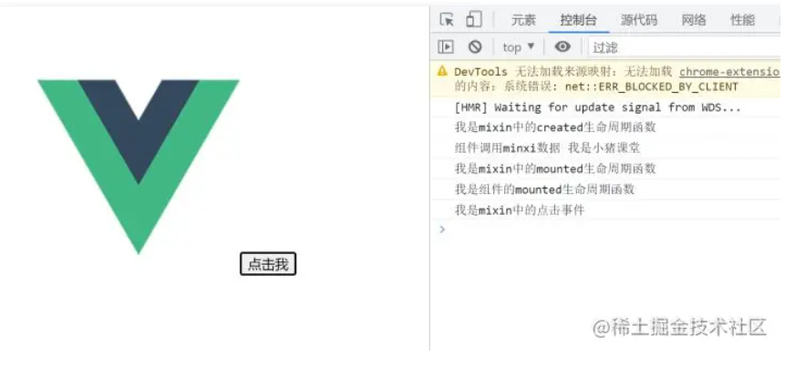
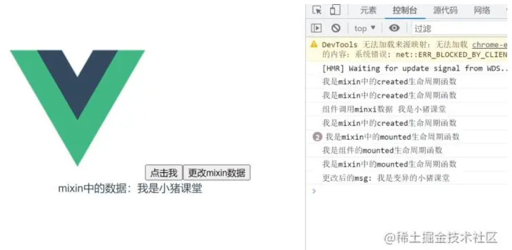

## 什么是Mixin
其实Mixin不是Vue专属的，可以说它是一种思想，也可以说它就是混入的意思，在很多开发框架中都实现了Mixin(混入)，这里主要讲解的是Vue的Minxin

**官方解释**
```md
混入(mixin)提供了一种非常灵活的方式，来分发Vue组件的可复用功能。一个混入对象可以包含任意组件选项。当组件使用混入对象时，所有混入对象的选项将被"混合"进入该组件本身的选项
```
**民间解释**
```md
将组件的公共逻辑或配置提取出来，哪个组件需要用时，直接将提取的这部分混入到组件内部即可。这样既可以减少代码冗余度，也可以让后期维护起来更加容易

这里需要注意的是：提取的是逻辑和配置，而不是HTML代码和CSS代码。其实大家也可以换一种想法，mixin就是组件中的组件，Vue组件化让我们的代码复用性更高，那么组件与组件之间还有重复部分，我们使用Mixin在抽离一遍
```
## Mixin和Vuex的区别
上面一点说Mixin就是一个抽离公共部分的作用。在Vue中，Vuex状态管理似乎也是做这一件事，它也是将组件之间可能共享的数据抽离出来。两者看似一样，实则还有细微区别
- Vuex公共状态管理，如果在一个组件中更改了Vuex中的某个数据，那么其它所有引用了Vuex中该数据的组件也会跟着变化
- Mixin中的数据和方法是独立的，组件之间使用后互相不影响

## 如何使用
### mixin定义
定义mixin也非常简单，它就是一个对象而已，只不过这个对象里面可以包含Vue组件一些常见配置，如data、methods、created等等。
```js
// src/mixin/index.js
export default mixins = {
    data() {
        return {}
    },
    computed: {},
    created() {},
    mounted() {},
    methods: {}
}
```
可以看到我们的mixin非常的简单，主要包含了一个Vue组件的常见的逻辑结构。
接下来让我们在mixin中简单的写点东西，代码如下：
```js
export const mixins = {
    data() {
        return {
            msg: '我是小猪课堂'
        }
    }，
    computed: {},
    created() {
        console.log('我是mixin中的created声明周期')
    },
    mounted() {
        console.log("我是mixin中的mounted生命周期函数");
    },
    methods: {
        clickMe() {
            console.log("我是mixin中的点击事件");
        },
    },
}
```
### 局部混入
**我们的公共mixin定义好后，最重要就是如何使用它。根据不同的业务场景，我们可以分为两种：局部混入和全局混入。顾名思义，局部混入和组件的按需加载有点类似，就是需要用到mixin中的代码时，我们再在组件章引入它。全局混入的话，则代表我在项目的任何组件中都可以使用mixin。**

组件中引入mixin也非常简单，我们稍微改造下App.vue组件。
```html
// src/App.vue
<template>
    <div id="app">
        
        <button @click="clickMe">点击我</button>
    </div>
</template>
<script>
import { mixins } from './mixin/index';
export default {
    name: 'App',
    mixins: [mixins],
    components: {},
    created() {
        console.log('组件调用mixin数据', this.msg)
    },
    mounted() {
        console.log('我是组件的mounted生命周期函数')
    }
}
</script>
```


上面代码中引入mixin的方法也非常简单，直接使用vue提供给我们的mixins属性:mixins:[mixins]

通过上面的代码和效果我们可以得出以下几点
- <span style="color: red">mixin中的生命周期函数会和组件的生命周期函数一起合并执行</span>
- <span style="color: red">mixin中的data数据在组件中也可以使用</span>
- <span style="color: red">mixin中的方法在组件内部可以直接调用</span>
- <span style="color: red">**生命周期函数合并后执行顺序:先执行mixin中，后执行组件的**</span>

这里我们就提出了一个问题：<span style="color: red">**一个组件中改动了mixin中的数据，另一个引用了mixin的组件会受影响吗？答案是不会的！**</span>


### 全局混入
上一点我们使用mixin是在需要的组件中引入它，我们也可以在全局先把它注册好，这样我们就可以在任何组件中直接使用了。
```js
import Vue from 'vue';
import App from './App.vue';
import { mixins } from './mixin/index';
Vue.mixin(mixins);

Vue.config.producationTip = false;

new Vue({
    render: (h) => h(App)
}).$mount('#app')
```
然后把App.vue中引入mixin的代码注释掉，代码如下
```html
<template>
  <div id="app">
    
    <button @click="clickMe">点击我</button>
    <button @click="changeMsg">更改mixin数据</button>
    <demo></demo>
  </div>
</template>

<script>
// import { mixins } from "./mixin/index";
import demo from "./components/demo.vue";
export default {
  name: "App",
  // mixins: [mixins],
  components: { demo },
  created() {
    console.log("组件调用minxi数据", this.msg);
  },
  mounted() {
    console.log("我是组件的mounted生命周期函数");
  },
  methods: {
    changeMsg() {
      this.msg = "我是变异的小猪课堂";
      console.log("更改后的msg:", this.msg);
    },
  },
};
</script>
```


可以发现效果和局部混入没有任何区别，这就是全局混入的特点

虽然很方便 ，但是不推荐，官方有一句话
```js
谨慎使用全局混入，因为它会影响每个单独创建的Vue实例(包括第三方插件)。大多数情况下，只应当应用于自定义选项，就像上面实例一样，推荐其作为插件发布，以避免重复应用混入
```
### 选项合并
上面的列子中我们仔细看会发现一个问题：mixin中定义的属性或方法的名称与组件中定义的名称没有冲突！
那么我们不禁会想，如果命名有冲突了怎么办？

我们使用git合并代码的时候经常会有冲突，有冲突了不要怕，我们合并就好了。这里的
冲突主要分为以下几种情况：

1. 生命周期函数

    确切来说，这种不算冲突，因为生命周期函数的名称都是固定的，默认的合并策略如下：
    - <span style="color: red">先执行mixin中生命周期函数中的代码，然后在执行组件内部的代码，上面的例子其实就很好的证明了。</span>
2. data数据冲突
    <span style="color: red">当mixin中的data数据与组件中的data数据冲突时，组件中的data数据会覆盖mixin中数据，借用官方的一段代码</span>
    ```js
    var mixin = {
        data: function () {
            return {
            message: 'hello',
            foo: 'abc'
            }
        }
        }

        new Vue({
        mixins: [mixin],
        data: function () {
            return {
            message: 'goodbye',
            bar: 'def'
            }
        },
        created: function () {
            console.log(this.$data)
            // => { message: "goodbye", foo: "abc", bar: "def" }
        }
    })
    ```
    可以看到最终打印的message是组件中message的值，其它没有冲突的数据自然合并了
3. 方法冲突

    ```js
    var mixin = {
        methods: {
            foo: function () {
            console.log('foo')
            },
            conflicting: function () {
            console.log('from mixin')
            }
        }
        }

        var vm = new Vue({
        mixins: [mixin],
        methods: {
            bar: function () {
            console.log('bar')
            },
            conflicting: function () {
            console.log('from self')
            }
        }
    })

    vm.foo() // => "foo"
    vm.bar() // => "bar"
    vm.conflicting() // => "from self"
    ```
    上段代码中mixin和组件中都有conficting方法，但是最终在组件中调用时，实际调用的是组件中的conflicting方法。

    当然，如果你要自定义合并规则也不是不可以，但是我觉得没有必要，项目中无需做这么复杂。

## mixin的优缺点
- 优点

    - 提高代码复用性
    - 无需传递状态
    - 维护方便，只需要修改一个地方即可
- 缺点

    - 命名冲突
    - 滥用的话后期很难维护
    - 不好追溯源，排查问题稍显麻烦
    - 不能轻易的重复代码


## 资料
[彻底搞懂Vue中的Mixin混入](https://developer.aliyun.com/article/974880)