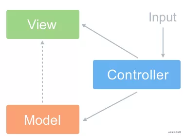
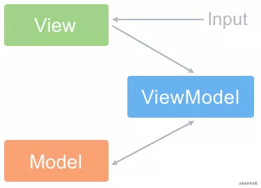
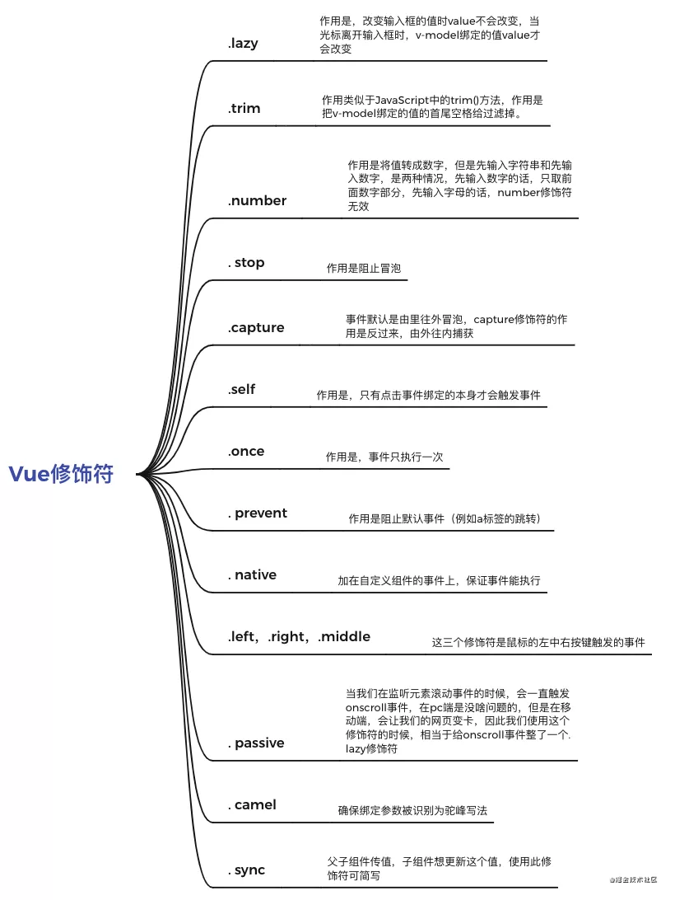
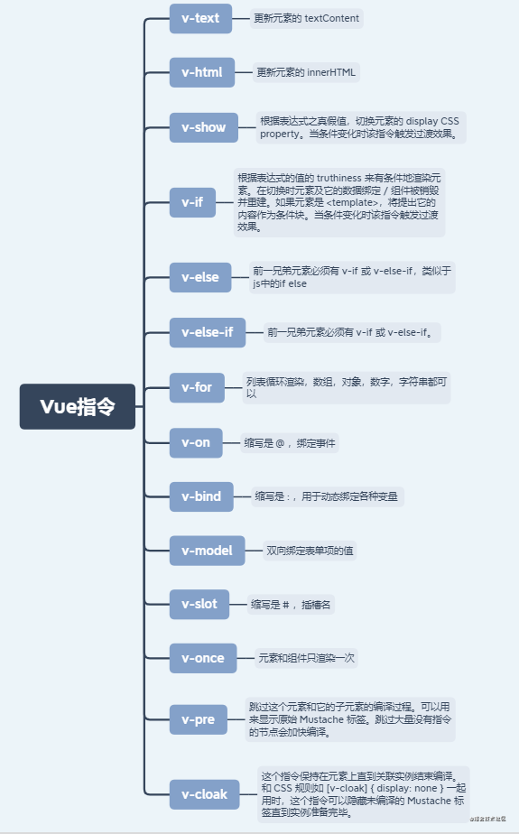
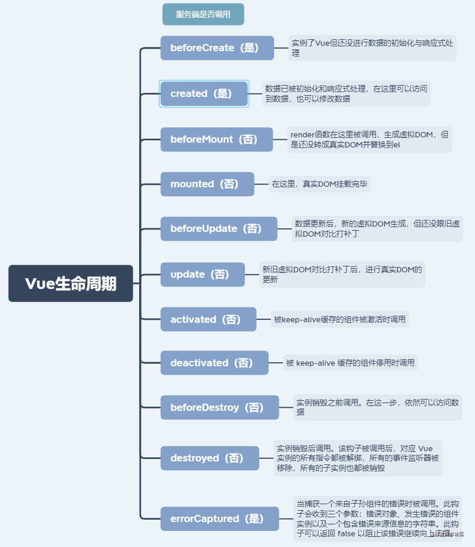
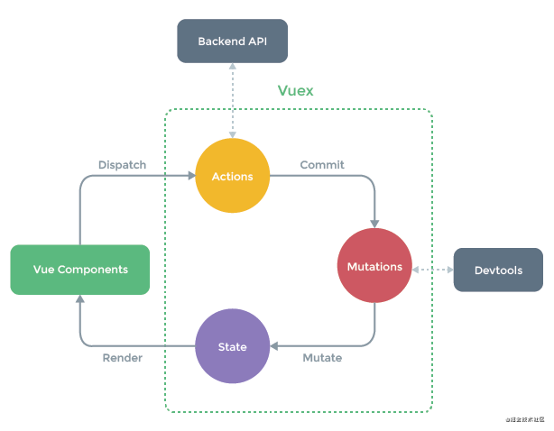
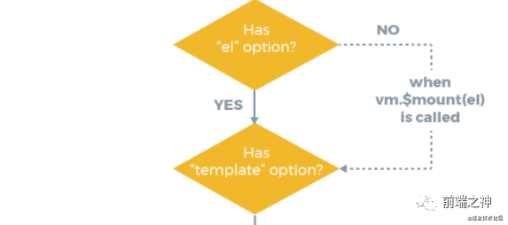

## 荣耀黄金
### Vue优点，缺点
优点：渐进式，组件化，轻量级，虚拟dom,响应时，单页面路由，数据与视图分开

缺点：单页面不利于SEO，不支持IE8一下，首屏加载时间长

### MVVM是什么？和MVC有何区别呢？
**MVC**
- Model(模型):负责从数据库中取数据
- View(视图): 负责展示数据的地方
- Controller(控制器):用户交互的地方，例如点击事件等等
思想：Controller将Model的数据展示在view上



**MVVM**
- VM:也就是View-Model，做了两件事达到了数据的双向绑定，一是将【模型】转化成【视图】,即将后端传递的数据转化成所看到的页面，实现方式是：数据绑定。二是将【视图】转换成【模型】，即将所看到的页面转化成后端数据。实现方式是:DOM事件监听
思想：实现了View和Model的自动同步，也就是当Model的属性改变时，我们不用在自己手动操作Dom元素，来改变View的显示，而是改变属性后该属性对应的View层显示会自动改变(对应Vue数据驱动思想)



**区别**

整体看来,MVVM比MVC精简很多，不仅简化了业务与界面的依赖，还解决了数据频繁更新的问题，不用在用选择器操作DOM元素。因为MVVM中，View不知道Model的曾在，Model和ViewModel也观察不到View，这种低耦合模式提高代码的可重用性

vue是不是MVVM框架

Vue是MVVM框架，但是不是严格符合MVVM，因为MVVM规定Model和View不能直接通信，而Vue的ref可以做到这点。

### Vue与Jquery区别在哪？为什么放弃Jquery用Vue
1. jquery是直接操作DOM，Vue不直接操作DOM，Vue的数据与视图是分开的，Vue只需要操作数据即可
2. jquery的操作DOM行为是频繁的，而Vue利用虚拟DOM的技术，大大提高了更新DOM时的性能
3. Vue中不提倡直接操作DOM，开发者只需要把大部分精力放在数据层面上
4. Vue继承的一些库，大大提高了开发效率，比如Vuex，Router等

## 永恒钻石
### 为什么data是个函数并且返回一个对象呢
data之所以只是一个函数，是因为一个组件可能会多处调用，而每一次调用就会执行data函数并返回新的数据对象，这样，可以避免多处调用之间的数据污染

### 使用过那些Vue修饰符

### 使用过哪些Vue的内部指令呢？


### 组件之间的传值方式有哪些？
- 父组件传值给子组件，子组件使用props进行接收
- 子组件传值给父组件，子组件使用$emit+ 事件 对父组件进行传值
- 组件中可以使用$parent和$children获取到父组件实例和子组件实例，进而获取数据
- 使用$attrs和$listeners,在对一些组件进行二次封装可以方便传值，例如A->B->C [参考](https://www.cnblogs.com/lsboom/p/11365293.html)
- 使用$ref获取组件实例，进而获取数据
- 使用Vuex进行状态管理
- 使用eventBus进行跨组件触发事件，进而传递数据
- 使用provide和inject,官方建议我们不要用这个，Elementui源码大量使用
- 使用浏览器缓存,例如LocalStorage

### 路由有哪些模式，又有何不同
- hash模式:通过#号后面的内容更改，触发hashchange事件，实现路由切换
- history模式:通过pushState和replaceState切换url，触发popstate事件，实现路由切换，需要后端配合

### 如何设置动态class，动态style
- 动态class对象：

  ```
  <div :class="{'is-active': true, 'red': isRed}"></div>
  ```
- 动态class数组

  ```
  <div :class="['is-active', isRed ? 'red' : '']"></div>
  ```

- 动态style对象

  ```
  <div :style="{color: textColor, fontSize: '18px'}></div>
  ```

- 动态style数组

  ```
  <div :style="[{color: textColor, fontSize: '18px'}, {fontWeight: '300'}]"></div>
  ```

### v-if和v-show有何区别
- v-if是通过控制dom元素的删除和生成来实现显隐，<span style="color: red">每一次显隐都会使组件重新跑一遍生命周期，因为显隐决定了组件的生成和销毁</span>
- v-show是通过控制dom元素的css样式来实现显隐，不会销毁
- 频繁或大量数据显隐使用v-show，否则使用v-if

### computed和watch的区别
- computed是依赖已有的变量来计算一个目标变量，大多数情况都是多个变量凑在一起计算出一个变量，并且computed具有缓存机制，依赖值不变的情况下其会直接读取缓存进行复用，computed不能进行异步操作
- watch是监听某一个变量的变化，并执行响应的回调函数，通常是一个变量决定多个变量的变化，watch可以进行异步操作
- 简单记录就是：一般情况下computed是多对一 watch是一对多

### vue的生命周期


### 为什么v-if和v-for不建议用在同一标签
在vue2中，v-for优先级是高于v-if的
```
<div v-for="item in [1,2,3,4,5,6, 7]" v-if="item !== 3">
  {{item}}
</div>
```
上面的写法是v-for和v-if同时存在，会先把7个元素都遍历出来，然后在一个个判断是否为3，并把3给隐藏掉，这样的坏处是，渲染了无用的3节点，增加无用的dom操作，建议使用computed来解决这个问题
```
<div v-for="item in list">
  {{item}}
</div>

computed() {
  list() {
    return [1,2 ,3,4,5,6,7].filter(item => item !== 3);
  }
}
```
### vuex有哪些属性，用处是什么


- State：定义了应用状态的数据结构，可以在这里设置默认的初始状态。
- Getter：允许组件从 Store 中获取数据，mapGetters 辅助函数仅仅是将 store 中的 getter 映射到局部计算属性。
- Mutation：是唯一更改 store 中状态的方法，且必须是同步函数。
- Action：用于提交 mutation，而不是直接变更状态，可以包含任意异步操作。
- Module：允许将单一的 Store 拆分为多个 store 且同时保存在单一的状态树中。

## 至尊星耀
### 不需要响应时的数据应该怎么处理
```
// 方法一：将数据定义在data之外
data () {
  this.list1 = { xxxxxxxxxxxxxxxxxxxxxxxxxxxxxxx }
  this.list2 = { xxxxxxxxxxxxxxxxxxxxxxxxxxxxxxx }
  this.list3 = { xxxxxxxxxxxxxxxxxxxxxxxxxxxxxxx }
  this.list4 = { xxxxxxxxxxxxxxxxxxxxxxxxxxxxxxx }
  this.list5 = { xxxxxxxxxxxxxxxxxxxxxxxxxxxxxxx }
  return {}
}

// 方法二：Object.freeze()
data () {
    return {
        list1: Object.freeze({xxxxxxxxxxxxxxxxxxxxxxxx}),
        list2: Object.freeze({xxxxxxxxxxxxxxxxxxxxxxxx}),
        list3: Object.freeze({xxxxxxxxxxxxxxxxxxxxxxxx}),
        list4: Object.freeze({xxxxxxxxxxxxxxxxxxxxxxxx}),
        list5: Object.freeze({xxxxxxxxxxxxxxxxxxxxxxxx}),
    }
 }
```
### watch有哪些属性，分别有什么用
当我们监听一个基本数据类型时
```
watch: {
  value() {
    // do something
  }
}
```
当我们监听一个引用数据类型时
```
watch: {
  obj: {
    handler() { // 执行回调
      // do something
    }，
    deep: true, // 是否进行深度监听
    immedate: true // 是否初始化执行handler函数
  }
}
```
### 父子组件声明周期顺序
父beforeCreate -> 父created -> 父beforeMount -> 子beforeCreate -> 子created -> 子beforeMount -> 子mounted -> 父mounted

### 对象新属性无法更新视图，删除属性无法更新视图，为什么？怎么办？
原因：Object.defineProperty() 没有对对象的新属性进行属性劫持

对象新属性无法更新视图：使用vue.$set(obj, key, value),组件中this.$set(obj, key, value)

删除属性无法更新视图： 使用vue.$delete(obj, key), 组件中this.$delete(obj, key)

### 直接arr[index] = xxx无法更新视图怎么办？为什么？怎么办？

原因：Vue没有对数组进行Object.defineProperty的属性劫持，所以直接arr[index] = xxx是无法更新视图的

使用数组的splice方法，arr.splice(index, 1, item)

使用Vue.$set(arr, index, value)

### 为什么不建议用index做key，为什么不建议用随机数做key？
```
<div v-for="(item, index) in list" :key="index">{{item.name}}</div>

list: [
    { name: '小明', id: '123' },
    { name: '小红', id: '124' },
    { name: '小花', id: '125' }
]

渲染为
<div key="0">小明</div>
<div key="1">小红</div>
<div key="2">小花</div>

现在我执行 list.unshift({ name: '小林', id: '122' })

渲染为
<div key="0">小林</div>
<div key="1">小明</div>
<div key="2">小红</div>
<div key="3">小花</div>


新旧对比

<div key="0">小明</div>  <div key="0">小林</div>
<div key="1">小红</div>  <div key="1">小明</div>
<div key="2">小花</div>  <div key="2">小红</div>
                         <div key="3">小花</div>

可以看出，如果用index做key的话，其实是更新了原有的三项，并新增了小花，虽然达到了渲染目的，但是损耗性能

现在我们使用id来做key，渲染为

<div key="123">小明</div>
<div key="124">小红</div>
<div key="125">小花</div>

现在我执行 list.unshift({ name: '小林', id: '122' })，渲染为

<div key="122">小林</div>
<div key="123">小明</div>
<div key="124">小红</div>
<div key="125">小花</div>

新旧对比

                           <div key="122">小林</div>
<div key="123">小明</div>  <div key="123">小明</div>
<div key="124">小红</div>  <div key="124">小红</div>
<div key="125">小花</div>  <div key="125">小花</div>

可以看出，原有的三项都不变，只是新增了小林这个人，这才是最理想的结果
```
### nextTick的用处
```
this.name = '陆二陆';
this.age = 11;
this.gender = '男'
```
修改了三个变量，那问题来了，是没修改一次，Dom就更新一次吗？不是的，Vue采用的是异步更新的策略,通俗点说就是，**同一个事件循环(一轮事件循环只取一个宏任务，宏任务中的同步代码执行完后，就依次从前往后执行微任务队列中的微任务)内多次修改,会统一进行一次视图更新**，这样才能节省性能

看懂了上面，那你应该看得懂下面的例子
```
<div ref="testDiv">{{name}}</div>

name: '小林'

this.name = '林三心'
console.log(this.$refs.testDiv.innerHTML) // 这里是啥呢
```
答案是“小林”，前面说了，Vue是异步更新，所以数据一更新，视图却还没更新，所以拿到的还是上一次的旧视图数据，那么想要拿到最新视图数据怎么办呢？
```
this.name = '林三心'
this.$nextTick(() => {
    console.log(this.$refs.testDiv.innerHTML) // 林三心
})
```
### Vue的SSR是什么？有什么好处？
- SSR就是服务端渲染
- 基于nodejs serve服务环境开发，所有html代码在服务端渲染
- 数据返回给前端，然后前端进行"激活",即可成为浏览器识别的html代码
- SSR首次加载更快，有更好的用户体验，有更好的SEO优化，爬虫能看到整个页面的内容，如果是vue项目，由于数据还要经过解析，这就造成爬虫不会等待你的数据加载完成，所以其实vue项目的SEO体验不是很好

## 最强王者
### Vue响应式怎么实现
整体思路就是数据劫持 + 观察者模式

对象内部通过defineReactive方法，使用Object.defineproperty将属性进行劫持(只会劫持已经存在的属性)，数组则是通过重写数组方法来实现。当页面使用对应属性时，每个属性都拥有自己的dep属性，存放他所依赖的wacher(依赖收集)。当属性变化后悔通知自己对应的watcher去更新(派发更新)

### 为什么只对对象劫持，而要对数组进行方法重写
因为对象最多也就几十个属性，拦截起来数量不多，但是数组可能会有几百几千项，拦截起来非常耗性能，所以直接重写数组原型上的方法,是比较节省性能的方案

### Vue.set方法的原理？
```
function set(target, key, val) {
  // 判断是否是数组
  if(Array.isArray(val)) {
    // 判断谁大谁小
    target.length = Math.max(target.length, key);
    // 执行splice
    target.splice(key, 1, val);
    return val;
  }
  
  const ob = target.__ob__;

  // 如果此对象不是响应时对象，直接设置并返回
  if(key in target && (!(key in target.prototype) || !ob) {
    target[key] = val;
    return val;
  }

  // 否则，新增属性，并响应式处理
  defineReactive(target, key, val);
  return val;
}
```
### Vue.delete方法的原理
```
function del(target, key) {
  // 判断是否为数组
  if(Array.isArray(target)) {
    // 执行splice
    target.splcie(key, 1);
    return ;
  }

  const ob = target.__ob__;

  // 对象本身没有这个属性，直接返回
  if(!(key in target)) return;

  // 否则删除这个属性
  delete target[key];

  // 判断是否是响应式对象，不是的话，直接返回
  if(!ob) return; 
  // 是的话，删除后要通知视图更新
  ob.dep.notify();
}
```
### nextTick的原理
```
let callback = []; // 回调函数
let pending = false; 
function flushCallbacks() {
  pending = false; // 把标志还原为false
  // 依次执行回调
  for(let i = 0; i < callbacks.length; i++) {
    callbacks[i]();
  }
}
let timerFunc; // 先采用微任务并按照优先级优雅降级的方式实现异步刷新
if(typeof Promise !== 'undefined') {
  // 如果支持promise
  const p = Promise.resolve();
  timerFunc = () => {
    p.then(flushCallbacks);
  }
} else if (typeof MutationObserver !== "undefined") {
  // MutationObserver 主要是监听dom变化 也是一个异步方法
  let counter = 1;
  const observer = new MutationObserver(flushCallbacks);
  const textNode = document.createTextNode(String(counter));
  observer.observe(textNode, {
    characterData: true,
  });
  timerFunc = () => {
    counter = (counter + 1) % 2;
    textNode.data = String(counter);
  };
} else if (typeof setImmediate !== "undefined") {
  // 如果前面都不支持 判断setImmediate
  timerFunc = () => {
    setImmediate(flushCallbacks);
  };
} else {
  // 最后降级采用setTimeout
  timerFunc = () => {
    setTimeout(flushCallbacks, 0);
  };
}
export function nextTick(cb) {
  callbacks.push(cb);
  if (!pending) {
    pending = true;
    timerFunc();
  }
}
```
## 冷门的知识点

### 如果子组件改变props里的数据会发生什么？
- 改变props数据是基本类型

  如果修改的是基本类型，则会报错
  ```
  props: {
    num: Number,
  }
  created() {
      this.num = 999
    }
  ```

- 改变的props数据是引用类型

  ```
  props:  {
    item: {
      default: () => {}
    }
  },
  create() {
    // 不报错，并且父级数据会跟着变
    this.item.name = 'sanxin';
    
    // 会报错，跟基础类型报错一样
    this.item = 'sss'
  }
  ```
### props怎么自定义验证
```
props: {
  num: {
    default: 1,
    validator: function(value) {
      // 返回值为true则不通过，报错
      return [
        1,2,3,4,5
      ].indexOf(value) !== -1
    }
  }
}
```
### watch监听一个对象时，如何排除某些属性的监听
下面代码是，params发生改变就重新请求数据，无论是a，b，c，d属性改变
```
data() {
    return {
      params: {
        a: 1,
        b: 2,
        c: 3,
        d: 4
      },
    };
  },
watch: {
    params: {
      deep: true,
      handler() {
        this.getList;
      },
    },
  }
```
但是如果我只想要a，b改变时重新请求，c，d改变时不重新请求呢？

```
mounted() {
  Object.keys(this.params).filter( _ => !['c', 'd'].includes(_)).forEach( _ => {
    this.$watch(vm  => vm.params[_], handler, {
      deep: true,
    })
  })
}
data() {
    return {
      params: {
        a: 1,
        b: 2,
        c: 3,
        d: 4
      },
    };
  },
watch: {
    params: {
      deep: true,
      handler() {
        this.getList;
      },
    },
  }
```
### computed如何实现传参
```
// html
<div>{{ total(3)}}</div>

// js
computed: {
  total() {
    return function(n) {
      return n * this.num;
    }
  }
}
```
### vue的hook的使用
- <span style="color: red">同一个组件中使用</span>

  这是我们常用的定时器方式
  ```js
  export default {
    data() {
      timer: null;
    },
    mounted() {
      this.timer = setInterval(() => {
        // 具体执行的内容
        console.log(1);
      }, 1000);
    },
    beforeDestory() {
      clearInterval(this.timer);
      this.timer = null;
    }
  }
  ```
  上面做法不好的地方在于：得全局使用一个timer变量，可以使用hook这么做
  ```js
  export default {
    methods: {
      fun() {
        let timer = setInterval(() => {
          // 具体执行的内容
          console.log(123)
        }, 1000);
        this.$once('hook:beforeDestory', () => {
          clearInterval(timer);
          timer = null;
        })
      }
    }
  }
  ```

- <span style="color: red">父子组件使用</span>

  如果子组件需要在mounted时触发父组件的某一个函数，平时都会怎么写
  ```js
  //父组件
  <rl-child @childMounted="childMountedHandle"
  />
  method () {
    childMountedHandle() {
    // do something...
    }
  },

  // 子组件
  mounted () {
    this.$emit('childMounted')
  },
  ```
  使用hook的话更方便
  ```js
  //父组件
  <rl-child @hook:mounted="childMountedHandle"
  />
  method () {
    childMountedHandle() {
    // do something...
    }
  },
  ```

### provide和inject是响应式的吗？
```js
// 祖先组件
provide() {
  return {
    // keyName: {name: this.name}, // value是对象才能实现响应式，也就是引用类型
    keyName: this.changeValue, // 通过函数的方式也可以[注意，这里是把函数作为value,而不是this.changeValue()]
    // keyName: 'test' value如果是基本类型，就无法实现响应式
  }
}
data(){
  return {
 name:'张三'
}
  },
  methods: {
   changeValue(){
    this.name = '改变后的名字-李四'
   }
  }  

// 后代组件
  inject:['keyName']
  create(){
 console.log(this.keyName) // 改变后的名字-李四
}

```
### Vue的el属性和$mount优先级
比如下面的这种情况，Vue会渲染到哪个节点上
```
new Vue({
  router,
  store,
  el:'#app',
  render: h => h(App)
}).$mount('#ggg')
```
这是官方的一张图，可以看出el和$mount同时存在 el优先级> $mount



### 动态指令和参数有使用过吗？
```js
<template>
    ...
    <aButton @[someEvent]="handleSomeEvent()" :[someProps]="1000" />...
</template>
<script>
  ...
  data(){
    return{
      ...
      someEvent: someCondition ? "click" : "dbclick",
      someProps: someCondition ? "num" : "price"
    }
  },
  methods: {
    handleSomeEvent(){
      // handle some event
    }
  }  
</script>
```
### 相同的路由组件如何渲染
开发人员经常遇到的情况是，多个路由解析为同一个Vue组件。问题是，Vue出于性能原因，默认情况下共享组件将不会重新渲染，如果你尝试在使用相同组件的路由之间进行切换，则不会发生任何变化。
```
const routes = [
  {
    path: "/a",
    component: MyComponent
  },
  {
    path: "/b",
    component: MyComponent
  },
];
```
如果依然想重新渲染怎么办？可以使用key
```
<template>
    <router-view :key="$route.path"></router-view>
</template>
```
### 自定义v-model
::: danger
默认情况下，v-model是@input事件监听器和:value属性上的语法糖。但是你可以在你的vue组件中指定一个模型属性来定义使用什么事件和value属性--- 非常棒
:::
```
export default {
  model: {
    event: 'change',
    prop: 'checked'
  }
}
```
### 如何获取data中某一个数据的初始状态
:::tip
开发中，有时候需要拿初始状态去计算。例如
:::
```
data() {
  return {
    num: 10
  }
},
mounted() {
  this.num = 1000;
}, 
methods: {
  howMuch() {
    // 计算出num增加了多少，那就是1000   初始值
    // 可以通过this.$options.data().xxx来获取初始值
    console.log(1000 - this.$options.data().num);
  }
}
```

### 计算变量时候，methods和computed哪个好
```
<div>
    <div>{{howMuch1()}}</div>
    <div>{{howMuch2()}}</div>
    <div>{{index}}</div>
</div>

data: () {
    return {
         index: 0
       }
     }
methods: {
    howMuch1() {
        return this.num + this.price
    }
  }
computed: {
    howMuch2() {
        return this.num + this.price
    }
  }
```
:::tip
computed会好一些，因为computed会有缓存。例如index由0变成1，那么会触发视图更新，这时候methods会重新执行一次，而computed不会，因为computed依赖的两个变量num和price都没变
:::


## 资料
[50个vue知识点](https://mp.weixin.qq.com/s/XJUEou9LTHVXNgHtr9O-UA)

[vue3知识点](https://mp.weixin.qq.com/s?__biz=MzAxODE2MjM1MA==&mid=2651580020&idx=2&sn=c985c76526e894b214957687c96bb17e&chksm=802531b5b752b8a3733559865444019d12d091a02c1fa8c454d5f5ff29b66a7bdaa31feb206d&scene=21#wechat_redirect)
