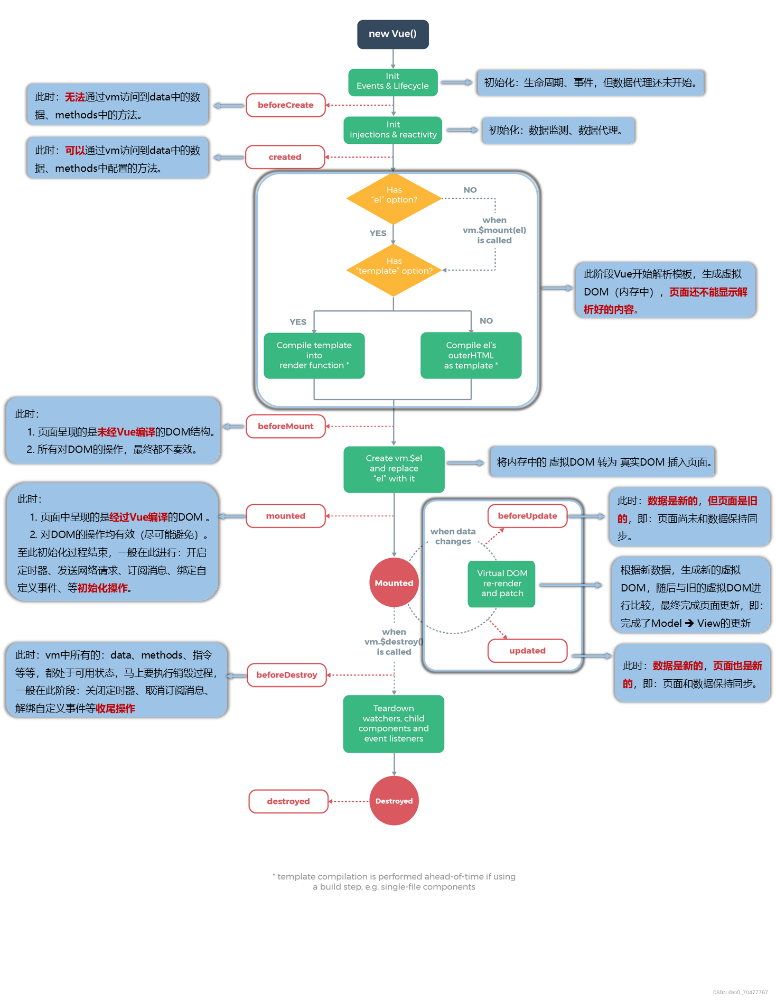
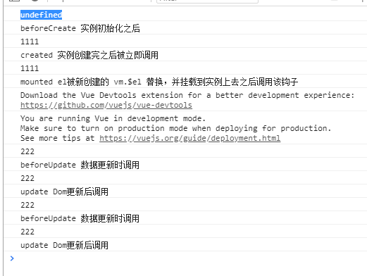

自己测试一下
```js
data() {
    aaa: '111',
    bbb: true
},
beforeCreate() {
    console.log(this.aaa);
    console.log('beforeCreate 实例初始化之后');
},
created() {
    console.log(this.aaa);
    console.log('created 实例创建完之后被立即调用');
},
beforeMounted() {
    console.log(this.aaa);
    console.log('beforeMounted 挂载开始之前被调用');
},
mounted() {
    console.log(this.aaa);
    console.log('mounted el被新创建的vm.$el替换，并挂载到实例上去之后调用该钩子');
},
beforeUpdate() {
    console.log(this.aaa);
    console.log('beforeUpdate 数据更新时调用')
},
updated() {
    console.log(this.aaa);
    console.log('update DOM更新后调用')
},
beforeDestory() {
    console.log(this.aaa);
    console.log('beforeDestory 实例销毁之前调用')
}
destroyed() {
   console.log(this.aaa);
    console.log('destoryed 实例销毁之后调用') 
}
methods: {
    updateDate() {
        this.aaa = '222';
    }
}
```



1. beforeCreate在实例初始化之后执行，此时data数据还未被装配，$el为undefined
2. created实例创建完毕后被调用，此时data和属性已经有了，但是还没有挂载到页面上，$el还为undefined
3. beforeMount在挂载之前被调用，$el还为undefined
4. mounted挂载完毕，el被新创建的vm.$el替换，页面上渲染元素成功
5. <span style="color: red">beforeUpdate数据更新时候调用，虚拟dom打补丁之前，数据是更新后的数据</span>
6. updated数据更改导致虚拟dom重新渲染和打补丁，在这之后调用该方法
7. <span style="color: red">beforeDestory实例销毁前调用，data数据和上面的方法依旧存在，$el还能或得到dom元素</span>
8. <span style="color: red">destoryed实例销毁后，data数据和上面的方法依旧存在，$el已经被删除</span>

### 数据
data Vue实例数据对象。Vue将会递归将data的属性转为getter/setter，从而让data的属性能够响应数据变化

props可是数组或对象，用于接收父组件的数据

propsData创建实例时传递的props,只能用于new创建的实例

computed计算属性

methods 方法集合

watch数据对象的观察

### DOM
el Vue实例的挂载目标

template字符串模板

render字符串模板替代方案

renderError 当render出错时的方案

### 资源
directives Vue实例可用指令的集合

filters过滤器的集合

components子组件的结合

### 组合
parent 父组件实例

mixins混入实例的数组集合

extends 扩展文件组件

provide/inject 高阶插件/组件库提供用例

### 其他
name 作为组件时组件的名字

delimiters 默认值为{{}}可改变在html页面数据包含标识

functional 使组件无状态和无实例

model 允许一个自定义组件在使用v-model时定制prop和event

inheritAttrs 默认行为被干掉

comments 注释将被干掉

### 总结
beforecreate 这可以加个loading事件

created 在这个做一些初始化结束loading

mounted 调用接口拿到数据配合其他钩子函数

beforeDestory 清楚计时器之类

data 为页面响应式数据集合

props 用于父组件给子组件传递数据

computed 用于计算属性

watch 用于监听数据变化

模板的话平时常用template，也可以用类react的render

filter 是过滤器的集合

components 是实例子组件的集合

parent是父组件

mixins 用于给实例混入一些属性


## Vue的父子组件生命周期

- 加载渲染过程

    父beforeCreate->父created->父beforeMount->子beforeCreate->子created->子beforeMount->子mounted->父mounted

- 子组件更新过程

    父beforeUpdate->子beforeUpdate->子updated->父updated

- 父组件更新过程

    父beforeUpdate->父updated

- 销毁过程

    父beforeDestroy->子beforeDestroy->子destroyed->父destroyed


[vue生命周期详细全过程（含图解）](https://blog.csdn.net/m0_70477767/article/details/124684195)


## Vue3生命周期
- setup(): 开始创建组件之前,在beforeCreate 和 created之前执行。创建的是data和method
- onBeforeMount(): 组件挂载到节点上之前执行的函数
- onMounted(): 组件挂载完成后执行的函数
- onBeforeUpdate(): 组件更新之前执行的函数.
- onUpdated():组件更新完成之后执行的函数
- onbeforeUnmount(): 组件卸载之前执行的函数
- onUnMounted(): 组件卸载完成之后执行的函数
- onActivated(): 被包含在中的组件，会多出两个生命周期钩子函数。被激活时执行
- onDeactivated(): 比如从A组件，切换到B组件，A组件消失时执行
- onErrorCaptured(): 当捕获一个自来子孙组件的异常时激活钩子函数

## vue2与vue3生命周期对比
那我到底使用Vue2.x还是Vue3.x的生命周期钩子函数？其实这个无所谓，但是不愿混用，如果你用 setup 这种Vue3的生命周期函数，就不要在使用Vue2的了。为了你更好的掌握，我做了一个函数对比

```js
Vue2 ---- Vue3

beforeCreate -> setup()
created -> setup()
beforeMount -> onBeforeMount
mounted -> onMounted
beforeUpdate -> onBeforeUpdate
updated -> onUpdated
beforeDestroy -> onBeforeUnmount
destroyed -> onUnmounted
activated -> onActivated
deactivated -> onDeactivated
errorCaptured -> onErrorCaptured
```

通过这样对比，可以很容易的看出 vue3 的钩子函数基本是再 vue2 的基础上加了一个on,但也有两个钩子函数发生了变化。

- BeforeDestroy变成了onBeforeUnmount
- destroyed变成了onUnmounted;尤大神的介绍是mount比Destroy更形象，也和beforeMount相对应。他是一个卸载的过程，并不是一个销毁的过程，语义化理解更好


[vue3.x 的生命周期和钩子函数，你get了么？](https://juejin.cn/post/6997412902713950221)