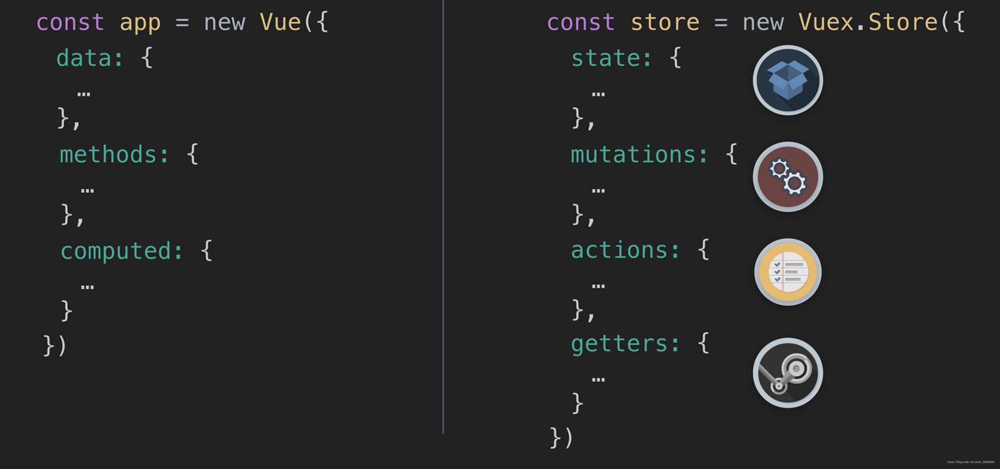
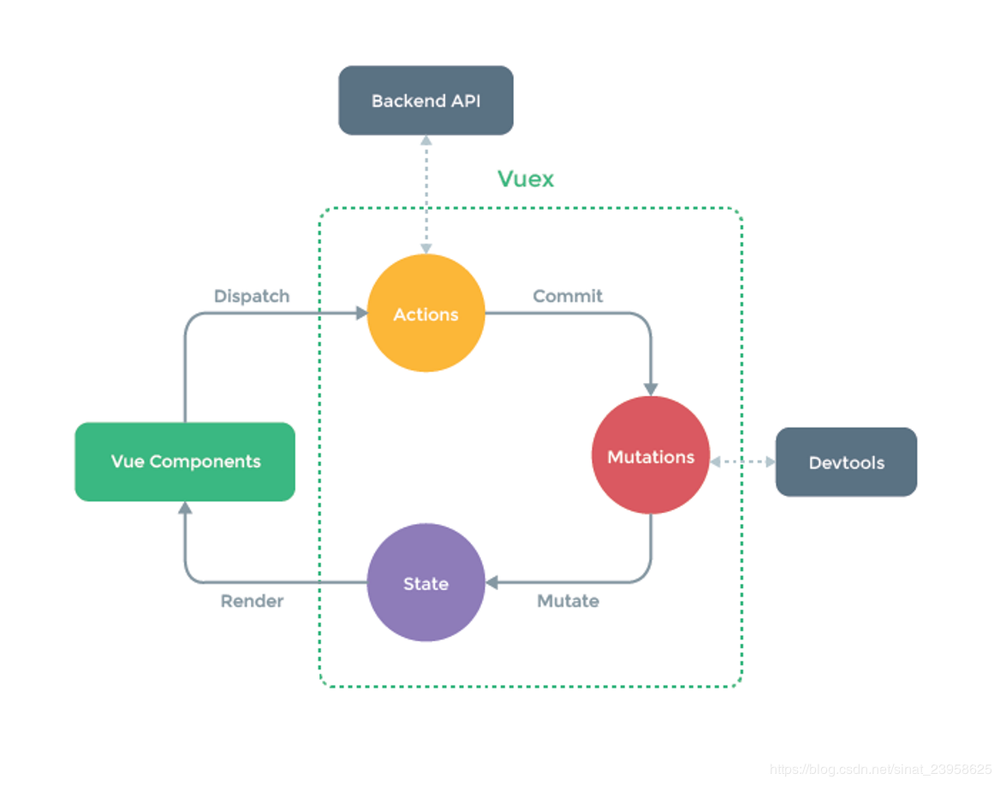

## 前言
可能你会使用vuex状态管理，但是对vuex原理存在着或多或少的疑惑和不解，这篇文章就针对vuex原理进行研究

## Vuex是什么
Vuex是专门为Vue服务，用于管理页面的数据状态、提供统一数据操作的生态系统，相当于数据库mongoDB、mySQL等，任何组件都可以存取存取仓库中的数据。其中vuex类似的还有Redux, Redux大多用于React,针对Redux后续在做补充，现在就让我们好好了解下Vuex到底是啥东西

<span style="color: blue;font-weight: bold">Vuex采用MVC模式中的Model层，规定所有的数据都必须通过action->mutation->state这个流程来改变数据状态的。在结合Vue的数据视图双向绑定实现页面的更新。统一状态管理，可以让复杂的组件交互变得简单清晰，同时在调试时也可以通过DEVtools去查看状态。</span>

在当前前端的spa模块化项目中不可避免的是某些变量需要在全局范围内引用,此时父子组件的传值，子父组件的传值，兄弟组件间的传值成了我们需要解决的问题。虽然vue中提供了props(父传子)、emit(子传父)、兄弟间也可以用localstorage和sessionstorage。但是这种方式在项目开发中带来的问题比解决的问题(难管理、难维护、代码复杂、安全性低)。vuex的诞生也是为了解决这些问题，从而大大提高我们vue项目的开发效率

### 抛出问题
1. 使用Vuex只需执行Vue.use(Vuex)，并在Vue的配置中传入一个store对象的示例，store是如何实现注入的？
2. state内部是如何实现支持模块配置和模块嵌套的？
3. 在执行dispatch触发action(commit同理)的时候，只需传入(type, payload),action执行函数中第一个参数store是从哪儿获取的
4. 如何区分state是外部直接修改，还是通过mutation方法修改的

## Vue与Vuex的关系


看一下这个vue响应式的例子，vue中的data 、methods、computed，可以实现响应式。

视图通过点击事件，触发methods中的increment方法，可以更改state中count的值，一旦count值发生变化，computed中的函数能够把getCount更新到视图。
```html
<div id="app">
    <button @click="increment"></button>
    {{getcount}}
</app>
<script>
new Vue({
    el: "#app",
    // state
    data () {
      return {
        count: 0
      }
    },
      // view
    computed: {
        getCount(){
            return this.count
        }
    },
    // actions
    methods: {
      increment () {
        this.count++
      }
    },
})
</script>
```
那么vuex又和vue这个响应时的例子有什么关系呢？

> 我们可以用vuex实现与vue相同的响应时功能

其实原理是一样的，vuex中也有四个属性值:state、getter、actions、mutations

在没有actions的情况下
- 数据：state -> data。
- 获取数据 getter-> computed
- 更改数据 mutations-> Methods

**视图通过点击事件，触发mutations中方法，可以更改state中的数据，一旦state数据发生更改，getters把数据反映到视图**

那么actions,可以理解处理异步，而单纯多加的一层。

既然提到了mutions actions这时候 就不得不提commit，dispatch这两个有什么作用呢？

在vue例子中，通过click事件，触发methods中的方法。当存在异步时，而在vuex中需要dispatch来触发actions中的方法，actions中的commit可以触发mutations中的方法。同步，则直接在组件中commit触发vuex中mutations中的方法。



## Vuex实现
下面我们看下vuex中能像vue中实现改变状态，更新视图的功能

Vuex.js
```javascript
const store =  new Vuex.Store({
    
  state: {
      count: 0
  },
  
  //state的值只能通过mutations来修改
  mutations: {
      increment(state) {
          state.count++
      }
  },
  
  //this.$store.commit("increment")触发mutations中函数"increment"
  actions: {
      increment({commit}) {
            commit("increment"); //this.$store.commit("increment")
      }
    
  },
  
  //通过getter中的方法来获取state值
  getters: {
      getCount(state) {
          return state.count
      }
  }
  })
    
  export default store
```
app.vue
```vue
    <template>
    <div id="app">
            <button @click="increment">增加</button>
            <!-- 有时候不能直接 强制使用store里面的状态 this.$store.state.count -->
            {{this.$store.getters.getCount}}
    </div>
    </template>
     
    <script>
    export default {
        methods: {
        increment(){
                //this.$store.dispatch("increment")触发actions函数"increment"
                this.$store.dispatch("increment")
            }
        }
    }
    </script>
```

## 源码分析
### store注入组件install方法
<span style="color: red">解答问题：vuex的store是如何注入到组件中的？</span>

首先使用vuex，安装需要插件
```javascript
Vue.use(Vuex); // vue的插件机制，安装vuex插件
```
当use(Vuex)时候，会调用vuex中的install方法，装在xuex

下面是install的核心源码
```javacript
Vue.mixin({
  beforeCreate() {
    if(this.$options && this.$options.store) {
      // 找到根组件main上面挂一个$store
      this.$store = this.$options.store;
      // console.log(this.$store);
    } else {
      // 非根组件指向其父组件的$Store
      this.$store = this.$parent && this.$parent.$store;
    }
  }
})
```
可见，store注入vue的实例组件的方式，是通过vue的mixin机制，借助vue组件的生命周期钩子beforeCreate完成的。即每个vue组件实例化过程中，会在beforeCreate钩子前调用vuexinit方法

<span style="color: red">解答问题：vuex的state和getters是如何映射到各个组件实例中响应时更新状态呢</span>

### new Vue实现双向数据绑定
```javascript
this._s = new Vue({
  data: {
    // 只有data中的数据才是响应式
    state: options.state
  }
})
```
### getter实现
```javascript
// 实现getters原理
let getters = options.getters || {};
// console.log(getters);
// this.getters = getters; // 不是直接挂载到getters上，这样只会拿到整个函数体
this.getters = {};
// console.log(Object.keys(getters)); // ['myAge', 'myName']
Object.keys(getters).forEach(getterName => {
  // console.log(getterName);
  // 将getterName放到this.getters = {}中
  // console.log(this.state)
  Object.defineProperty(this.getters, getterName, {
    // 当你要获取getterName（myAge）会自动调用get方法
    // 箭头函数中没有this               
    get: () => {
        return getters[getterName](this.state)
    }
  })
})
```
<span style="color: blue">从上面源码，我们可以看出Vuex的state状态是响应时，是借助vue的data响应式，将state存入vue实例组件的data中；Vuex的getters则是借助vue的计算属性computed实现数据实时监听</span>

### matations实现
```javascript
let matations = options.matations || {};
// console.log(mutations);
this.mutations = {};
Object.keys(mutations).forEach(mutationName => {
  // console.log(mutationName)
  this.mutations[mutationName] = payload => {
    this.mutations[mutationName](this.state, payload);
  }
})
```
### actions实现
```javascript
// actions原理
let actions = options.actions || {};
this.actions = {};
forEach(actions, (actionName, value) => {
  this.actions[actionsName] = payload => {
    value(this, payload)
  }
})
```
### commit dispatch实现
```javascript
commit(type, payload) {
  this.mutations[type](payload)
}

// type是actions的类型
dispatch = (type, payload) => {
  this.actions[type](payload)
}
```

## 原理总结
Vuex是通过全局注入store对象，来实现组件间的状态共享。在大型复杂的项目中(多级组件嵌套)，需要实现一个组件更改数据，多个组件自动获取更改后的数据进行业务逻辑处理，这时候使用vuex比较合适。假如只是多个组件间的传递传递数据，使用vuex未免大材小用，其实只用组件间常用的通信方式即可


[vuex原理](https://blog.csdn.net/weixin_44667072/article/details/101164766)

[vuex实现及简略解析](https://segmentfault.com/a/1190000018343771)