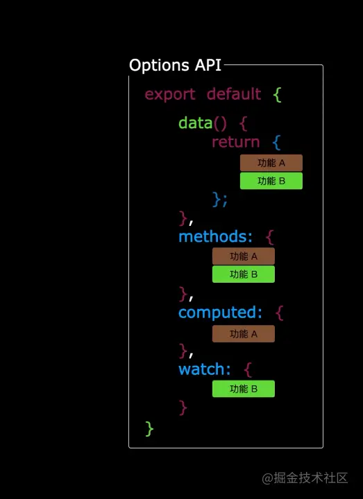
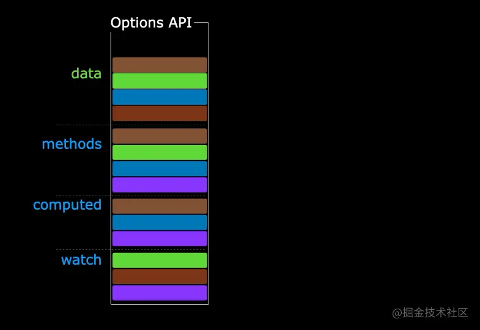
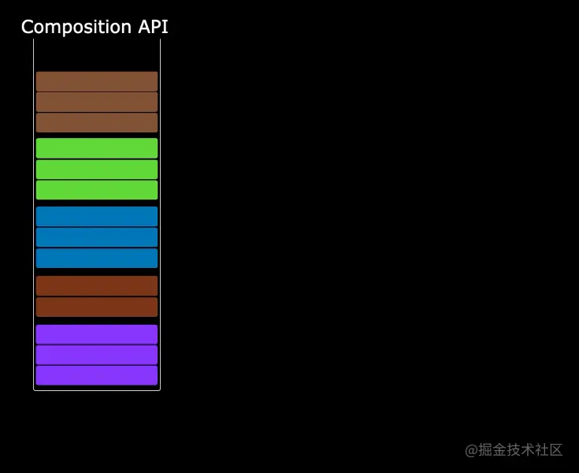

## 花里胡哨的需求
- 第一天：产品突发奇想，让把按钮字体随机变色
- 两个小时候，产品又说是不是按钮的背景是不是也可以随机变色
- 两分钟：两个按钮的变色频繁是不是可以不一样，或者随心组合

## 解决思路
这个需求看起来花里胡哨实际上核心的逻辑只有一个就是随机变色

至于后面提出的变态的变色频繁自定需求可以考虑将逻辑函数升阶为函数工厂的的方式解决。

难度在是在复杂的逻辑组合时很难保证代码的耦合度。这有啥Vue2的一个明显的缺点。React使用Hook后这个问题很好解决

### optionAPI的不足
1. 烦人的反复横跳
    在传统的Vue OptionsAPI中，新增或者修改一个需求，就需要分别在data,mounted,methods coumputed里修改，滚动条反复上下移动，我称之为反复横跳

    

2. Minxin与继承之殇
    想象一下如果我们想在所有的组件中都实现这样的花里胡哨的需求，又要考虑代码的耦合度。我们首先想到的是
    - Mixins
    - 高阶组件(Higher-order Components,aka HOCs)
    - Renderless Components(基于scoped slots/作用域插槽封装逻辑的组件)

    这三者都不是非常理想，主要问题在于
    - 模板数据来源不清晰，譬如mixin光看模板很难分清一个属性是哪里来的
    - 命名空间冲突
    - 性能问题。譬如HOC需要额外的组件逻辑嵌套 会导致无谓的性能开销
### Composition API横空出世
composition就是为了解决这个问题存在的，通过组合的方式，把零散在各个data,methods的代码重新组合，一个功能的代码放在一起维护，并且这些代码可以单独拆分成函数





## 代码实现
1. 编写一个变色的复合API工厂，首先将变色的逻辑封装在一个复合API工厂中，这个API还可以保证用参数控制变色的范围，和变色频繁
    ```
    function useColor(type, time) {
        const state = reactive({
            color: '#000000'
        });
        onMounted(() => {
            setInterval(() => {
                const r = type === 'r' ? Math.florr(Math.random() * 255).toString(16) : '00';
                const g = type === 'g' ? Math.florr(Math.random() * 255).toString(16) : '00';
                const b = type === 'b' ? Math.florr(Math.random() * 255).toString(16) : '00';
                var color = `#${r + g + b}`;
                state.color = color;
            }, time);
        })
        return toRefs(state);
    }
    ```
2. 根据需求组装视图组件
    我们只需要根据产品的需求，调用原有的变色API去组装就可以了，你要怎么样就怎么样。由于输出的数据本身还是响应时的，其实你即使组合后也可以是响应式的
    ```
    const MyComponents = {
        temeplate: `<button type="button" class="el-button" :style="{ background,color }"><span>按钮</span></button>`,
        setup() {
            const {
                color
            } = useColor('r', 100);
            const {
                color: background
            } = useColor('b', 100);

            return {
                color, 
                background
            }
        }
    }
    createApp(MyComponent).mount('#app');
    ```

## 资料
[忙了一夜用CompositionAPI征服产品妹子花里胡哨的需求](https://juejin.cn/post/6891885484524437518)