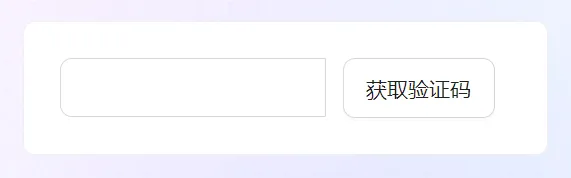

## 获取验证码组件
最近封装了一个 获取验证码 的组件，虽然算是一个比较小的组件，但是还是感觉比较有意思的，大致效果如下


## 最基础组件
我们先从简单的开始,先实现一个比较简单的组件，后面再去完善它，最基础代码如下
```html
<!-- Index.vue -->
<template>
    <Input class="countdown-input" size="large">
        <template #addonAfter>
            <Button size="large">获取验证码</Button>
        </template>
    </Input>
</template>
<script lang="ts" scoped>
    import {Input, Button} from 'ant-design-vue';
</script>
<style lang="less" scoped>
    .countdown-input {
        :deep(.ant-input-group-addon) {
            border: none;
            background-color: transparent;
            button {
                font-size: 14px;
            }
        }
    }
</style>
```
这个时候可以看到这个组件的出行已经出来了



## 实现倒计时
接下来我们需要下一个 useCountSown 的 Hooks,来编写倒计时的逻辑~大家在封装组件的时候，要有这种习惯，就是把一些逻辑比较紧密的代码抽取到一个Hooks中去

:::tips
注意: setState 是异步更新，所以想获取最新值需要使用useRef
:::

```js
// useCountdown.ts
import {ref, unref} from 'vue';
import {tryOnUnmounted} from '@vueuse/core';

export function useCountDown(count: number) {
    // 用来记录当前的数字
    const currentCount = ref(count);

    // 用来记录是否开始计时了
    const isStart = ref(false);

    // 记录定时器
    let timerId:ReturnType<typeof setInterval> | null;

    // 清除定时器
    function clear() {
        timerId && window.clearInterval(timerId);
    }

    // 停止计时
    function stop() {
        isStart.value = false;
        clear();
        timerId = null;
    }

    // 重置
    function reset() {
        currentCount.value = count;
        stop();
    }

    // 开始计时
    function start() {
        if(unref(isStart) || !!timerId) return;
        isStart.value = true;
        timerId = setInterval(() => {
            if(unref(currentCount) == 1) {
                // 计时结束，恢复初始
                reset();
            } else {
                // 计时继续，每次减1
                currentCount.value -= 1;
            }
        }, 1000)
    }

    // 重启
    function restart() {
        reset();
        start();
    }
    // 组件销毁的时候记得初始化
    tryOnUnmounted(() => {
        reset();
    })
    return { start, reset, restart, clear, stop,currentCount, isStart}
}
```
封装完后可以到组件中使用
```html
<!-- Index.vue -->
<template>
    <Input class="cuntdown-input" size="large">
        <template #addonAfter>
            <Button size="large" @click="start">{{ButtonText}}</Button>
        </template>
    </Input>
</template>
<script lang="ts" setup>
    import {unref, computed} from 'vue';
    import {Input, Button} from 'ant-design-vue';
    import { useCountdown} from './useCountdown.ts';

    const {currentCount, isStart, start} = useCountdown(60);
    const buttonText = computed(() => {
        return !unref(isStart) ? '获取验证码' : `${unref(currentCount)秒后重新获取}`
    })
</script>
<style lang="less" scoped>
    .countdown-input {
        :deep(.ant-input-group-addon) {
            border: none;
            background-color: transparent;
            button {
                font-size: 14px;
            }
        }
    }
</style>
```
这样就能到达想要的倒计时效果，但是还是有很多不足，比如按钮没有禁用，而且尺寸不能自定义，也没有响应时把验证码的内容暴漏出去


## 完善组件封装
上面的组件封装的太简单了，一个好的组件需要具有比较好的自定义性、拓展性，所以我们需要完善一下组件的封装

可以把这个组件拆成两个部分
- CountdownInput 输入框
- CountButton 按钮

```html
<!-- CountInput.vue -->

<template>
    <Input v-bind="$attrs" class="countdown-input" :size="size" v-model:value="value">
        <template #addonAfter>
            <CountButton :size="size" :count="count" :beforeStartFunc="sendCodeApi"/>
        </template>
    </Input>
</template>
<script lang="ts" setup>
    import {PropType, computed} from 'vue';
    import CountButton from './CountButton.vue';
    import {Input} from 'ant-design-vue';

    defineOptions({ name: 'CountDownInput', inheritAttrs: false });

    const emits = defineEmits<{
        (e: 'update:value', v: string):void
    }>();

    const props = defineProps({
        // 验证码的值
        value: { type: String },
        // 尺寸大小
        size: { type: String, validator: (v: string) => ['default', 'large', 'small'].incluedes(v)},
        // 秒数
        count: { type: Number, default: 60},
        // 发送获取验证码请求的 api
        sendCodeApi: {
            type: Function as PropType<() => Promise<boolean>>,
            default: null
        }
    })

    const value = computed<string>({
        get() {
            return props.value as string;
        },
        set(v: string) {
            emits('update:value', v);
        }
    })
</script>
<style lang="less" scoped>
    .countdown-input {
        :deep(.ant-input-group-addon) {
            border: none;
            background-color: transparent;
        }
        button {
            font-size: 14px;
        }
    }
</style>
```
### CountButton 
```html
<!-- CountButton.vue -->
<template>
    <Button v-bind="$attrs" @click="handleStart" :loading="loading">
        {{getButtonText}}
    </button>
</template>
<script lang="ts" setup>
    import { ref, computed, unref, PropType } from 'vue';
    import { Button } from 'ant-design-vue';
    import { useCountdown } from './useCountdown';
    import { isFunction } from 'lodash-es';

    defineOptions({ name: 'CountButton' });

    const props = defineProps({
        count: {type: Number, default: 60},
        beforeStartFunc: {
            type: Function as PropType<() => Promise<boolean>>,
            default: null,
        }
    })
    
    const loading = ref(false);
    const { currentCount, isStart, start } = useCountdown(props.count);

    const getButtonText = computed(() => {
        return !unref(isStart) ? '获取验证码' : `${unref(currentCount)}秒后重新获取`；
    })

    async function  handleStart() {
        const { beforeStartFunc } = props;
        if(beforeStartFunc && isFunction(beforeStartFunc)) {
            loading.value = true;
            try {
                const canStart = await beforeStartFunc();
                canStart && start();
            } finally {
                loading.value = false;
            }
        } else {
            start();
        }
    }
</script>
```
## 最终使用
```html
<!-- Index.vue -->
<template>
    <CountdownInput size="large" v-model:value="code"/>
</template>
<script lang="ts" setup>
    import { ref } from 'vue';
    import CountdownInput from './CountdownInput.vue';

    const code = ref('')
</script>
```
效果如下
