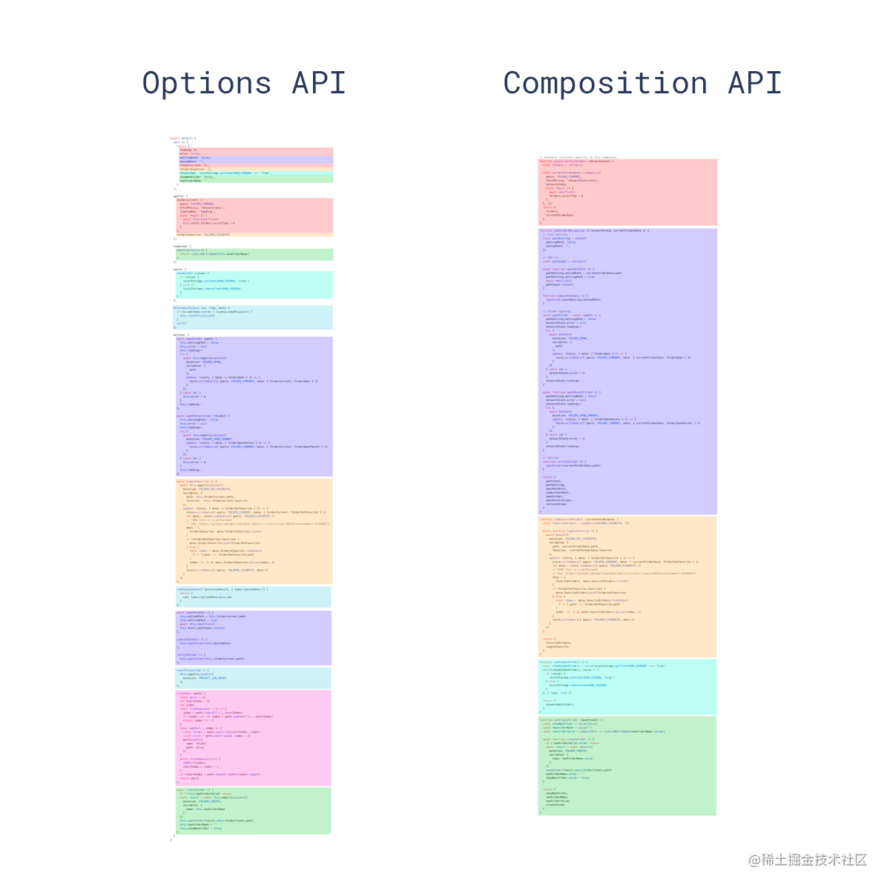

> 2020年02月16日 20:51 

## 前言
vue3目前已经发布了alpha版本，除了服务端渲染，其他工作已经全部完成。尤大大也升级了vue-loader，提供了一个可以使用.vue组件的[测试模板](https://github.com/vuejs/vue-next-webpack-preview/blob/master/src/App.vue).**vue3最大的改变是加入了这个灵感来源于React Hook的Composition API(组成api), 这个API将对Vue编程产生了根本性变革，但是vue3还是兼容vue2的Options API**.除此之外，还引入了一些不兼容修改，具体可以查看[Vue3已合并的RFC](https://github.com/vuejs/rfcs/pulls?q=is%3Apr+is%3Amerged+label%3A3.x).本文并不会全面介绍vue3的新特效，只会着重与vue3的核心——Composition API。

## 小试牛刀
先看下基础例程
```html
<template>
    <button @click="increment">
        Count is: {{ state.count }}, double is: {{ state.double }}
    </button>
</template>
<script>
import { reactive, computed } from 'vue';

export default {
    setup(props, context) {
        const state = reactive({
            count: 0, 
            double: computed(() => state.count * 2)
        })
        function increment() {
            state.count++;
        }
        return {
            state, 
            increment
        }
    }
}
</script>
```
从上面的基础例程可以看到，vue3的.vue组件答题还是和vue2一致，由template,script和style组成，做出的改变有一下几点
1. 组件增加了setup选项，组件内所有的逻辑都在这个方法内组织，返回的变量或方法都可以在末班中使用
2. vue2中data、computed等选项让然支持，但使用setup时不建议在使用vue2中的data等选项
3. 提供了reactive、computed、watch、onMounted等抽离的接口代替vue2中的data等选项

## 为什么Composition API？
为什么使用Composition API代替Options API？难道将各种类型的代码分类卸载对应的地方不比把所有的代码都卸载一个setup函数中更好？要解答这两个问题 我们首先思考一个Options API的局限

### 代码组织
Options API是把代码分写卸载几Option中
```js
export default {
    components: {},
    date() {};
    computed: {},
    watch: {},
    mounted() {}
}
```
当组件比较简单只有一个逻辑的时候，稍微麻烦的是用户必须在几个Options之间跳来跳去，这个是小问题，写代码哪能不用鼠标呢？挑战往往在复杂的情况下才会出现。当一个vue组件内存在多个逻辑时会怎么样呢?



图片中相同的样色表示一种逻辑
1. 使用Options API时，相同的逻辑写在不同的地方，各个逻辑的代码交叉错乱，这对维护别人嗲吗的开发者来说绝不是一件简单的事，理清楚这些代码都需要花费不少时间
2. 而使用Composition API时，相同的逻辑可以写在同一个地方，这些逻辑甚至可以使用函数抽离出来，各个逻辑之间界限分明，即便维护别人的代码也不会在"读代码"上话费太多时间(前提是你的前任会写代码)

必须指出的是，Composition API提高了代码的上限，也降低了代码的下限。在使用Options api时，即便再菜的鸟也能保证各种代码按其种类进行划分。但使用Composition API时，由于其开放性，出现什么代码是无法想象的。但毫无疑问，Options API到Composition API是vue的一个巨大进步，vue从此可以从容面对大型项目。

### 逻辑抽取与复用
在vue2中要实现逻辑复用主要有两种方式
- mixin

    mixin的确能抽取逻辑并实现逻辑复用(我更多用它来定义接口)，但是这种方式着实不好，mixin更多是一种代码复用的手段：
    - 命名冲突。mixin的所有option如果与组件或其他mixin相同会被覆盖(这个问题可以使用Mixin Factory解决)
    - 没有运行时实例。顾名思义，mixin不过是把对应的option混入组件内，运行时不存在所抽取的逻辑实例。
    - 含蓄的属性增加。mixin加入的option是含蓄的，新手会迷惑于莫名其妙就存在的一个属性，尤其是在有多个mixin的时候，无法知道当前属性是哪个mixin的。

- Scoped slot

    scoped slot也可以实现逻辑抽取，使用一个组件抽取逻辑，然后通过作用域插槽暴露给子组件

    ```html
    // GenericSort.vue
    <template>
        <div>
            <!-- 暴露逻辑的数据给子组件 -->
            <slot :data="data"></slot>
        </div>
    </template>
    <script>
        export default {
            // 在这里完成逻辑
            data() {

            }
        }
    </script>
    ```
    使用的时候
    ```html
    <template>
        <!-- 传入未排序的数据unSortdata -->
        <GenericSort data="unSortdata">
            <template v-slot="sortData">
                <!-- 使用经过处理后的sortData数据 -->
            </template>
        </GenericSearch>
    </template>
    ```
    但这种方式还是有很多缺点
    - 增加缩进。一两个时没有多大影响，但过多时可读性边差。
    - 一般需要增加配置，不灵活。需要在slot上增加配置，以应对更多的情况
    - 性能差。仅为了抽取逻辑，需要创建维护一个组件实例

- Composition Function

    在vue3中提供了一个叫Composition Function的方式,这种方式允许像函数搬抽离逻辑
    ```html
    <template>
        <div>
            <p>{{count}}</p>
            <button @click="onClick" :disabled="state">Start</button>
        </div>
    </template>

    <script>
        import { ref } from 'vue';
        // 倒计时逻辑的Composition Function
        const useCountdown = initialCount => {
            const use = ref(initialCount);
            const state = ref(false);
            const start = initCount => {
                state.value = true;
                if(initCount > 0) {
                    count.value = initCount;
                }
                if(!count.value) {
                    count.value = initialCount;
                }
                const interval = setInterval(() => {
                    if(count.value === 0) {
                        clearInterval(interval);
                        state.value = false;
                    } else {
                        count.value--;
                    }
                }, 1000);
            }
            return {
                count, 
                start, 
                state
            }
        }
        export default {
            setup() {
                // 直接使用倒计时逻辑
                const { count, start, state } = useCountDown(10);
                const onClick = () => {
                    start();
                }
                return { count, onClick, state }
            }
        }
    </script>
    ```
    vue3建议使用如React hook中一样使用use开发命名抽取的逻辑函数，如上代码抽取的逻辑几乎如函数一般，使用的时候也及其方便，完胜vue2中抽取逻辑的方法。

### TS支持
<span style="color: red">vue2比较令人诟病的地方还是对ts的支持，对ts支持不好是vue2不适合大型项目的一个重要原因。其根本原因是Vue依赖单个this上下文来公开属性，并且vue中this比在普通的javascript更具魔力(如methods对象下的单个method中this并不指向methos，二三指向vue实例)</span>。换句话说，尤大大在设计Options API时并没有考虑对ts引用的支持。那么vue2中是怎么做到对ts的支持。

```html
<script lang="ts">
    import { Vue, Component, Prop } from 'vue-property-decorator';

    @Component
    export default class YourComponent extends Vue {
        @Prop(Number) readonly propA: number | undefined
        @Prop({ default: 'default value' }) readonly propB!: string
        @Prop([String, Boolean]) readonly propC: string | boolean | undefined;
    }
</script>
```
vue2对ts的支持主要是通过vue class component,还需引入vue-property-decorator包，该库完全依赖于vue-class-component包，咋一看，这不是支持了吗？下面聊聊这种缺点
1. <span style="color: red">vue class component与js的vue组件差异太大，另外需要引入额外的库，学习成本大幅度增高。</span>
2. <span style="color: red">依赖于装饰器语法。而目前装饰器目前还处于stage2阶段，在实现细节上还存在许多不确定性，这使其成为一个相当危险的基础</span>
3. <span style="color: red">复杂性增高。采用Vue class component且需要使用额外的库，相比于姜丹的js vue组件，显然复杂化。</span>

这些原因让人望而却步，vue2的ts项目数量不多也是可以让人理解的。相比与vue2，vue3对ts的支持则好得多：
1. vue3中是在setup中进行编程，setup不依赖this，大部分API大多使用普通的变量和函数，他们天然类型友好
2. 用Composition API编写的代码可以享受完整的类型推断，几乎不需要手动类型提示。这也意味着用提议的API编写的代码在TypeScript和普通Javascript中看起来几乎相同
3. 这些接口已获得更好的IDE支持，即使非TypeScript用户也可以从键入中受益。
## 接口一栏
Compositon API是一些列接口的总称，下文将逐一介绍Composition API的各个接口。[学习代码](https://github.com/PerryHuan9/vue3-test)

### setup
<span style="color: blue">setup是vue新增的一个选项，它是组件内使用Composition API的入口。setup中没有this上下问题的(js函数都有this，但是setup的this更vue2的this不是一个东西，已经完全没用了，固为没有)。</span>

- 执行时机

    <span style="color: red">setup是在创建vue组件实例并完成props的初始化之后执行的，也是在beforeCreate钩子之前执行s，这意味着setup中无法使用其他option(如data)中的变量，而其他option可以使用setup中返回的变量</span>

    [vue组件中方法执行顺序是怎么样的？](/source-vue/source-sequee.html)

- 与模板结合使用

    如果setup返回一个对象，这个对象的所有属性会合并到template的渲染上下文中，**也就是说可以在template中使用setup返回的对象的属性**

    ```html
    <template>
        <div>{{ count }} {{ object.foo }}</div>
    </template>
    <script>
    import { ref, reactive } from 'vue';
    export default {
        setup() {
            const count = ref(0);
            const object = reactive({foo: 'bar'});
            return {
                count, 
                object
            }
        }
    }
    </script>
    ```
- 与Render Function/jsx结合使用

    setup也可以返回render function,这个时候则与vue的render方法类似，次数不需要teplate
    ```js
    import { h, ref, reactive } from 'vue';
    export default {
        setup() {
            const count = ref(0);
            const object = reactive({ foo: 'bar' });
            return () => h('div', [
                count.value,
                object.foo
            ])
        }
    }
    ```
- setup的参数

    setup有两个参数，第一个参数为props,是组件的所有参数，与vue2中一样，参数是响应式的，改变会触发更新；第二个参数是setup context，包含emit等属性。下面是其函数签名
    ```js
    interface Data {
        [key: string]: unknown
    }
    interface SetupContext {
        attrs: Data,
        slots: Slots,
        parent: ComonentInstance | null,
        root: ComponentInstance,
        emit:((event: string, ...args:unkown[]) => void)
    }
    function setup(
        props: Data,
        context: SetupContext
    ): data
    ```
### reactive
reactive函数接收一个对象，并返回一个对这个对象的响应式代理。它与vue2中Vue.obserable()是等价的，为了避免与RxJs中的observable重名，故改名为reactive.
```html
<template>
    <div>
        <input type="text" v-model="state.input">
        <p>input: {{state.input}}</p>
        <p>computedInput: {{ state.computedInput }}</p>
    </div>
</template>
<script>
    import { reactive, computed, watch } from 'vue';
    export default {
        setup(props) {
            const state = reactive({
                input: '',
                computedInput: computed(() => '? ' + state.input + ' ?');
            })
            return { state }
        }
    }
</script>
```
必须注意的是，reactive使用者必须始终保持对返回的对象的引用，以保持反应性。该对象不能被破坏或散布，所有setup和组合函数中不能返回reactive的解构。
```html
<template>
    <div>
        {{input}}
        <button @click="onClick">change</button>
    </div>
</template>
<script>
    import { reactive, computed, watch, toRefs } from 'vue';
    export default {
        setup(props) {
            const state = reactive({ input: '' });

            const onClick = () => {
                state.input = '我已经改变了'
            }
            // return state 模板上下文丢失引用
            // return {...state, onClick} 模板上下文丢失引用
            return {...toRef(state), onClick}; // 正确的
        }
    }
</script>
```
如上组件如果不适用toRefs,在点击change按钮时，组件并不会重新渲染，也就是说模板中的input还是之前的值。出现这种情况的根本原因是js中是值传递，并不是引用传递。解决方案是使用toRefs，至于ref是什么，请看下文

### ref
ref函数接收一个用于初始化的值并返回一个响应式的和可修改的ref对象。该ref对象存在一个value属性，value保存着ref对象的值。
```html
<template>
    <div class="tf">
        <!-- 在模板中使用时不需要使用count.value，会自动解包 -->
        <p>{{count}}</p>
        <button @click="onClick(true)">+</button>
        <button @click="onClick(false)">-</button>
    </div>
</template>
<script>
    import {ref, reactive} from 'vue';

    export default {
        setup() {
            const count = ref(0);
            // 在reactive中使用也不需要count.value,也会解包
            const state = reactive({count});
            const onClick = isAdd => {
                isAdd ? count.value++ : count.value--;
            }
            return {count, onClick}
        }
    }
</script>
```
> 注意:在reactive和template中使用的时候，不需要使用.value，他们会自动解包

### isRef
isRef用于判断变量是否为ref对象
```js
const unwrapped = isRef(foo) ? foo.value : foo;
```
### toRefs
toRefs用于将一个reactive对象转化为属性全部为ref对象的普通对象
```js
const state = reactive({
    foo: 1,
    bar: 2
})
const stateRefs = toRefs(state); 
/*
Type of stateAsRefs:
{
  foo: Ref<number>,
  bar: Ref<number>
}
*/
```
toRefs在setup或者Composition Function的返回值特别有用
```js
import { reactive, toRefs } from 'vue';
function useFeatureX() {
    const state = reactive({
        foo: 1,
        bar: 2
    })
    return state;
}
function useFeature2() {
    const state = reactive({
        a: 1,
        b: 2
    })
    return toRefs(state);
}
export default {
    setup() {
        // 使用解构之后foo和bar都是丧失响应式
        const { foo, bar } = useFeatureX();
        // 即使使用了结构也不会丧失响应式
        const { a, b } = useFeature2();
        return  {
            foo, 
            bar
        }
    }
}
```
### computed
computed函数与vue2中computed功能一致，它接收一个函数并返回一个value为getter返回值的不可改变的响应式ref对象
```js
const count = ref(1);
const plusOne = computed(() => count.value + 1);
console.log(plusOne.value); // 2;
plusOne.value++; // 错误，computed不可改变

// 同样支持set和get属性
const count = ref(1);
const plusOne = computed({
    get: () => count.value + 1,
    set: val => { count.value = val - 1}
})
plusOne.value = 1;
console.log(count.value); // 0
```
### readonly
readonly函数接收一个对象(普通函数或者reactive对象)或者ref并返回一个只读的参数对象代理，在参数对象改变时，返回的代理对象也会相应改变。如果传入的是reactive或者ref响应对象，那么返回的对象也是响应的
```html
<template>
    <!--vue3中允许template下有多个根元素-->
    <input type="text" v-model="state.count">
    <button @click="onClick">change</button>
</template>
<script>
    import { reactive, readonly, watch } from 'vue';
    
    export default {
        setup() {
            const state = reactive({count: 12});
            const rnState = readonly(state);
            watch(() => {
                // state改变也会触发rnState的watch
                console.log(rnState.count)
            })

            const planObj = {count: 12};
            const rnPlanObj = readonly(planObj)
            const onClick = () => {
                planObj.count = 888;
                console.log(rnPlanObj.count); // 888;
            }
            return {state, onClick}
        }
    }
</script>
```
### watch
相比于vue2的watch，Composition API的watch不仅仅是将其逻辑抽取出来，其功能也得到了极大的丰富。下面看其类型定义
```js
type StopHandle = () => void;

type WatcherSource<T> = Ref<T> | (() => T)

type MapSources<T> = {
  [K in keyof T]: T[K] extends WatcherSource<infer V> ? V : never
}

type InvalidationRegister = (invalidate: () => void) => void

interface DebuggerEvent {
    effect: ReactiveEffect
    target: any
    type: OperationTypes
    key: string | symbol | undefined
}

interface WatchOptions {
    lazy?: boolean
    flush?: 'pre' | 'post' | 'sync'
    deep?: boolean
    onTrack?: (event: DebuggerEvent) => void
    onTrigger?: (event: DebuggerEvent) => void
}

// basic usage
function watch(
    effect: (onInvalidate: InvalidationRegister) => void,
    options?: WatchOptions
): StopHandle

// wacthing single source
function watch<T>(
    source: WatcherSource<T>,
    effect: (
        value: T,
        oldValue: T,
        onInvalidate: InvalidationRegister
    ) => void,
    options?: WatchOptions
): StopHandle

// watching multiple sources
function watch<T extends WatcherSource<unknown>[]>(
    sources: T
    effect: (
        values: MapSources<T>,
        oldValues: MapSources<T>,
        onInvalidate: InvalidationRegister
    ) => void,
    options? : WatchOptions
): StopHandle
```
- 基础用法

    ```html
    <template>
        <div>
            <input type="text" v-model="state.count">{{state.count}}
            <input type="text" v-model="inputRef">{{inputRef}}
        </div>
    </template>
    <script>
        import { watch, reactive, ref } from 'vue';

        export default {
            setup() {
                const state = reactive({ count: 0 });
                const inputRef = ref('');
                // state.count 与inputRef中任意一个源改变都会触发watch
                watch(() => {
                    console.log('state', state.count);
                    console.log('ref', inputRef.value);
                })
                return { state, inputRef }
            }
        }
    </script>
    ```
- 指定依赖源

    在基础用法中：
    - 当依赖了多个reactive或者ref是无法直接看到的，需要在回调中寻找
    - 在回调中我虽然使用了多个reactive，但我希望只有在某个reactive改变时才触发watch
    解决上面两个问题可以为watch指定依赖源
    ```html
    <template>
        <div>
            state2.count: <input type="text" v-model="state2.count"/>
            {{state2.count}}<br/>
            ref2: <input type="text" v-model="ref2">{{ref2}}<br/>
        </div>
    </template>
    <script>
        import { watch, reactive, ref } from 'vue';

        export default {
            setup() {
                const state2 = reactive({count: ''});
                const ref2 = ref('');
                // 通过函数参数指定reactive依赖源
                // 只有在state2.count改变时才出发watch
                watch(
                    () => state2.count,
                    () => {
                        console.log('state2.count', state2.count);
                        console.log('ref2.value', ref2.value);
                    }
                )
                // 直接指定ref已来院
                watch(ref2, () => {
                    console.log('state2.count', state2.count);
                    console.log('ref2.value', ref2.value);
                })
                return { state, inputRef, state2, ref2 }
            }
        }
    </script>
    ```
- watch多个数据源

    ```html
    <template>
        <div>
            <p>
                <input type="text" v-model="state.a"><br/>
                <input type="text" v-model="state.b"><br/>
            </p>
            <p>
                <input type="text" v-model="ref1"><br/>
                <input type="text" v-model="ref2"><br/>
            </p>
        </div>
    </template>
    <script>
        import { reactive, ref, watch } from 'vue';

        export default {
            setup() {
                const state = reactive({a: 'a', b: 'b'});
                // state.a 和 state.b任意一个改变都会触发watch的回调
                watch(() => [state.a, state.b], 
                    // 回调的第二个参数是对应上一个状态的值
                    ([a, b], [preA, preB]) => {
                        console.log('callback params:', a, b, preA, preB);
                        console.log('state.a', state.a);
                        console.log('state.b', state.b);
                        console.log('*********')
                    }
                )
                const ref1 = ref(1);
                const ref2 = ref(2);
                watch([ref1, ref2], ([val1, val2], [preVal1, preVal2]) => {
                    console.log('callback params:', val1, val2, preVal1, preVal2)
                    console.log('ref1.value:',ref1.value)
                    console.log('ref2.value:',ref2.value)
                    console.log('##############')
                })
                return { state, ref1, ref2 }
            }
        }
    </script>
    ```
- 取消watch

    <span style="color: red;font-weight:bold">watch接口会返回一个函数，该函数用以取消watch</span>
    ```html
    <template>
        <div>
            <input type="text" v-model="inputRef">
            <button @click="onClick">stop</button>
        </div>
    </template>
    <script>
        import { watch, ref } from 'vue';

        export default {
            setup() {
                const inputRef = ref('');
                const stop = watch(() => {
                    console.log('watch', inputRef.value);
                })
                const onClick = () => {
                    // 取消watch， 取消之后对应的watch不会在执行
                    stop()；
                }
                return {inputRef, onClick}
            }
        }
    </script>
    ```
- 清除副作用

    为什么需要清除副作用？有这样一种场景,在watch中执行异步操作时，在异步操作还没有执行完成，此时第二次watch被处罚，这时候需要清除上一次异步操作
    ```html
    <template>
        <div>
            <h3>Cleanup</h3>
            <input type="text" v-model="inputRef">
            <input type="text" v-model="inputRef2">
        </div>
    </template>
    <script>
        import {ref, watch} from 'vue';

        export default {
            setup() {
                const inputRef = ref('');
                const getData = value => {
                    const handler = setTimeout(() => {
                        console.log('已获得数据', value);
                    }, 5000);
                    return handler;
                }
                watch(onCleanup => {
                    const handler = getData(inputRef.value);
                    // 清除副作用
                    onCleanup(() => {
                        clearTimeout(handler);
                    })
                })

                // 另一种获取onCleanup的方式
                const inputRef2 = ref('');
                watch(inputRef2, (val, oldVal, onCleanup) => {
                    // 清除副作用
                    onCleanup(() => {
                        clearTimeout(handler);
                    })
                })
                return { inputRef, inputRef2 }
            }
        }
    </script>
    ```
    watch提供了一个onCleanup的副作用清除函数,该函数接收一个函数，在该函数中进行副作用清除。那么onCleanup什么时候执行？
    - <span style="color: red">watch的callback即将被第二次执行时候先执行onCleanup</span>
    - <span style="color: red">watch被停止时，即组件被卸载之后</span>
- watch选项-

    watch接口还支持配置一些选项以改变默认行为，配置选项可通过watch的最后一个参数传入

- lazy

    <span style="color: red">vue2中的watch默认在组件挂载之后是不会执行的，但如果希望理解执行，可以设置immediate为true。而vue3中,watch默认会在组件挂载之后执行，如果希望取得与vue2 watch同样的行为，可配置lazy为true</span>
    ```html
    <template>
        <div>
            <h3>Watch Option</h3>
            <input type="text" v-model="inputRef">
        </div>
    </template>
    <script>
        import { watch, ref } from 'vue';

        export default {
            setup() {
                const inputRef = ref('');
                // 配置lazy为true之后，组件挂载不会执行，直到inpurRef改变才执行
                watch(() => {
                    console.log(inputRef.value);
                }, {lazy: true});
                return {inputRef}
            }
        }
    </script>
    ```
- deep

    如vue2的deep参数一般，在设置deep为true之后，深层对象的任意一个属性改变都会出发回调的执行
    ```html
    <template>
        <div>
            <button @click="onClick">CHANGE</button>
        </div>
        </template>
        <script>
        import {watch, ref} from 'vue'

        export default {
            setup() {
            const objRef = ref({a: {b: 123}, c: 123})
            watch(objRef,() => {
                console.log('objRef.value.a.b',objRef.value.a.b)
            }, {deep: true})
            const onClick = () => {
                // 设置了deep之后，深层对象任意属性的改变都会触发watch回调的执行
                objRef.value.a.b = 780
            }
            return {onClick}
            }
        }
        </script>
    ```
- flush

    **当同一个tick中发生许多状态突变时，Vue的反应性系统会缓冲观察者回调并异步刷新他们，以避免不必要的重复调用。默认的行为是：当调用观察者回调时，组件状态和DOM状态已经同步**。

    <span style="color: red">这种行为可以通过flush来配置，flush有三个值，分别是post(默认)、pre与sync。sync表示在状态更新时同步调用，pre则表示在组件更新之前调用。</span>

- onTrack 与 onTrigger

    onTrack 与 onTrigger 用于调试
    - onTrack:在reactive属性或ref被追踪为依赖时调用。
    - onTrigger：在watcher的回调因依赖改变而触发时调用
    ```html
    <template>
        <div>
            <h4>test onTrigger & onTrack</h4>
            <input type="text" v-model="debugRef">
        </div>
    </template>
    <script>
        import {watch, ref, reactive} from 'vue'

        export default {
            setup() {
            const debugRef = ref(0)
            // 在组件挂载之后只有onTrack被调用
            // 在debugRef改变之后先调用onTrigger，再调用onTrack
            watch(() => {
                console.log('debugRef.value:',debugRef.value)
            }, {
                onTrack() {
                debugger;
                },
                onTrigger() {
                debugger;
                }
            })
            return {inputRef, onClick, debugRef}
            }
        }
    </script>
    ```
### Lifecycle Hooks
Composition API当然也提供了组件生命周期钩子的回调
```js
import { onMounted, onUpdated, onUnmounted } from 'vue';

const MyComponent = {
    setup() {
        onMounted(() => {
            console.log('mounted!')
        })
        onUpdated(() => {
            console.log('updated!')
        })
        onUnmounted(() => {
            console.log('unmounted!')
        })
    }
}
```
对比vue2的生命周期钩子
- <span style="color: red">beforeCreate -> 使用setup()</span>
- <span style="color: red">created -> 使用setup()</span>
- <span style="color: red">beforeMount -> onBeforeMount</span>
- <span style="color: red">mounted -> onMounted</span>
- <span style="color: red">beforeUpdate -> onBeforeUpdate</span>
- <span style="color: red">updated -> onUpdated</span>
- <span style="color: red">beforeDestroy -> onBeforeUnmount</span>
- <span style="color: red">destroyed -> onUnmounted</span>
- <span style="color: red">errorCaptured -> onErrorCaptured</span>

### provide & inject
类似于vue2中provide与inject，vue3提供了对应的provide 与inject API
```js
import { provide, inject } from 'vue';

const ThemeSymbol = Symbol();
const Ancestor = {
    setup() {
        provide(ThemeSymbol, 'dark');
    }
}
const Descendent = {
    setup() {
        const theme = inject(ThemeSybol, 'light');
        return {
            theme
        }
    }
}
```
### Template Refs
当时使用前文中的ref时会感到迷惑，模板中也有一个ref用于获取组件实例或dom对象，这样会不会冲突。而实际上在vue3中，ref会用来保存templates的ref
```html
<template>
    <div ref="root">
        Test Template Refs
    </div>
</template>
<script>
import { ref, onMounted } from 'vue';

export default {
    setup() {
        const root = ref(null);

        onMounted(() => {
            // 在render初始化后，DOM对象将被赋值为ref
            console.log(root.value); // div dom对象
        })
    }
}
</script>
```
### defineComponent
该接口是为了支持ts类型引用
```js
import { defineComponent } from 'vue';

export default defineComponent({
    props: {
        foo: String
    },
    setup(props) {
        props.foo // type: string
    }
})
```
当只有setup选项时
```js
import { defineComponent } from 'vue';

// provide props typing via argument annotation.
export default defineComponent((props: {foo: string}) => {
    props.foo;
})
```

## 总结
总的来说，vue3的Composition API为开发者提供了更大的灵活，但更大的灵活需要更大的规则，对编程者的代码素质有一定要求，一定程度上增加了vue的入门程度，另外为了持有原来类型的引用引入了ref，引入了复杂度，但相比Composition API所产生的效益，这些微不足道。


## 资料
[Vue3 Composition API 使用教程](https://juejin.cn/post/6844904066103902215)

[react适合做大型项目的一些原因](/source-react/react-readme.html#react适合做大型项目的一些原因)