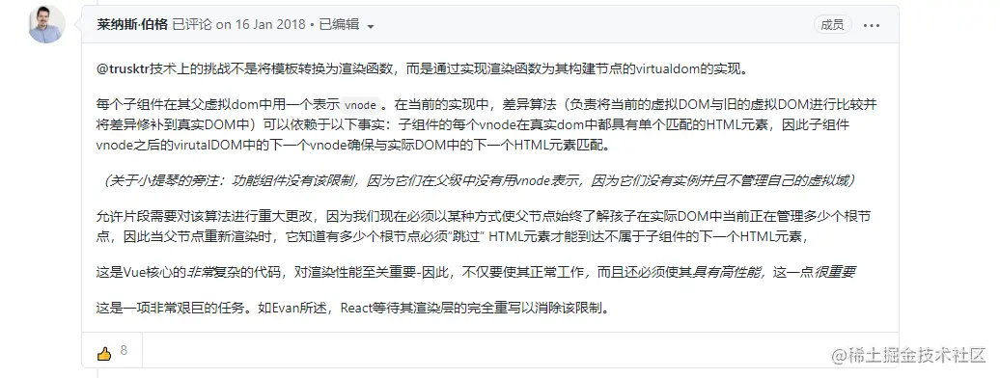

## vue编码但不渲染的标签
vue下载包
```javascript
vue i -s vue-fragment
```
在main.js里添加代码
```javascript
import Fragment form 'vue-fragment';
Vue.use(Fragment.Plugin)
```
在文件里就可以直接使用&lt;fragment&gt;元素了
```javascript
<template>
    <fragment>
        <div>test</div>
    </fragment>
</template>
```
最终渲染结果就只有div一种元素了
```html
<div>test</div>
```
用fragment这个技术的原因，主要是为了把fragment当成根节点，然后循环template标签

因为vue默认的template不能在根节点循环，但我又不想在去渲染多余的标签

这个问题我在循环element NavMenu导航菜单时发现的
```javascript
<template>
    <!-- fragment 在此做根节点 页面不渲染此标签-->
    <fragment>
        <template v-for="(item,index) in list"></template>
    </fragment>
</template>
```
## Vue3学习笔记之Fragment和Emits

### Fragments
Fragments作为<span style="color:red">vue3</span>的新特性之一，允许一个vue组件可以有多个根节点。创建一个如下的组件，vue3中开箱即用
```javascript
<template>
    <header>...</header>
    <main v-bind="attrs">...</main>
    <footer></footer>
</template>
```
相比于vue3, vue2规定创建一个vue组件，只能有一个根节点，在vue2中创建如上一个vue组件，会报如下错误
```
Errors compiling template:
Component template should contain exactly one root element.
```
原因是代表任何组件的vue实例需要绑定到一个单一的DOM元素中。唯一可以创建具有多个DOM节点的组件的方法就是创建一个没有底层Vue实例的功能的功能组件

<span style="color: blue">目前可以在vue2中使用vue-fragments库使用Fragments</span>

<span style="color: orange">Fragments</span>用起来像一个普通的DOM元素，但它是虚拟的，根本不会在DOM树中呈现。这样我们就可以将组件功能绑定到一个单一的元素中，而不需要创建一个多余的DOM节点

### Emit Component option
<span style="color: orange">Vue3</span>中组件发送的自定义事件需要定义在<span style="color:orange">emits</span>选项中
- 若自定义事件名与原生事件冲突，比如'click'，倘若没有emits选项中的设置，则会有触发两次事件的坑
- 更好的指示组件工作方式
    ```javascript
    <template>
        <button @click="$emit('click')">
            自定义事件
        </button>
    </template>
    <script>
        import { defineComponent } from 'vue';

        export default defineComponent({
            emits: ['click'] // 此处与原生事件名冲突，若没有设置，则点击会触发两次，一次为自定义事件，一次为原生事件
        })
    </script>
    ```
    > 注意：尽量避免自定义事件名与原生事件名冲突

- 参数有两种形式对象和数组，对象里面可以配置带校验函数的事件，为null表示不校验，校验函数将接收传递给$emit 调用的其他参数，如`$emit('event', 1)被调用，event事件对应的校验函数接收参数1，返回布尔值，表示事件参数是否有效
```javascript
// search-btn组件
<template>
	<a-button @click="onReset">
      重置
    </a-button>
    <a-button
      type="primary"
      @click="onSearch"
    >
      搜索
    </a-button>
</template>

<script lang="ts">
import { defineComponent } from 'vue';

export default defineComponent({
  name: 'search-btn',
  emits: {
    // 没有校验函数
    reset: null,
     // 带校验函数
    search: playload 为子组件向父组件传的值 => {
      // playload 为子组件向父组件传的值
      if (playload) {
    	// 校验通过
        return true;
      } else {
         // 校验不通过                      
        return false;
      }
    }
  },
  setup(props, { emit }) {
	const onReset = () => {
      emit('reset');
    };
    const onSearch = () => {
      emit('search');
    };

    return {
      onSearch
    };
  }
});
</script>
// 父组件 index.vue
 <search-btn @reset="onReset" @search="onSearch" />

// js核心代码
const onSearch = () => {
   console.log('执行外部的事件')
}

```
注意：校验不通过的时候，控制台会输出一个警告，但是emits事件会继续执行。

> 这里有个坑，一开始理解以为是校验不通过就拦截，不执行外部组件的方法，但经过测试，发现还是会继续执行，只是输出一个警告，所以个人认为这个校验函数还是比较鸡肋

### 思考
问题一：[vue2为什么不引入Fragments？](https://github.com/vuejs/vue/issues/7088)

根据Vue贡献者的说法，vue2限制组件只能有一个根节点， 主要原因是虚拟DOM diff算法依赖于具有单个根的组件，如果允许Fragments需要对该算法进行重大更改，不仅要使其正常工作，而且必须使其具有高性能，这是一项非常艰巨的任务。



划重点，vue2不引入主要是diff算法的缘故，

问题二：vue3引入Fragments，diff算法是否变化？渲染机制是否改变？

TODO： diff算法理解。


## 资料
[MDN](https://developer.mozilla.org/zh-CN/docs/Web/API/Document/createDocumentFragment)

[Vue.js 中的片段](https://juejin.cn/post/6844904040816476174)

[vue3学习笔记之Fragment和Emits](https://juejin.cn/post/6967259191299801124)

[vue3.0 diff算法详解](https://blog.csdn.net/zl_Alien/article/details/106595459)