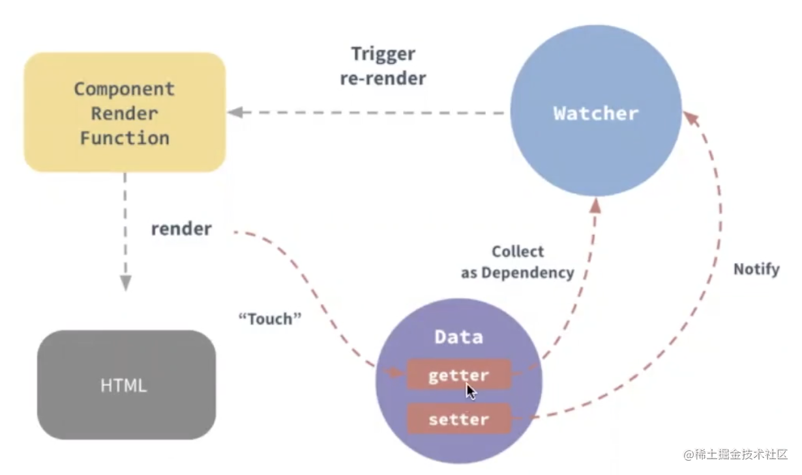

## 响应式
### 概念
<span style="color: red">响应式(Reactivity)是一种允许我们以声明式的方式去适应变化的编程范例</span>

通俗来说，就是数据变化了，响应的视图会更新(重新渲染)

### 实现思路
1. 当值被访问(touch)时触发跟踪(track)函数，收集依赖(collect as dependency)。
2. 检测值是否发生变化
3. 当值变化(setter)时触发(trigger)函数通知(notify)该值相关的依赖更新(re-render)



## Vue2的实现
### 基本原理
- Object.defineProperty

    ES5的Object.defineProperty()方法支持在一个对象上定义个新属性prop，或者修改一个对象现有属性prop，并返回此对象
    - 语法: Object.defineProperty(obj, prop, descriptor);
    - 参数
        - obj: 要定义属性的对象
        - prop: 要定义或修改的属性的名称或Symbol
        - descriptor:要定义或修改的属性描述符。对象里目前存在的属性描述符有两种主要形式:数据描述符和存储描述符。数据描述符是一个具有值的属性，改值可以是可写的，也可以是不可写的。存取描述符是由getter函数和setter函数所描述的属性
- 存取描述符的关键键值
    - get

        属性的getter函数，默认为undefined。当访问该属性时,会调用次函数。执行时不传入任何参数，但是也会传入this对象(由于继承关系，这里的this并不一定是定义该属性的对象),该函数的返回值会被用作属性的值
    - set

        属性的setter函数，默认为undefined。当属性值被修改时，会调用此函数。该方法接受一个参数(也就是被赋予的新值),会传入赋值时的this对象

### 实现方案
遍历数据data的所有属性，通过Object.defineProperty()拦截并改写(自定义)数据的属性的getter & setter函数，从而在访问对象属性和设置/修改对象属性的时候能够执行自定义的回调函数:在getter中进行依赖收集操作(track，访问过该属性的节点、组件、函数...都会被收集为依赖watcher),在setter中进行视图更新操作(tigger，通知前面收集到的依赖触发执行&视图重新渲染)
### 简单实现
```js
// 重写数组的原型方法
let oldArrayPrototype = Array.prototype;
let proto = Object.create(oldArrayPrototype);
['push', 'pop', 'unshift', 'shift', 'sort', 'reverse', 'splice'].forEach(method => {
    proto[method] = function() {
        updateView();
        oldArrayPrototype[method].call(this, ...arguments);
    }
})
// 监听数据变化
function observer(target) {
    if(typeof target !== 'object' || target === null) {
        // 不是对象，无法更改属性值，直接返回
        return target;
    }
    // 数组，重写原型方法
    if(Array.isArray(target)) {
        target.__proto__ = proto;
    }
    // 循环对象，重新定义属性的getter & setter
    for(let key in target) {
        defineReactive(target, key, target[key]);
    }
}
// 定义响应式
function defineReactive(obj, key, val) {
    observer(val);
    Object.defineProperty(obj, key,{
        get() {
            // 在这里进行依赖收集
            return val;
        },
        set(newValue) {
            if(newVal !== val) {
                observer(newVal);
                // 在这里进行依赖触发
                updateView();
                val = newVal;
            }
        }
    })
}
function updateView() {
    console.log('视图更新')
}
```
以上省略了依赖收集 watcher 的具体实现，可参考 [vue原理依赖收集–watcher](https://juejin.cn/post/6844904099310206989)

### 缺陷
1. 影响性能(如增加首次渲染时间)、增加内存消耗,尤其数据层级很深时
    - 原因:默认会进行递归
2. 无法监听数组改变length，vue在检测数组的变化时需要重写push,pop,unshift,shift,reverse,sort,splice这7个能改变原数组的原型方法
    - 原因:数组的length属性具有以下初始化键值
        ```js
        // 表示对象的属性是否可以被枚举，如能否通过for-in循环返回该属性
        enumberable: false

        // 表示对象的属性是否可以被删除，以及除value和writable特性(键值)外的其他特性(如get、set)是否可以被修改
        configurable: false;

        // 表示对象的属性值是否可以被改变
        writable: false
        ```
        length 属性初始为 non-configurable，无法删除 / 修改 length 属性，无法改写 length 属性的 getter & setter 函数，因此，通过改变 length 而变化的数组长度不能被 Object.defineProperty() 监测到。而 push, pop, unshift, shift, reverse, sort, splice 这几个内置的方法在操作数组时，都会改变原数组 length 的值，而 Object.defineProperty() 不能监测到数组长度的变化，因而不会触发视图更新。

3. 对象上新增的属性不能被拦截
    - 原因:Object.defineProperty()需要指定对象具体的属性名才能对其getter和setter进行拦截
    - 补丁:Vue2提供了一个api：this.$set,使新增的属性也拥有响应式的效果。但是需要判断到底什么情况下需要使用$set，什么时候可以直接触发响应式

## Vue3的实现
### Proxy
Proxy是一个包含另一个对象或函数并允许你对其进行拦截的对象。

ES6的Proxy对象用于创建一个对象的代理，从而实现对其基本操作的拦截 & 自定义。

- 语法-- const p = new Proxy(target, handler);
- 参数
    - target:要使用Proxy包装的目标对象(可以是任何类型的对象，包括原生数组，函数，甚至另一个代理)
    - handler：一个通常以函数作为属性的对象，它包含有Proxy的各个捕获器(trap),定义了在执行各种操作时代理p的行为。所有捕获器是可选的。如果没有定义某个捕获器，那么就会保留源对象的默认行为。Vue3用到的traps
        - handler.get():属性读取操作
        - handler.set()：属性设置操作
        - handler.deleteProperty():属性delete操作
        - handler.has()：属性in操作符
        - handler.ownKeys(): Object.getOwnPropertyNames方法Object.getOwnPropertySymbols方法的捕获器
### Reflect
> Reflect对象与Proxy对象一样,也是ES6为了操作对象而提供的新API。相比Object对象对象主要有如下特点/优势
1. <span style="color: red">将Object对象的一些明显属于语言内部的方法(比如Object.defineProperty),放到Reflect对象上</span>。现阶段，某些方法同事在Object和Reflect对象上部署，未来新的方法只部署在Reflect对象上。也就是说，从Reflect对象上可以拿到语言内部的方法
2. <span style="color:red">返回结果合理，不会报错，操作失败只会返回false</span>。比如Object.defineProperty(obj, name, desc)在无法定义属性时，会抛出一个错误；二Reflect.defineProperty(obj, name, desc)则会返回false
3. <span style="color:red">方法都是函数式的。</span>Object存在某些命令操作，如name in obj和delete obj[name],则对应的Reflect.has(obj, name)和Reflect.deleteProperty(obj, name)都是函数式操作
3. <span style="color:red">Reflect对象的方法与Proxy对象的方一一对应，只要是Proxy对象的方法，就能在Reflect对象上找到对应的方法。因此Proxy对象可以方便调用对应Reflect方法，完成默认行为，作为修改行为的基础</span>

### WeakMap
[WeakMap-Javascript|MDN](https://developer.mozilla.org/zh-CN/docs/Web/JavaScript/Reference/Global_Objects/WeakMap)

WeakMap对象是一组键/值对的集合，其中的键是弱引用。其键必须是对象，而只可以是任意的。原生的WeakMap持有的是每个键对象的『弱引用』，这意味着在没有其他应用存在时垃圾回收能正确进行。原生WeakMap的结构是特殊且有效的，其用于映射的key只有在其没有被回收才是有效的。

WeakMap键名所指向的对象，不计入垃圾回收机制，有助于防止内存泄露。所以WeakMap可以事先往对象上添加数据，又不会干扰垃圾回收机制

### 实现方案
用Proxy代理数据，创建响应式对象，拦截其getter和setter函数；依赖该数据/属性的方法(被称为副作用effect)默认先执行一次。触发所依赖属性的 get 方法，在 getter 函数中进行依赖收集（track，把当前属性与当前的 effect 建立联系，即映射表）；当属性变化时，会触发其 set 方法，在 setter 函数中进行更新（trigger，依次触发映射表中依赖当前属性的 effect）。

### 关键方法
- reactive

    把数据变为响应式，遍历 & 自定义对象所有属性的getter & setter函数，返回proxy对象
- effect

    - effect方法本质是一个高级函数(如何或出参是函数).默认会立即执行传入的函数(此时会触发内部函数响应式对象的get方法，从而触发依赖收集)，在依赖的数据变化时会在执行
    - 含义:副作用(数据变化会触发响应的回调),相当于Vue2中watcher
### 具体实现
- reactive

    ```js
    // 判断是否是对象
    function isObject(val) {
        return typeof val === 'object' && val !== null;
    }
    // 1. 响应式的核心方法
    function reactive(target) {
        // 创建响应式对象
        return createReactiveObject(target);
    }
    let toProxy = new WeakMap(); // 弱引用映射表，es6;放的是『原对象:代理后的对象』
    // 防止被代理过的对象再次被代理
    let toRaw = new WeakMap();// “代理后的对象：原对象”

    // 判断当前对象有无某属性
    function hasOwn(target, key) {
        return target.hasOwnProperty(key);
    }
    // 创建响应式对象
    function createReactiveObject(target) {
        if(!isObject(target)) return target;
        let proxy = toProxy.get(target);
        if(proxy) {
            // 如果target已经有响应的代理后的对象，直接返回之前代理过的结果即可
            return proxy;
        }
        if(toRaw.has(target)) { // 判断target是否已经是reactive对象
            // target 已经是代理后的对象了，则无需再次代理
            return target;
        }
        const baseHandler = {
            // reflect有点：不会报错&会有返回值；以后替代Object
            get(target, key, receiver) {
                //target:原对象，key：属性，receiver：当前代理对象proxy(target被代理后的对象)
                console.log('获取');
                let res = Reflect.get(target, key, receiver);
                // res 是当前获取到的值
                return isObject ? reactive(res) : res; // 按需实现递归
            },
            set(target, key, value, receiver) {
                // 识别是 修改属性or 新增属性
                let hadKey = hasOwn(target, key); // 判断这个属性以前有没有
                let oldValue = target[key];
                let res = Reflect.set(target, key, value, receiver);
                if(!hadKey) {
                    console.log('新增属性');
                    console.log('设置')
                } else if(value !== oldValue) {
                    // 屏蔽无意义的修改(即修改前后值相同)
                    console.log('修改属性')
                    console.log('设置')
                }
                return res;
            },
            deleteProperty(target, key) {
                console.log('删除');
                let res = Reflect.deleteProperty(target, key);
                return res;
            }
        }
        // 创建观察者
        let observer = new Proxy(target, baseHandler);
        toProxy.set(target, observer);
        toRaw.set(observer, target);
        return observer
    }
    ```
- effect
    ```js
    // reactive 中函数 createReactiveObject 的 baseHandler 修改如下
    const baseHandler = {
        get(target, key, receiver) {
        let res = Reflect.get(target, key, receiver);
        // 收集依赖（把属性 & 对应的 effect 建立联系），即 订阅【把当前的 key 与 effect 对应起来】
        track(target, key); // 如果目标上的 key 变化了，重新让数组中的 effect 执行即可
        return isObject(res) ? reactive(res) : res; // 按需实现递归
        },
        set(target, key, value, receiver) {
        let hadKey = hasOwn(target, key);
        let oldValue = target[key];
        let res = Reflect.set(target, key, value, receiver);
        if (!hadKey) {
            trigger(target, 'add', key);
        } else if (value !== oldValue) {
            trigger(target, 'edit', key);
        }

        return res;
        },
        deleteProperty(target, key) {
        console.log('删除');
        let res = Reflect.deleteProperty(target, key);
        return res;
        },
    };
    ```
    ```js
    // 2.依赖收集（发布订阅）
    // 取值会触发 get，get 触发 track（track 里存映射表，最外层是个 WeakMap）；设置值时触发 set，set 触发 trigger，取出 effect 执行，更新视图

    // 栈：先进后出
    let activeEffectStacks = []; // 保存 reactiveEffect

    // 依赖的数据结构应该如下
    // {
    //   target: {
    //     key: [fn, fn, fn,...] // 一个属性可能对应多个副作用（即有多个 effect 都依赖这个属性）【应去重，所以用 Set 数据结构】
    //   }
    // }

    let targetSMap = new WeakMap(); // 集合 和 hash 表

    function track(target, key) {
        //若这个 target 中的 key 变化了，就执行栈中的方法
        let effect = activeEffectStacks[activeEffectStacks.length - 1];
        if (effect) {
            // 有对应关系，才创建关联【以下为动态创建依赖关系】
            let depsMap = targetSMap.get(target);
            if (!depsMap) {
            // 首次没有，设置一个并设默认值
            targetSMap.set(target, (depsMap = new Map()));
            }

            // 取对象的 key 对应的副作用数组
            let deps = depsMap.get(key);
            if (!deps) {
            depsMap.set(key, (deps = new Set()));
            }
            if (!deps.has(effect)) {
            deps.add(effect);
            }
        }
    }

    function trigger(target, type, key) {
        let depsMap = targetSMap.get(target);
        if (depsMap) {
            // 有才需要触发
            let deps = depsMap.get(key);
            if (deps) {
            // 将当前 key 对应的 effect 依次执行
            deps.forEach((effect) => effect());
            }
        }
    }

    // 响应式——副作用
    function effect(fn) {
        // 需要把 fn 这个函数 变成 响应式的函数
        let reactiveEffect = createReactiveEffect(fn);
        // 副作用 默认会先执行一次
        reactiveEffect();
    }

    function createReactiveEffect(fn) {
        let reactiveEffect = function () {
            // 创建的响应式的 effect
            return run(reactiveEffect, fn); // 2个目的：1、执行 fn；2、把这个 reactiveEffect 存到栈中
        };
        return reactiveEffect;
    }

    // 运行 fn & 把 effect 存起来
    function run(effect, fn) {
        try {
            activeEffectStacks.push(effect);
            fn(); // 和 vue2 一样，利用 js 的单线程
        } finally {
            // 即使前面报错，这里也会执行
            activeEffectStacks.pop();
        }
    }
    ```
- ref
    - ref中可以类似_isRef来判断是否为ref类型
    - reactive中get函数需要判断res是否为ref对象，若是直接返回value
    ```js
    // 如果传入ref的是一个对象，将调用reactive方法进行深层响应转换
    const convert = raw => isObject(raw) ? reactive(raw) : raw

    function ref(raw) {
        raw = convert(raw);
        const v = {
            _isRef: true,
            get value() {
                track(v, '');
                return raw;
            },
            set value(newValue) {
                raw = convert(newValue);
                trigger(v, '');
            }
        }
        return v;
    }
    ```
- computed
    - 返回一个ref对象
    - 原始值value应该放在闭包内，使用dirty字段决定是否被缓存
    - 依赖触发trigger时,不会立即执行effect,而是执行effect options中的scheduler
    ```js
    function effect(fn, options = {}) {
        const effect = createReactiveEffect(fn, options);
        if(!options.lazy) {
            effect();
        }
        return effect;
    }
    function createReactiveEffect(fn, options){
        const effect = function() {
            return run(effect, fn);
        }
        effect.scheduler = options.scheduler;
        return effect;
    }
    function computed(getterOrOptions) {
        const getter = isFunction(getterOrOptions)
            ? getterOrOptions
            : getterOrOptions.get;
        const setter = isFunction(getterOrOptions) ? () => {} : getterOrOptions.set;
        let value;
        let dirty = true;
        let v;
        const runner = effect(getter, {
            lazy: true,
            scheduler: () => {
            dirty = true;
            trigger(v, '');
            },
        });
        v = {
            _isRef: true,
            get value() {
            if (dirty) {
                value = runner();
                dirty = false;
            }
            track(v, '');
            return value;
            },
            set value(newValue) {
            setter(newValue);
            },
        };
        return v;
    }
    ```
### 应用
API | 特性 | 使用场景
--- | --- | ---
reactive | - 接受一个普通对象然后返回该普通对象的响应式代理<br/>- 响应式转换是"深层的"：会影响对象内部所有嵌套的属性<br/>返回的代理对象不等于原始对象。建议仅使用代理对象而避免依赖原始对象 | 只能用于代理非基本数据类型Object
toRefs | 可以将一个响应式对象(reactive Object)转换为普通对象，同时又把该对象中的每一个属性转换为对应的响应时属性(ref) | 保留被解构的响应式对象(reactive object)的响应式特性(reactivity)[响应式对象被解构后悔丢失响应式],e.g:...toRefs(data)
ref | --- | - 一般用于给JS基本数据类型添加响应式(也支持非基本类型的object)<br/>- 基本类型有7个，只能使用ref:String, Number, BigInt，Boolean，Symbol,Null, Undefined
watch | --- | ---
computed | --- | ---
### 优点
1. 性能(如首次渲染时间)、内存小号等方面都优于vue2
2. 可以监听数组改变length
3. 对象上原有属性 & 新增属性都可以拦截
### 缺点
兼容性 IE11及以下版本不兼容ES6的Proxy

## 资料
[vue3手写 isRef、isReactive、isReadonly、isProxy的判断](https://blog.csdn.net/weixin_43245095/article/details/113986306)

[vue3 的响应式实现__Vue.js](https://www.vue-js.com/topic/609d190496b2cb0032c38bca)