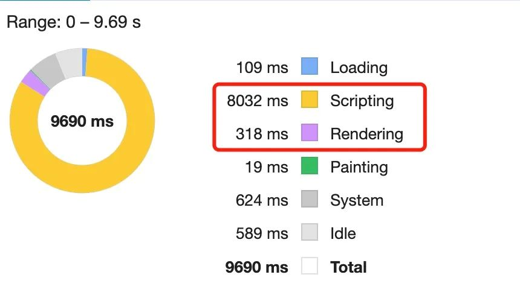
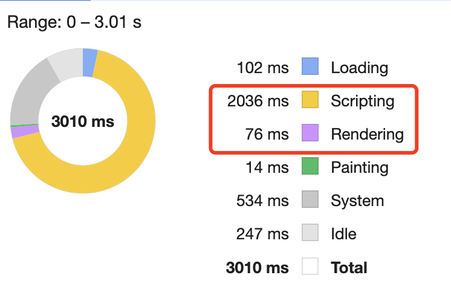

- Scripting: Javascript逻辑处理时间
- Rendering: UI渲染时间

有人会问，不应该是数据量多导致渲染慢吗? 那为啥耗时都在Scripting呢？

那是因为Vue3在渲染前会进行一系列的Javascript逻辑处理，包括
1. 数据创建
2. 模板解析
3. 虚拟DOM创建
4. 虚拟DOM转真实DOM

不过最耗时的是可能就是后两步了，所以需要针对这个问题，做一个解决方案

页面代码
```html
<template>
   <Row>
        <Col :span="8" v-for="dataItem in dataSource">
            <div style="height: 800px; overflow-y: auto">
                <List item-layout="horizontal" :data-source="dataItem">
                    <template #renderItem="{item}">
                        <ListItem>
                            <ListItemMeta :description="item.description">
                                <template #title>
                                    <div>{{ item.title }}</div>
                                </template>
                                <template #avatar>
                                    <Avatar :src="item.avatar"/>
                                </template>
                            </ListItemMeta>
                        </ListItem>
                    </template>
                </List>
            </div>
        </Col>
   </Row> 
</template>
<script setup lang="ts">
    import { shallowRef, onMounted } from 'vue';
    import { Row, Col, List, ListItem, ListItemMeta, Avatar } from 'ant-design-vue';

    const dataSource = shallowRef<any[]>([[], [],[]]);

    const fetchData = () => {
        dataSource.value = [
            new Array(200).fill({
                title: '这是数据1的标题',
                description: '这是数据1的描述',
                avatar: 'https://next.antdv.com/assets/logo.1ef800a8.svg'
            }),
            new Array(200).fill({
                title: '这是数据2的标题',
                description: '这是数据2的描述',
                avatar: 'https://next.antdv.com/assets/logo.1ef800a8.svg'
            }),
            new Array(200).fill({
                title: '这是数据3的标题',
                description: '这是数据3的描述',
                avatar: 'https://next.antdv.com/assets/logo.1ef800a8.svg'
            })
        ]
    }
    onMounted(() => {
        fetchData();
    })
</script>
```
## 懒加载分页？虚拟滚动？不行
很多人第一想象到的解决方案就是做分页，其实分页和懒加载都是一个道理，就是按需去加载数据，但是不好意思，后端接口是老接口并且没有做分页，团队不想耗费后端精力去重构这个接口，所以这条路就别想了！！

又有人说虚拟滚动，这么说吧，虚拟滚动用在性能好的电脑上效果是很不错的，如果用在性能差的电脑上，那么效果会非常糟糕，毫无疑问虚拟滚动确实会减少首屏加载的时间，但是性能差的电脑滚动快了，会有白屏现象，而且很严重，，熟悉虚拟滚动的人都知道，虚拟滚动是根据滚动时间去重新计算渲染区域的，这个计算时需要时间的，但是用户滚动是很快的，性能差的电脑根本计算不过来所以导致会有短暂白屏现象。。

又有人说虚拟滚动不是可以做预加载吗？可以解决短暂白屏现象。还是那句话，在性能好的电脑上确实可以，但是性能差的电脑上，你预渲染再多也没用，该白屏还是得白屏

## 分片渲染
不能做分片，不能做懒加载，不能做虚拟滚动，那么咋办呢？我回家挨说选择了分片渲染进行渲染，也就是在浏览器渲染的每一帧中去不断渲染列表数据，一直渲染出整个列表数据位置。

这样做就能保证首屏时不会一股脑把整个列表都渲染出来，而且是先进侯爷后，在慢慢把所有列表都渲染完成。

### 实施
要这么才能保证在每一帧中去控制列表渲染呢？可以使用 requestAnimationFrame，我们先封装一个useDefer
- frame： 记录当前的帧数
- checkIsRedner: 拿列表每一项的索引去跟当前帧数比较，到达了制定索引帧数才能渲染这一项

```js
import { readonly, ref } from 'vue';

export const useDefer = () => {
    const frame = ref(0);
    const updateFrame = () => {
        requesetAnimationFrame(() => {
            // 每一帧递增
            frame.value++;
            updateFrame();
        })
    }
    updateFrame();
    const checkIsRedner =(index: number) => {
        // 判断是否需要渲染那
        return frame.value >= index;
    }
    return {
        frame: readonly(frame),
        checkIsRender
    }
}
```
页面里直接使用这个HOOKS即可
```js
import { useDefer } from './useDefer';

// 使用hooks
const { checkIsRender } = useDefer();
```
```html
<Row>
        <Col :span="8" v-for="dataItem in dataSource">
            <div style="height: 800px; overflow-y: auto">
                <List item-layout="horizontal" :data-source="dataItem">
                    <template #renderItem="{item, index}">
                        <!-- 加一个 v-if 判断 -->
                        <template v-if="checkIsRender(index)">
                            <ListItem>
                                <ListItemMeta :description="item.description">
                                    <template #title>
                                        <div>{{ item.title }}</div>
                                    </template>
                                    <template #avatar>
                                        <Avatar :src="item.avatar"/>
                                    </template>
                                </ListItemMeta>
                            </ListItem>
                        </template>
                    </template>
                </List>
            </div>
        </Col>
   </Row> 
```
这样就能保证了达到一定帧数时，才去渲染一定的列表数据，我们来看看效果，可以看到首屏快了很多  从8s->2s，因为首屏并不会一股脑加载所有数据，而是逐步加载，这一点看滚动条的变化就知道了




滚动条一直在变，因为数据在不断逐步渲染

### 优化点
我们在完成一个功能后，可以看出这个功能有什么
- 列表渲染完毕后，可以停止当前帧的计算
- 现在是一帧渲染一条数据，能否控制一帧渲染多条数据？

```js
import { onUnmounted, readonly, ref } from 'vue';

export const useDefer = (max: number, count: number = 1) => {
    const frame = ref(0);

    // 记录raf的id
    let rafId: number | null = null;
    const updateFrame = () => {
        rafId = requestAnimationFrame(() => {
            // 每一帧的时候递增 count
            frame.value = frame.value + count;
            // 渲染完就不计算计算了
            if(frame.vlaue >= max) return;
            updateFrame();
        })
    }
    updateFrame();
    const checkIsRender = (index: number) => {
        // 判断是否需要渲染那
        return frame.value >= index;
    }

    onUnmounted(() => {
        // 组件销毁时取消
        if(rafId) {
            cancelAnimationFrame(rafId)
        }
    })
    return  {
        frame: readonly(frame),
        checkIsRender
    }
}
```

```js
import { useDefer } from './useDefer'

// 使用hooks
const { checkIsRender } = useDefer(200,10)
```

[时间分片](/front-end/JavaScript/basices-time-siicing.html#web-worker)
