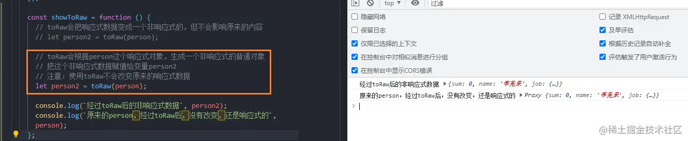
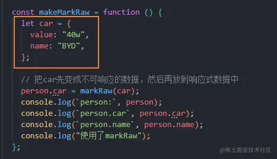
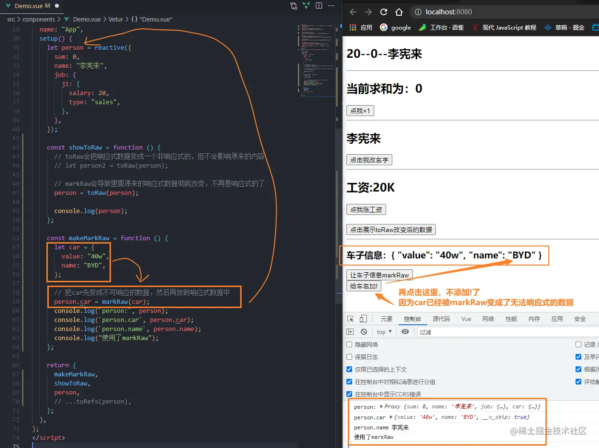

## raw的意思
- raw就是原始的意思
- toRaw 就是把一个响应式对象转化为普通对象
- markRaw 就是某个数据，标记为普通对象，当我们把它放到响应式对象中，也依然是非响应式的

## toRaw 
### toRaw的作用是什么？
- 将一个用reactive生成的响应式对象，变成非响应式的普通对象
- 然后赋值给新的对象
- 注意：不影响原来的对象

### roRaw的使用场景是什么？
- 用于读取响应式对象中的普通对象
- 对这个对象的所有操作，都不会引起页面更新

## markRaw
### 为什么需要用到markRaw
- 有些值不应被设置为响应式的,例如复杂的第三方库
    - 比如一个响应式对象中，要放入axios,或者别的随机数字的第三方库
    - 如果不让他变成非响应式的，那么Vue就会找到每个层级，让其都能响应式处理
    - 这样的情况下，性能就会受到严重影响
    - 所以我们需要让其变成永远都会成功响应式的数据，提高性能
- 当渲染具有不可变数据源的大列表时，跳过响应式可以提高性能

### 对谁使用markRaw?
- 这个数据原本不能是响应式的

    
- 然后把这个数据放到响应式对象中

    这个属性依然不是响应式的

### 怎么用markRaw
- 引入 markRaw
- 对一个原本不是响应式的数据进行使用markRaw,变成不响应式的数据

    