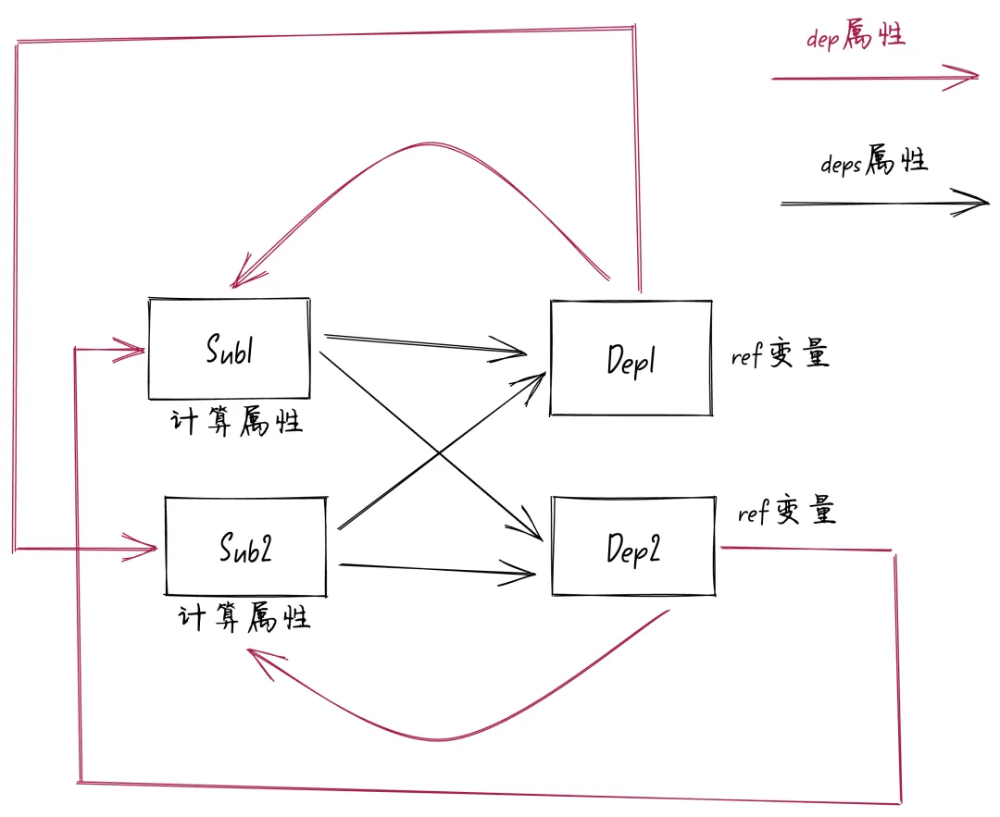
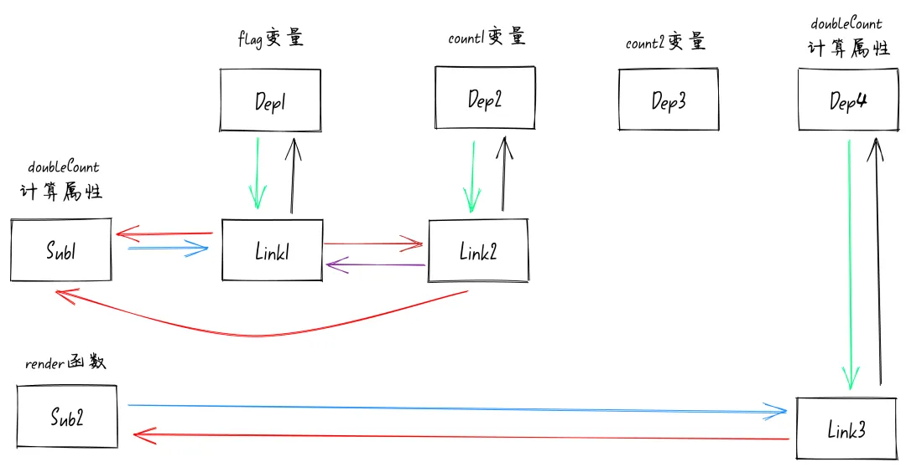
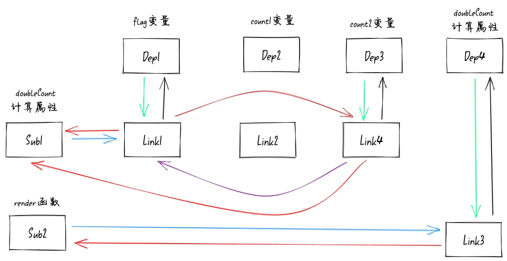

## 前言
Vue3.5版本又将响应式给重构了，重构后的响应式系统主要有两部分组成：双向链表和版本计数，这篇文章我们来讲讲为什么这次重构能够让内存占用减少56%.

## 为什么说"又"将响应式重构了
因为在之前的Vue3.4版本中刚刚将响应式重构了，这次响应式重构是vscode插件Vue-Official的作者搞的。

3.4版本重构优化了很多东西，最直观的就是:computed计算属性的值没有变化，另外一个watch又监听了这个computed的值。在3.4以前还是会触发watch的回调，经过3.4的优化后就不会触发了。

在3.5版本以前，Vue的响应式系统中有两个角色：Sub订阅者和Dep依赖。

- Sub订阅者：主要有watchEffect、watch、render函数、computed等。
- Dep依赖: 主要有ref、reactive、computed等响应式变量

他们之间是相互依赖的关系，如下图



Dep依赖(比如ref响应式变量)可以通过dep属性访问到Sub订阅者(比如computed计算属性),就知道了到底有哪些订阅者依赖自己，当自己的值改变后就去通知订阅者。

同样Sub订阅者(比如computed计算属性)可以通过 deps 属性访问到Dep依赖(比如ref响应式变量)，当Sub订阅者不在依赖某个变量时就可以通过这个关系去访问到这个Dep依赖。然后把自己从不在依赖的变量的Sub订阅者集合中去掉，这样当这个响应式变量改变后就不会通知到不在订阅到他的Sub订阅者了。

我们来看个例子，代码如下
```html
<template>
    <p>{{ doubleCount }}</p>
    <button @click="flag = !flag">切换flag</button>
</template>
<script setup>
    import { computed, ref } from 'vue';
    const count1 = ref(1);
    const count2 = ref(2);
    const flag = ref(true);

    const doubleCount = computed(() => {
        console.log('computed');
        if(flag.value) {
            return count1.value * 2
        } else {
            return count2.value * 2
        }
    })
</script>
```
当 flag 的值为true时计算属性 doubleCount 其实值依赖响应式变量 flag 和count1,当flag的值切换为false时，计算属性应该变为依赖变量 flag 和 count2

就上面这个更新 Sub订阅者 依赖的逻辑，Vue其实重构了很多次。**在早期的Vue3版本中是直接清空 Sub订阅者 所依赖的响应式变量，然后在重新执行计算属性 doubleCount时在去将新的响应式变量进行收集，很明显这个版本内存的使用就非常浪费了**

在最新的Vue3.4版本重构后的响应式系统中会在执行计算属性之前利用 _trackId 和 _depslength 字段进行标记，在重新执行计算属性时进行依赖收集就可以利用 _trackId 和 _depslength 字段判断出 Dep依赖是否能够复用，并且执行完计算属性的回调函数后同样利用_trackId和_depsLength字段就可以将不再依赖的Dep依赖给移除掉。

上面这个方案看着很完美，但是他的核心是依赖计算属性中所依赖的变量顺序不变，如果顺序变了，那么依然还是不能够复用的，同样会对内存造成浪费.（PS：这一段3.4版本响应式看不懂没关系，因为他已经是过去式了）

## 内存优化主要原因：利用Link节点
在Vue3.5版本中那个最了解Vue的男人出手了，使用 双向链表 和 版本计数 将响应式系统再次给重构了。说实话这次重构后让读响应式源码的门槛变得更高了，但是收益特别明显，最主要的是通过复用Link节点去实现减少内存的使用。

还是上面的例子，对应新的响应式模型如下图



在新的响应式模型中 Sub订阅者 和 Dep依赖 之间不在有直接的关联关系了，而是通过中间的Link节点作为桥梁去关联。

在前一节中我们讲过,3.5以前 Sub订阅者 中有属性会存依赖的 Dep依赖，Dep依赖中有属性去存依赖他的Sub订阅者，所以导致当Sub订阅者依赖的变量需要更新时就无法做到完全的复用，内存就会浪费。

在3.5新的响应式模型中，X轴是Dep依赖，Y轴是Sub订阅者，Link节点是作为坐标轴上面的点。每一组 Dep依赖 和 Sub订阅者都会对应一个Link节点，并且可以通过这个Link直接访问到Dep依赖和Sub订阅者。

在Y轴上面找一个点（比如Sub1也就是计算属性doubleCount），横向出发就可以找到Sub1订阅者所依赖的所有响应式变量。因为横向的这些Link节点是一个双向链表，并且可以通过某一个Link节点直接访问到他的Dep依赖。

当flag的值切换为false后，订阅者Sub1所依赖的响应式变量就从flag+count1变成flag+count2。这时我们需要做的事情就很简单了，新建一个Link3节点，可以直接访问到Sub1和Dep3。然后将Link1中原本指向Link2的指针改为指向Link3，同时让Link3的指针也指向Link1。并且将Link2指向Link1的指针改为指向空，由于Dep2现在不被任何订阅者所依赖了，所以将Link2原本指向Dep2的指针也改为指向空，同样将Dep2指向Link2的指针也指向空。

上面的一顿操作，除了必要的初始化一个Link3之外我们一直都是在进行指针的操作，并不像以前的响应式一样去增加Sub订阅者依赖或者减少依赖，这是非常高效的方式。

当flag的值切换为false后，新的响应式模型图如下：



从上图中可以看到Link2已经彻底从双向链表中移除了，并且整个过程中我们都是在操作指针的指向，所以Link1也一直都是复用的。

V8在进行垃圾回收的时候发现 Link2 不在被任何变量所使用，就可以认为 Link2 是一个可以被回收的变量，就会被其直接回收释放内存。

<span style="color: green">Link节点复用以及让不再使用的Link节点尽快的被回收进而释放内存，就是这次响应式重构减少56%内存占用的主要原因。</span>

## 其他优化
有了双向链表后依赖触发也变得更加清晰，当某个响应式变量改变后，只需要遍历Dep依赖(纵向)的Link节点组成的双向链表，然后通过这些Link节点直接访问到对应的Sub订阅者，触发其依赖。

基于Sub订阅者的触发就是一个线性的过程，所以就可以实现将需要触发的Sub订阅者串起来组成一个Sub订阅者组成的队列。等需要触发的订阅者收集完了后，在去进行触发Sub订阅者，避免同一个订阅者被触发多次。

依赖触发相比之前也变得更加简单了，性能以及内存也有所提升。

最后就是因为有了双向链表和版本计数的加持后，computed计算属性变得更加聪明，现在是惰性计算了。computed计算属性只有等有人使用他（比如在template中使用计算属性doubleCount）后才会去执行计算属性中的回调函数，以及3.4版本中就已经实现的如果计算属性值没有变化，另外一个watch又监听了这个computed的值，此时这个watch不会被触发。

## 总结
Vue3.5响应式重构主要是通过 双向链表 和 版本计数 实现的，优化后内存占用减少了56%。主要原因是：在新的响应式系统中多了一个Link节点用于链接Sub订阅者 和Dep依赖，更新Sub订阅者依赖只是进行指针的变换，并且还能够复用Link节点以及将不在使用的Link节点给鼓励出来便于V8更快的将这个Link节点给回收。此外还有Sub订阅者的触发也变得更加简单，以及现在是computed计算属性是惰性计算了，这些优化同样也优化了内存的使用。


