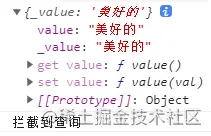
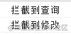

## ref
vue3中一般用ref将一个值为基本数据类型的变量变成响应式，它是一个函数，组合式API之一，参数为变量的初始值。举个栗子，比如我们需要一个响应式的变量num,初始值为1。在Vue2中我们会这么做
```js
data() {
    return {
        num: 1
    }
}
```
把num写在data里。而在vue3中，我们通过setup函数里使用ref定义num,此时num成了一个类型为Ref(reference)的，包含响应式数据的引用对象
```js
setup() {
    const num = ref(1)
}
```
<span style="color: blue">现在，如果想在js中改变num的值，需要通过num.value。在ref内部，是通过给value属性添加getter/setter来实现对数据的劫持，这点在我们手写shallowRef时需要用上</span>

<span style="color: red">注意，在&lt;template&gt;内不需要通过.value而是直接使用num</span>

### ref对象
使用ref创建对象，里面任意深度的属性与视图都是响应式的，如在vue2中创建的data
```js
data() {
    return {
        a: {
            b: 1
        }
    }
}
```
使用ref则为
```js
const data = ref({
    a: {
        b: 1
    }
})
```
<span style="color: red">当修改b属性的值时，视图会更新</span>

## shallowRef
只处理value的响应式，不进行对象的reactive处理，也就是说如果传给shallowRef一个对象，这个对象的任何一层属性都不是响应式的

### 手写实现(拦截对数据的操作)
将target赋值给_value属性，通过对象本身的set和get方法来实现对target的操作的拦截
```js
function shallowRef(target) {
    return {
        _value: target,
        get value() {
            console.log('兰街到查询');
            return this._value;
        },
        set value() {
            consoeo.log('拦截到修改');
            this._value = val;
        }
    }
}
```
可以测试下效果
```js
const testShallowRef = shallowRef('美好的')
```
打印查看 testShallowRef 对象本身 console.log(testShallowRef)：



可以看到有个value属性，值为传递给shallowRef的参数

对testShallowRef进行查改操作
```js
testShallowRef.value += '周五'
```


说明确实拦截到了对 testShallowRef 的查询和修改操作，那么就可以继续做一些更新渲染页面的功能。

### shallowRef --对象
与ref不同，shallowRef修改深层属性时，并不会更新视图
```html
<template>
    <div>
        <p>{{data.foo}}</p>
        <button @click="update">update</button>
        <button @click="log">log</button>
    </div>
</template>
<script>
    setup() {
        const data = shallowRef({foo: '1'});
        function update() {
            data.value.foo = '2';
        }
        function log() {
            console.log(data.value.foo)
        }
        return {
            data,
        }
    }
</script>
```
上面点击update，视图并不会更新，但是点击log按钮时，打印出foo的值为2

<span style="color: red">想要更新视图，必须给value赋值，直接替换这个对象</span>

```js
function update() {
    data.value = { foo: 200 }
}
```
再次点击update按钮，视图更新。

shallow即浅的意思，shallowRef只有整个数据变更时才刷新视图

<span style="color:red">或者在修改数据之后，调用triggerRef方法，主动触发视图刷新</span>

```js
function update() {
    data.value.foo = '300';
    triggerRef(data); // 触发视图刷新
}
```
> 需要注意如果组件中有ref/reactive的数据更新引起组件更新，会把shallowRef更新后的数据更新到视图

### 为什么使用shallowRef
因为ref方法会递归遍历对象的所有属性，使所有属性都具备响应性，所以，当对象很复杂且庞大时，过多的监听会导致性能上的损耗。如假设有一个文章列表数组：

像这种做展示用的数据，并不需要每个属性都做响应性，此时使用shallowRef就很合适。
> 其实可以放在外面不做响应式或者Object.freeze()

## shallReactive
只处理对象最外面一层的响应时数据(浅响应时)
```js
const obj = shallowReactive({name: 'Mr.long', son: {name: 'Mr.liu'}})
// vue不会做son.name响应式
```


[ref与shallowRef区别](https://blog.csdn.net/LiuMH2011/article/details/123716933)

[shallowReactive和shallowRef](https://www.jianshu.com/p/4e0d4fcff950)

[vue3.0中shallowRef和shallReactive](https://juejin.cn/post/6987942531472457759)