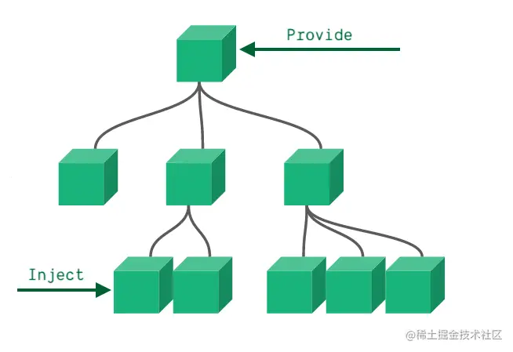

## 善用h(createVNode)和 render 函数
我们知道在vue3中导出了一个神奇的createVNode函数，当前函数它能创建一个vdom,大家不要小看vdom,我们好好利用它，就能做出意想不到的效果--比如实现一个弹窗组件

我们通常的思路是写一个组件在项目中引用进来，通过v-model来控制它的显示隐藏，但是这样有个问题，我们复用的时候的成功需要复制粘贴。我们有没有办法来提高效率，比如封装成npm通过调用js来使用

然而，有了createVNode和render之后所有问题就迎刃而解了
```js
// 我们先写一个弹窗组件
const message = {
    setup() {
        const num = ref(1);
        return {
            num
        }
    },
    template: `<div>
                <div>{{num}}</div>
                <div>这是一个弹窗</div>
            </div>`
}
```

```js
// 初始化组件生成vdom
const vm = createVNode(message);
// 创建容器，也可以用已经存在的
const container = document.createElement('div');
// rnder通过path 变成dom
render(vm, container);
// 弹窗挂到任何你想去的地方
document.body.appendChild(container.firstElementChild);
```
经过上面这一通骚操作，我们发现我们可以将他封装为一个方法，放到任何想放的地方。

## 善用JSX/TSX
文档上说了,在绝大多数情况下，Vue推荐使用模板预发来搭建HTML。然而在某些使用场景下，我们真的需要用到Javascript完全的编程能力。这时渲染函数就派上用场了

### JSX和模板预发的优势对比
jsx和模板语法都是vue 支持的的书写范畴，然后他们确有不同的使用场景，和方式，需要我们根据当前组件的实际情况，来酌情使用

- 什么是JSX

    JSX是一种Javascript的语法扩展，JSX=Javascript + XML,即在Javascript里面写XML，因为JSX的这个特性，所以它即具备了Javascript的灵活性，同时又兼具html的语义化和直观性

- 模板语法的优势
    1. 模板语法写起来不怎么违和，我们就像在写html一样
    2. 在vue3中由于模板的可遍历性，它能在编译阶段做更多优化，比如静态标记、块block、缓存事件处理程序等。
    3. 模板代码逻辑代码严格分开，可读性高
    4. 对JS功底不那么好的人，记几个命令就能快速开发，上手简单
    5. vue官方插件的完美支持，代码格式化，语法高亮等。

- JSX的优势
    1. 灵活、灵活、灵活(重要的事情说三遍)
    2. 一个文件能写好多个组件
    3. 只要JS功底好，就不用记忆那么多命令，上来就是一通输出
    4. JS和JSX混用，方法即声明即用，对于懂行的人来说清晰

- 对比
    
    由于vue对于JSX的支持，社区里，也是争论来争论去，到底要分个高低，然后本渣认为，他俩本来没有高低，您觉得哪个适合，就用哪个即可，缺点放在对的地方他就是优势 要发扬咱们老前辈们传下来的中庸之道，做集大成者，将两者结合使用，就能发挥无敌功效，乱军之中博老板青睐。

    接下来说一下本人的一点粗浅理解，我们知道组件类型，分为容器性组件和展示型组件 在一般情况下，容器性组件，它由于可能要对于当前展示型组件做一个标准化或者在包装，那么此时容器性组件中用JSX就在好不好了。

    举个例子：现在有个需求，我们有两个按钮，现在要做一个通过后台数据来选择展示哪一个按钮，我们通常的做法，是通过在一个模板中通过v-if去控制不同的组件

    然而有了JSX与函数式组件之后，我们发现逻辑更清晰了，代码更简洁了，质量更高了，也更装X了

    我们来看

    先整两个组件
    ```html
    // btn1.vue
    <template>
        <div>
            这是btn1 {{ name }}
            <slot></slot>
        </div>
    </template>
    <script>
        import { ref, defineComponent } from 'vue';
        export default defineComponent({
            name: 'btn1',
            setup() {
                const num = ref(1);
                return { num }
            }
        })
    </script>
    //btn2.vue
    <template>
    <div>
        这是btn2{{ num }}
        <slot></slot>
    </div>
    </template>
    <script>
        import { ref, defineComponent } from 'vue'
        export default defineComponent({
            name: 'btn2',
            setup() {
                const num = ref(2)
                return { num }
            }
        })
    </script>
    ```
    用JSX配合函数式组件来做一个容器组件
    ```js
    // 容器组件
    import btn1 from './btn1.vue';
    import btn2 from './btn2.vue';
    export const renderFn = function(props, context) {
        return props.type === 1 ? <btn1>{context.slots.default()}</btn1> : <btn2>{context.slots.default()}</btn2>
    }
    ```
    引入业务组件
    ```html
    <!-- 业务组件 -->
    <template>
        <renderFn :type="1">111111</renderFn>
    </template>
    <script>
        import { renderFn }  from './components';
        console.log(renderFn);
        export default {
            components: {
                renderFn
            }
            setup() {},
        }
    </script>
    ```
## 善用依赖注入(Provide/Inject)
在善用依赖注入之前是，我们先来了解一些概念，帮助我们更全面的了解依赖注入的前世今生

### IOC 和 DI 是什么？
<span style="color: red">控制反转(Inversion of Control，缩写为IOC),是[面向对象编程](https://zh.wikipedia.org/wiki/%E9%9D%A2%E5%90%91%E5%AF%B9%E8%B1%A1%E7%A8%8B%E5%BA%8F%E8%AE%BE%E8%AE%A1)中一种设计原则，可以用来降低计算机代码之间的耦合度。其中最常见的的方式叫做**依赖注入(Dependency Injection，简称DI)**，还有一种方式叫做"依赖查找(dependency Lookup)"。**通过控制反转，对象在被创建的时候，由一个调控内所有对象的外界实体，将其所以来的对象的引用传递(注入)给它**</span>

### 什么是依赖注入
依赖注入用大白话来说：就是将实例变量注入到一个对象中去

### Vue中的依赖注入
<span style="color: blue">在vue中，我们套用依赖注入的概念，其实就是在父组件中声明依赖，将他们注入到子孙组件实例中去，可以说是能够很大程度上代替全局状态管理的存在</span>



基本用法

父组件中声明provide
```html
<!-- parent.vue -->
<template>
    <child @setColor="setColor"></child>
    <button @click="count++">添加</button>
</template>
<script>
    import { defineComponent, provide, ref } from 'vue';
    import Child from './child.vue';
    export default defineComponent({
        components: {
            Child
        },
        setup() {
            const count = ref(0);
            const color = ref('#000');
            provide('count', count);
            provide('color', color);
            function setColor(val) {
                color.value = val;
            }
            return {
                count, 
                setColor
            }
        }
    })
</script>
```
子组件注入进来
```html
<!-- child.vue -->
<!-- 使用inject注入 -->
<template>
    <div>这是注入的内容：{{count}}</div>
    <child1 v-bind="$attrs"></child1>
</template>
<script>
    import { defineComponent, inject } from 'vue';
    import child1 from './child1.vue';
    export default defineComponent({
        components: {
            child1
        },
        setup(props, {attrs}) {
            const count = inject('count');
            console.log(count);
            console.log(attrs);
            return {
                count
            }
        }
    })
</script>
```
正因为依赖注入的特性，我们很大程度上代替了全局状态管理，相信谁都不想动不动就引入那繁琐的vuex吧

接下来我们来举个例子，现在我么有个页面主题色，他贯穿所有组件，并且可以在某一些组件内更改主题色，那我们常规的解决方案中，就是装个vuex然后通过他的api下发颜色值，这时候如果想改，首先要发起dispatch到Action ，然后在Action中触发Mutation接着在Mutation中再去改state,如此一来，你是不是发现有点杀鸡用牛刀了，我就改个颜色而已!

我们来看有了依赖注入 应该怎么处理

<span style="color: red">首先我们知道vue是单向数据流，也就是子组件不能修改父组件的内容，于是我们就应该想到使用$attrs，使用它将方法投创给祖先组件，在组建中修改既可</span>

```html
<!-- 子孙组件child1.vue -->
<template>
    <div :style="`color: ${color}`" @click="setColor">这是注入的内容的颜色</div>
</template>
<script>
    import { defineComponent, inject } from 'vue';
    export default defineComponent({
        setup(props, { emit }) {
            const color = inject('color');
            function setColor() {
                console.log(0);
                emit('setColor', 'red');
            }
            return {
                color, 
                setColor
            }
        }
    })
</script>
```
将当前子孙组件嵌入到child.vue中去，就能利用简洁的方式来修改颜色了
## 善用Composition API抽离通用逻辑


## 资料
[vue3中可以帮助你早点下班的9个开发技巧！](https://juejin.cn/post/7080875763162939429#heading-19)