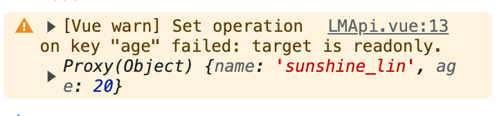

## readonly
顾名思义,就是只读的意思，如果你的数据被这个API包裹住的话，那么修改之后并不会触发响应式，并且会提示警告

```html
<template>
    <div>{{ obj.age }}</div>
</template>
<script lang="ts" setup>
    import { readonly, reative } from 'vue';

    let obj = reactive({
        name: 'sunshine_lin',
        age: 20
    })
    obj = readonly(obj);
    obj.age = 18
</script>
```



readonly 的用途一般用于一些hooks暴露出来的变量，不想外界去修改，比如我封装了一个hooks,这样去做的话，那么外界只能用变量，但是不能修改变量，这样大大保护了hooks内部的逻辑
```js
import { onMounted, reactive, readonly } from 'vue';

iterface IUser {
    name?.string;
    age?.number;
}

export const useExample = () => {
    const user = reactive<IUser>({});

    const fetchEnum = async () => {
        // 模拟请求
        const res = await new Promise<IUser>(resolve => {
            resolve({ name: 'sunshine_lin', age: 20})
        })
        user.name = res.name;
        user.age = res.age;
    }

    onMounted(() => {
        fetchEnum();
    })

    return {
        user: readonly(user)
    }
}
```
## shallowRef
shallowRef用来包住一个基础类型或者引用类型，如果是基础类型那么跟Ref基本没区别;如果是引用类型的话，那么直接改深层属性是不能触发响应式的，除非直接修改引用地址。如下
```html
<template>
    {{obj.name}}
    {{obj.hobbies[0]}}
</template>
<script lang="ts" setup>
    import { shallowRef, onMounted } from 'vue';

    const obj = shallowRef<any>({
        name: 'sunshine_lin',
        hobbies: ['eat', 'sleep'],
    })
    onMounted(() => {
        // 无效
        obj.value.name = 'sanxin_lin';
        // 无效
        obj.value.hobbies[0] = 'sleep';
        // 有效
        obj.value = {
            name: 'sanxin_lin',
            hobbies: ['sleep', 'sleep']
        }
    })
</script>
```
:::ganger
注意:改变深层属性能改数据，只是没触发响应式，所以当下一次响应式触发的时候，你修改的深层数据会渲染到页面上~
:::
shallowRef的用处主要用于一些比较大的但又变化不大的数据，比如我有一个表格数据，通过接口直接获取,并且主要用于前端展示,需要修改一些深层的属性，但是这些属性并不需要立即表现在页面上，比如以下例子，我只需要展示 name、age 字段，至于 isOld 字段并不需要展示，我想要计算 isOld 但是又不想触发响应式更新，所以可以用 shallowRef 包起来，进而减少响应式更新，优化性能

```js
import { onMounted, shallowRef } from 'vue';

interface IRow {
    name: string;
    age: 20,
    isOld?: boolean;
}

// hooks 
export const useFetchData = () => {
    const list = shallowRef<IRow[]>([])
    // 模拟请求
    const fetchData = async () => {
        list.value = await new Promise<IRow[]>(resolve => {
            resolve(
                new Array(1000).map(() => {
                    name: 'sunshine_lin',
                    age: 20
                })
            )
        })
    }

    const checkIsOld = () => {
        list.value.forEach(({ age }, index) => {
            list.value[index].isOld = age > 60;
        })
    }

    onMounted(() => {
        fetchData();
    })

    return {
        list,
        checkIsOld,
    }
}

// 页面中
// 只需要展示 name age
// 只需要展示 old
const columns = ['name', 'age'];

const { checkIsOld, list } = useFetchData();
// 判断成员是不是老人
checkIsOld();
```


## shallowReactive

## toRef && toRefs

## effectScope & onScopeDispose

## 全局状态管理

## provide & inject


[十个Vue3超级实用但是很冷门的API](https://mp.weixin.qq.com/s/0S_IGopSeqD6h6QV9TqLWA)