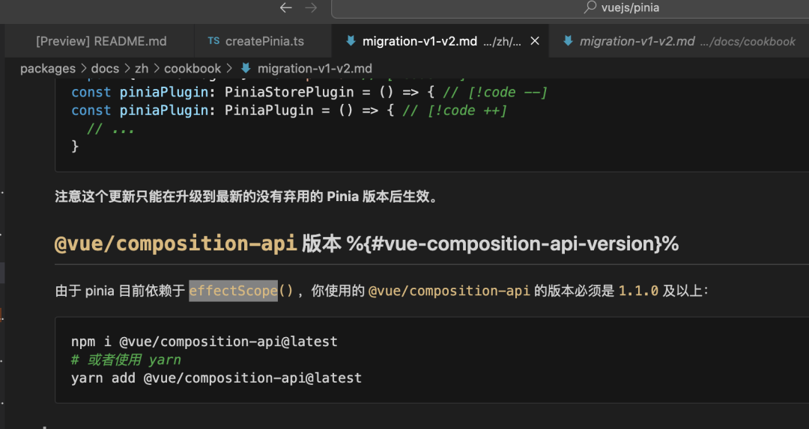
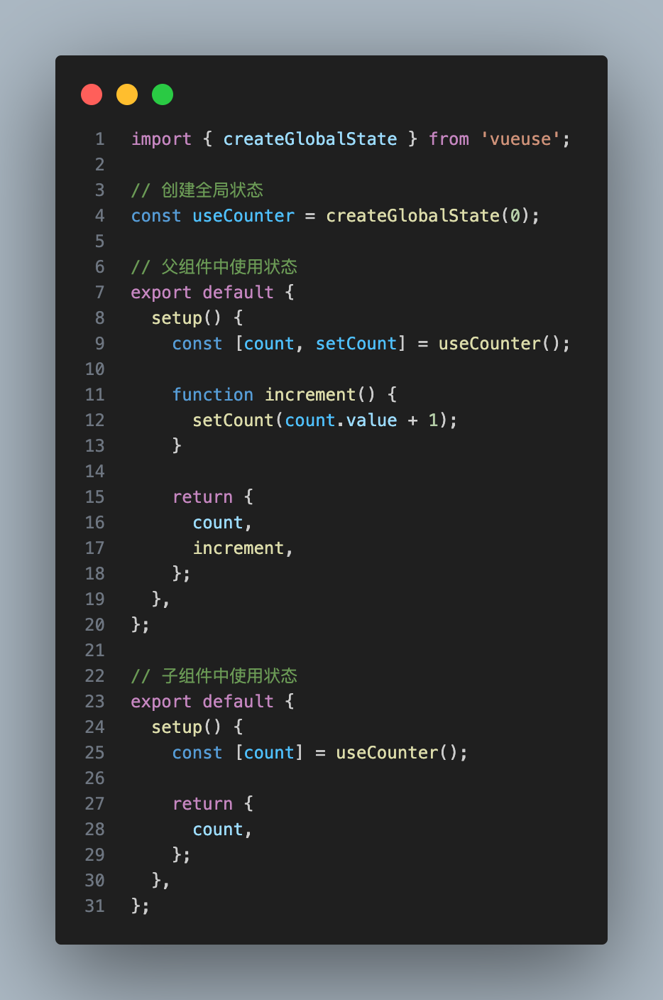
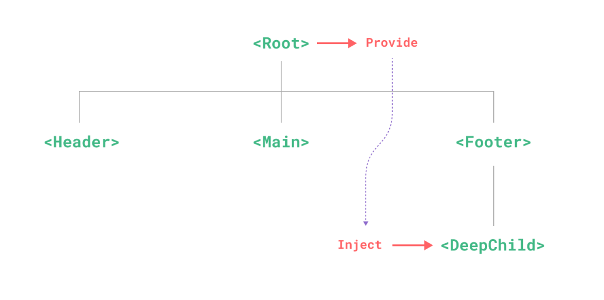

## readonly
顾名思义,就是只读的意思，如果你的数据被这个API包裹住的话，那么修改之后并不会触发响应式，并且会提示警告

```html
<template>
    <div>{{ obj.age }}</div>
</template>
<script lang="ts" setup>
    import { readonly, reative } from 'vue';

    let obj = reactive({
        name: 'sunshine_lin',
        age: 20
    })
    obj = readonly(obj);
    obj.age = 18
</script>
```


readonly 的用途一般用于一些hooks暴露出来的变量，不想外界去修改，比如我封装了一个hooks,这样去做的话，那么外界只能用变量，但是不能修改变量，这样大大保护了hooks内部的逻辑
```js
import { onMounted, reactive, readonly } from 'vue';

iterface IUser {
    name?.string;
    age?.number;
}

export const useExample = () => {
    const user = reactive<IUser>({});

    const fetchEnum = async () => {
        // 模拟请求
        const res = await new Promise<IUser>(resolve => {
            resolve({ name: 'sunshine_lin', age: 20})
        })
        user.name = res.name;
        user.age = res.age;
    }

    onMounted(() => {
        fetchEnum();
    })

    return {
        user: readonly(user)
    }
}
```
## shallowRef
shallowRef用来包住一个基础类型或者引用类型，如果是基础类型那么跟Ref基本没区别;如果是引用类型的话，那么直接改深层属性是不能触发响应式的，除非直接修改引用地址。如下
```html
<template>
    {{obj.name}}
    {{obj.hobbies[0]}}
</template>
<script lang="ts" setup>
    import { shallowRef, onMounted } from 'vue';

    const obj = shallowRef<any>({
        name: 'sunshine_lin',
        hobbies: ['eat', 'sleep'],
    })
    onMounted(() => {
        // 无效
        obj.value.name = 'sanxin_lin';
        // 无效
        obj.value.hobbies[0] = 'sleep';
        // 有效
        obj.value = {
            name: 'sanxin_lin',
            hobbies: ['sleep', 'sleep']
        }
    })
</script>
```
:::danger
注意:改变深层属性能改数据，只是没触发响应式，所以当下一次响应式触发的时候，你修改的深层数据会渲染到页面上~
:::
shallowRef的用处主要用于一些比较大的但又变化不大的数据，比如我有一个表格数据，通过接口直接获取,并且主要用于前端展示,需要修改一些深层的属性，但是这些属性并不需要立即表现在页面上，比如以下例子，我只需要展示 name、age 字段，至于 isOld 字段并不需要展示，我想要计算 isOld 但是又不想触发响应式更新，所以可以用 shallowRef 包起来，进而减少响应式更新，优化性能

```js
import { onMounted, shallowRef } from 'vue';

interface IRow {
    name: string;
    age: 20,
    isOld?: boolean;
}

// hooks 
export const useFetchData = () => {
    const list = shallowRef<IRow[]>([])
    // 模拟请求
    const fetchData = async () => {
        list.value = await new Promise<IRow[]>(resolve => {
            resolve(
                new Array(1000).map(() => {
                    name: 'sunshine_lin',
                    age: 20
                })
            )
        })
    }

    const checkIsOld = () => {
        list.value.forEach(({ age }, index) => {
            list.value[index].isOld = age > 60;
        })
    }

    onMounted(() => {
        fetchData();
    })

    return {
        list,
        checkIsOld,
    }
}

// 页面中
// 只需要展示 name age
// 只需要展示 old
const columns = ['name', 'age'];

const { checkIsOld, list } = useFetchData();
// 判断成员是不是老人
checkIsOld();
```

## shallowReactive
shallowReactive 用来包住一个引用类型，被包住后，修改第一层才会触发响应式更新，也就是浅层的属性,修改深层的属性并不会触发响应式更新
:::danger
注意: 改深层属性性能改数据，只是没有触发响应式,所以当下一次响应式触发的时候，你修改的深层数据会渲染到页面上~
:::

```html
<template>
    {{obj.name}}
    {{obj.hobbies[0]}}
</template>

<script lang="ts" setup>
    import { shallowReactive, onMounted } from 'vue';

    const obj = shallowReactive<any>({
        name: 'sunshine_lin',
        hobbies: ['eat', 'sleep']
    })

    onMounted(() => {
        // 有效
        obj.name = 'sanxin_lin';
        // (单独)无效(这个例子有效是因为上面的异步更新顺带把这个数据给更新了)
        obj.hobbies[0] = 'sleep'
    })
</script>
```
shallowReactive 用的比较少,shallowReactive的用处跟shallowRef比较像，都是为了让一些比较大的数据能减少响应式更新，进而优化性能

## toRef && toRefs
先说说 toRef 吧,我们平时在使用 reactive 的时候会有个苦恼，那就算解构，比如看一下例子，<span style="color: red">**我们为了少写一些代码，解构出来了name并放到模板里渲染，但是当我们想改原数据的时候，发现name并不会更新，这就是解构出来基础类型的烦恼**</span>
```html
<template>
    <div>{{ obj.name }}</div>
    <div>{{ name }}</div>
</template>

<script lang="ts" setup>
    import { reactive } from 'vue';

    const obj = reactive({
        name: 'sunshine_lin',
        age: 20
    })

    let { name } = obj;

    obj.name = 'sanxie_lin'
</script>
```

这时我们可以使用toRef,这个时候我们直接修改name也会触发原数据的修改，修改原数据也会触发name的修改
```html
<template>
    <div>{{ obj.name }}</div>
    <div>{{ name }}</div>
</template>
<script lang="ts" setup>
    import { reactive, toRef } from 'vue';

    const obj = reactive({
        name: 'sunshine_lin',
        age: 20,
    })

    const name = toRef(obj, 'name');
    
    // 都会相互触发数据修改(以下两个可单独)
    name.value = 'sanxin_lin';
    obj.name = 'sanxin_lin';
</script>
```
但是如果是属性太多了，我们想一个一个去用 toRef 的话会写很多代码
```html
<template>
    <div>{{ obj.name }}</div>
    <div>{{ name }}</div>
</template>
<script lang="ts" setup>
    import { reactive, toRef } from 'vue';

    const obj = reactive({
        name: 'sunshine_lin',
        age: 20,
        hobbies:[]
    })

    const name = toRef(obj, 'name');
    const age = toRef(obj, 'age');
    const hobbies = toRef(obj, 'age');
</script>
```
<span style="color: red">所以我们可以使用 toRefs 一次性解构</span>

```html
<template>
    <div>{{ obj.name }}</div>
    <div>{{ name }}</div>
</template>
<script lang="ts" setup>
    import { reactive, toRefs } from 'vue';

    const obj = reactive({
        name: 'sunshine_lin',
        age: 20,
        hobbies:[]
    })

    const { name, age, bobbies } = toRefs(obj);
</script>
```

### toRaw & markRaw & unref
<span style="color: red">toRaw 可以把一个响应式 reactive 转成普通对象，也就是把响应式转成非响应式对象</span>

```html
<template>
    {{ rawObj.name }}
</template>
<script setup lang="ts">
    import { reactive, toRaw, onMounted } from 'vue';

    const obj = reactive({
        name: 'sunshine_lin',
        age: 20
    })

    const rawObj = toRaw(obj);

    onMounted(() => {
        // 不会触发视图更新
        rawObj.name = 'sanxin_lin';
    })
</script>
```
<span style="color: red">toRaw 主要用在回调传参中，比如我封装了一个hooks，我想要把hooks内维护的响应时变量转成普通数据，当做参数传递给回调函数，可以用toRaw</span>

```js
import { onMounted, reactive, toRaw } from 'vue';

interface IUser {
    name: string;
    age: number;
}

export const useExample = ({ onUserChange }: { onUserChange: (user: IUser) => void}) => {
    const user = reactive({
        name: 'sunshine_linr',
        age: 20
    })

    onMounted(() => {
        onUserChange(toRaw(user))
    })
}
```
<span style="color: blue;font-weight: bold">markRaw 可以用来标记响应式对象里的某个属性不被追踪，如果你的响应时对象里有某个属性数据量比较大，但又不想被追踪，你可以使用markRaw</span>

```html
<template>
    <div>{{ obj.name }}</div>
    <div>{{ obj.hobbies }}</div>
</template>
<script lang="ts" setup>
    import { reactive, markRaw, onMounted } from 'vue';

    let obj = {
        name: 'sunshine_lin',
        age: 20,
        hobbies: ['eat', 'sleep']
    }

    // hobbies不触发响应时
    obj.hobbies = markRaw(obj.hobbies);

    obj = reactive(obj);

    onMounted(() => {
        // 不更新视图
        obj.hobbies[0] = 'coding';
        // 更新视图(带动更新hobbies更新视图)
        obj.name = 'sanxin_lin';
    })
</script>
```
<span style="color: blue;font-weight: bold">unref 相当于返回ref的value</span>

```js
import { ref, unref } from 'vue';

const name = ref('sunshine_lin');

console.log(unref(name)); // sunshine_lin
```
## effectScope & onScopeDispose
effectScope 可以有两个作用
- 收集副作用---重要
- 全局状态管理

### 收集副作用
<span style="color: red">比如我们封装一个共用的hooks，为了减少页面隐患，肯定会统一收集副作用，并且在组件销毁的时候去统一消除，比如一下代码</span>

```js
import { computed, onUnmounted, ref, stop, watch, watchEffect } from 'vue'

export const useExample = () => {
    const disposables: any[] = [];

    const counter = ref(0);
    const doubled = computed(() => counter.value  * 2);

    disposables.push(() => stop(doubled.effect));

    const stopWatch1 = watchEffect(() => {
        console.log(`counter: ${counter.value}`);
    })

    disposables.push(stopWatch1);

    const stopWatch2 = watchEffect(doubled, () => {
        console.log(doubled.value);
    })

    disposables.push(stopWatch2);

    onUnmounted(() => {
        disposables.push(fn => fn());
    })
}
```
<span style="color: red">但是这么收集很麻烦,effectScope 能帮我们做到统一收集，并且通过 stop 方法来进行清除，且stop执行的时候会触发 effectScope内部的 onScopeDispose</span>

```js
import { computed, effectScope, onScopeDispose, onUnmounted, ref, watch, watchEffect } from 'vue';

export const useExample = () => {
    const scope = effectScope();
    scope.run(() => {
        const counter = ref(0);
        const doubled = computed(() => counter.value * 2);

        watchEffect(() => {
            console.log(`counter: ${counter.value}`);
        });

        watch(doubled, () => {
            console.log(doubled.value);
        })

        onScopeDispose(() => {
            // 清楚时执行
            console.log('执行清除了哦');
        })
    })
    onUnmounted(() => {
        // 统一收集清除
        scope.stop();
    })
}
```
我们可以利用effectScope & onScopeDispose 来做一些性能优化，比如下面这个例子，我们封装一个鼠标监听的hooks

```js
function useMouse() {
    const x = ref(0);
    const y = ref(0);

    function handler(e) {
        x.value = e.x;
        y.value = e.y;
    }
    window.addEventListener('mousemove', handler);

    onUnmounted(() => {
        window.removeEventListener('mousemove', handler);
    })
    return {x, y}
}
```
<span style="color: red">但是如果在页面里调用多次的话，那么势必会往window身上监听很多多余事件，造成性能负担，所以解决方案就是，无论页面里调用在多次useMouse,我们只往window身上加一个鼠标监听事件</span>

```js
function useMouse() {
    const x = ref(0);
    const y = ref(0);

    function handler(e) {
        x.value = e.x;
        y.value = e.y;
    }
    window.addEventListener('mousemove', handler);

    onUnmounted(() => {
        window.removeEventListener('mousemove', handler);
    })
    return {x, y}
}
function createSharedComposable(composable) {
    let subscribers = 0;
    let state, scope;

    const dispose = () => {
        if(scope && --subscribers <= 0) {
            scope.stop();
            state = scope = null;
        }
    }

    return (...args) => {
        subscribers++;
        if(!state) {
            scope = effectScope(true);
            state = scope.run(() => composable(...args));
        }
        onScopeDispose(dispose);
        return state;
    }
}
const useSharedMouse = createSharedComposable(useMouse);

export default useSharedMouse;
```

## 全局状态管理
现在vue3最火的全局状态管理工具肯定是Pinia了，那么你知道Pinia的原理是什么吗？原理就是依赖了 effectScope



所以我们完全可以自己使用 effectScope 来实现自己的局部状态管理,比如我们封装了一个通用组件,这个组件层级比较多，并且需要共享一些数据，那么这个时候肯定不会用Pinia这种全局状态管理，而是会自己写一个局部的状态管理，这个时候 effectScope 就可以派上用场了

vueuse 中的 createGlobalState 就是为了这个而生

```js
import { effectScope } from 'vue-demi';
import type { AnyFn } from '../utils';

export function createGlobalState<Fn extends AnyFn>(
    stateFactory: Fn
): Fn {
    let initialized = false;
    let state: any;
    const scope = effectScope(true);

    return((...args: any[]) => {
        if(!initialized) {
            state = scope.run(() => stateFactory(...args))!;
            initialized = true;
        }
        return state;
    }) as Fn
}
```


## provide & inject
Vue3 用来提供注入的 API，主要是用在组件的封装，比如那种层级较多的组件，且子组件需要依赖父组件甚至爷爷组件的数据，那么可以使用 provide & inject，最典型的例子就是 Form 表单组件，可以去看看各个组件库的源码，表单组件大部分都是用 provide & inject 来实现的，比如 Form、Form-Item、Input这三个需要互相依赖对方的规则、字段名、字段值，所以用 provide & inject 会更好。具体用法看文档吧~https://cn.vuejs.org/guide/components/provide-inject.html




[十个Vue3超级实用但是很冷门的API](https://mp.weixin.qq.com/s/0S_IGopSeqD6h6QV9TqLWA)