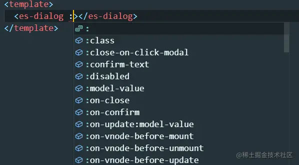
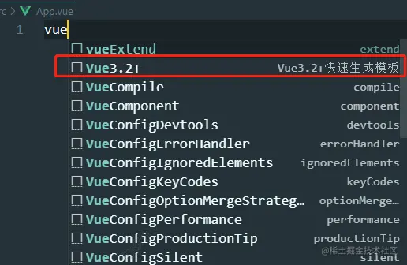

## 一、自动注册全局组件
自动注册components目录下所有vue组件并以组件的文件名为组件的名称
```js
// components/index.ts

import { type App, defineAsyncComponent } from 'vue';
const components = Object.entries(import.meta.glob('./**/*.vue'));
const preFix = 'Es';

export default {
    // use 的时候
    install: (app: App) => {
        components.forEach(([key, comp]) => {
            // 得到组件的名称
            const name = getCompName(comp.name || key);
            app.component(preFix + name, defineAsyncComponent(com as any));
        })
    }
}

function getCompName(key: string) {
    const nameReg = /\/(\w+).vue/;
    return nameReg.test(key) ? key.match(nameReg)![1] : key;
}
```
1. 使用 import.meta.glob 动态导入所有以.vue 结尾的文件，并将他们作为键值对的形式存储在 components变量中
2. 在 install 方法中，通过遍历 components 数组，对每个组件进行注册
3. 通过 comp.name 获取组件的名称,如果名称不存在，则使用组件的路径key.然后，使用defineAsyncComponent 将组件定义为异步组件
4. getComName 函数用于从组件路径中提取组件的名称。使用正则对组件路径进行匹配，提取出路径中最后一个斜杠后的单词作为组件名称。

使用这个插件
```js
import { createApp } from 'vue';
import App from './App';

import MyComponents from './components';

createApp(App).use(MyComponents).mount('#app');
```
自动注册全局组件虽然很方便，但在使用时缺少了ts类型提示，下面介绍一下为全局组件添加类型提示

### 为全局组件添加类型提示
这需要我们自己编写.d.ts声明文件
```js
// src/typings/component.d.ts

export {};

declare module 'vue' {
    export interface GlobalComponent {
        EsDialog: typeof import('../components/Dialog.vue')['default'];
    }
}
```


## 函数式图片预览
图片预览是一个比较常用的功能,封装成函数调用可以简化我们使用的方式

基于element-plus 的EllmageViewer组件

对于有类似的功能都可以使用这种方式，例如我们想使用函数调用的方式弹窗

```js
// utils/preview.ts
import { createVNode,render } from 'vue';
import { ElImageViewer, ImageViewerProps } from 'elment-plus';

type PrevviewOption = Partina<ImageViewerProps>;

export function preview(options: PreviewOption) {
    const container = document.createElement('div');
    let vm = createVNode(ElImageViewer, {
        ...options,
        onClose() {
            render(null, container);
        }
    })

    // 将组件渲染成真实节点
    render(vm.container);
    document.body.append(container.firstElementChild!);
}
```
1. preview 函数接受一个 option 参数，它是PreviewOption(ImageViewerProps 类型的部分可选类型)类型的对象，用于配置图片预览的选项
2. 函数内部，首先创建了一个div元素作为容器，用于渲染预览组件
3. 使用 createVNode 创建了一个ElImageViewer 组件实例 vm
4. 使用 render 方法将 vm渲染为真实的节点，并将其挂在到之前创建的容器中,最后添加到body页面上
5. 传入的props中监听 close 时间移除节点

调用
```js
preview({
    urlList: ['https://fuss10.elemecdn.com/0/6f/e35ff375812e6b0020b6b4e8f9583jpeg.jpeg'],
    initialIndex: 0
})
```
## 手动封装svgIcon组件
这节主要是vangle组件库的icon组件方式的介绍，为想自己手动封装 svgIcon 组件的朋友可以做个参考

- Icon.vue

    ```html
    <template>
        <i class="es-icon" :style="style" v-html="icon"></i>
    </template>

    <script>
        import { computed, CSSProperties } from 'vue';
        import { IconProps, getIcon } from './icon';

        const props = defineProps(IconProps);

        const icon = computed(() => getIcon(props.name));
        const style = computed<CSSProperties>(() => {
            if(!props.size && !props.color) return {};

            return {
                fontSize: typeof props.size === 'string' ? props.size : `${props.size}px`,
                '--color': props.color
            }
        })
    </script>
    <style scoped lang="scss">
        .es-icon {
            --color: inherit;
            height: 1em;
            line-height: 1em;
            display: inline-flex;
            justify-content: center;
            align-items: center;
            position: relative;
            fill: currentColor;
            color: var(--color);
            font-size: inherit;
            font-style:normal;
            svg {
                width: 1em;
                height: 1em;
            }
        }
    </style>
    ```

- 以下是getIcon的视线 icon.ts

    ```js
    export const svgs = import.meta.glob('./svg/*.svg', {eager: true, as: 'raw'})
    export const IconProps = {
        name: String,
        color: String,
        size: [String, Number]
    }

    export const getIcon = (name?: string) => {
        if(!name) return '';
        return svgs[`./svg/${name}.svg`]
    }
    ```

使用 import.meta.glob 动态导入svg目录下所有以 .svg结尾的文件，as: 'raw' 表示导入的文件内容以原始字符串形式保存

getIcon 根据name获取svg的内容

- 直接使用

    ```html
    <es-icon name="add-location" />
    <es-icon name="add-location" color="pink" />
    <es-icon name="add-location" color="pink" :size="30" />
    ```
## 封装拖拽钩子函数
```js
import { onBeforeUnmount, onMounted, watchEffect, Ref } from 'vue';

export const useDraggable = (
    targetRef: Ref<HTMLElement | undefined>,
    dragRef: Ref<HTMLElement | undefined>,
    draggable: Ref<boolean>
) => {
    // 保存偏移量
    let transform = {
        offsetX: 0, 
        offsetY: 0,
    }

    const onMousedown = (e: MouseEvent) => {
        const downX = e.clientX;
        const downY = e.clientY;
        const { offsetX, offsetY } = transform;

        // 获取拖拽目标的位置和尺寸信息
        const targetRect = targetRef.value!.getBoundingClientRect();
        const targetTop = targetRect.top;
        const targetWidth = targetRect.width;
        const targetHeight = targetRect.height;

        // 计算拖拽目标在页面中的可移动范围
        const clientWidth = document.documentElement.clientWidht;
        const clientHeight = document.documentElement.clientHeight;

        const minLeft = -targetRect.left + offsetX
        const minTop = -targetTop + offsetY
        const maxLeft = clientWidth - targetRect.left - targetWidth + offsetX
        const maxTop = clientHeight - targetTop - targetHeight + offsetY

        const onMousemove = (e: MouseEvent) => {
            // 计算移动后的位置
            /**
             * offsetX + e.clientX - downX: 初始偏移量 offsetX 加上 e.clientX - downX 移动的距离得到拖拽元素在水平方向上的新位置。
             * Math.max(offsetX + e.clientX - downX, minLeft) 确保新位置大于等于最小可移动位置 minLeft,即不超出左边界
             * Math.min(..., maxLeft) 确保新位置小于等于最大可移动位置 maxLeft，即不超出右边界。这样做的目的是防止拖拽元素移出指定的范围。
             */
            const moveX = Math.min(
                Math.max(offsetX + e.clientX - downX, minLeft),
                maxLeft
            )

            // 和上面同理
            const moveY = Math.min(
                Math.max(offsetY + e.clientY = downY, minTop),
                maxTop
            )

            // 更新偏移量和元素位置
            transform = {
                offsetX: moveX,
                offsetY: moveY,
            }
            targetRef.value!.style.transform = `translate(${moveX}px, ${moveY}px)`;
        }

        const onMouseup = () => {
            // 移除事件监听
            document.removeEventListener('mousemove', onMousemove);
            document.removeEventListener('mouseup', onMouseup);
        }

        // 监听鼠标移动和鼠标抬起事件
        document.addEventListener('mousemove', onMousemove);
        document.addEventListener('mouseup', onMouseup);
    }
    const onDraggable = () => {
        if(dragRef.value && targetRef.value) {
            dragRef.value.addEventListener('mousedown', onMousedown);
        }
    }

    const offDraggable = () => {
        if(dragRef.value && targetRef.value) {
            dragRef.value.removeEventListener('mousedown', onMousedown);
        }
    }

    onMounted(() => {
        watchEffect(() => {
            if(draggable.value) {
                onDraggable();
            } else {
                offDraggable();
            }
        })
    })

    onBeforeUnmount(() => {
        offDraggable();
    })
}
```
useDraggable 的函数，接受三个参数：
- targetRef: 拖拽目标Ref 
- dragRef: 拖拽出发区域Ref
- draggable: 开始/关闭拖拽

在函数内部定义了一个变量transform,用于保存拖拽过程中的偏移量。
1. 在 onMousedown 函数中，首先记录下鼠标按下时的坐标 downX 和 downY,以及当前的偏移量 offsetX 和 offsetY.
2. 获取拖拽目标元素的位置和尺寸信息，计算出拖拽目标在页面中可移动的范围
3. 移动时 onMousemove 中,根据鼠标移动的位置计算出新的偏移量 moveX 和 moveY,并更新transform对象和拖拽目标元素的位置
4. 最后，定义了一个onMouseup函数，当鼠标抬起时执行的事件处理函数。在函数内部，移除鼠标移动和鼠标抬起事件的监听。

## vscode中vue3代码片段
针对Vue 3.2+的代码片段模板，用于在VSCode中快速生成 Vue组件的模版代码

在项目的.vscode目录下创建一个名为 vue3.2.code-snippets的文件，它是一个JSON格式的代码片段文件

```js
{
  "Vue3.2+快速生成模板": {
    "prefix": "Vue3.2+",
    "body": [
      "<template>",
      "\t<div>\n",
      "\t</div>",
      "</template>\n",
      "<script setup lang='ts'>",
      "</script>\n",
      "<style lang='scss' scoped>\n",
      "</style>",
      "$2"
    ],
    "description": "Vue3.2+"
  }
}
```
- prefix: 定义了在代码编辑器中出发该代码片段的前缀，这里设定为"Vue3.2+" 
- body: 定义了代码片段的主体部分，它是一个数组，包含多行模板代码
- description: 对该代码片段的描述

在vue文件中输入"Vue3.2+"(会有自动提示)按下 Tab 键，就会自动插入这段模板代码。你可以根据需要自行修改和完善这个模板




## 资料
[学会这几个常用功能，给你的 vue3 项目加点餐！](https://juejin.cn/post/7256975111562674233)