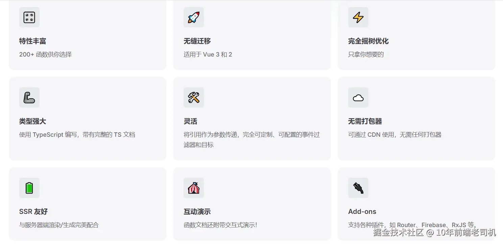
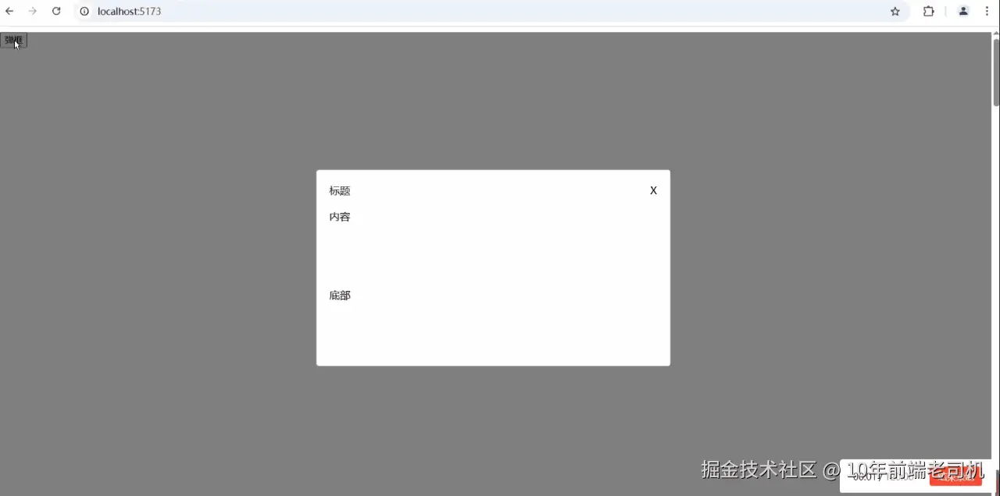
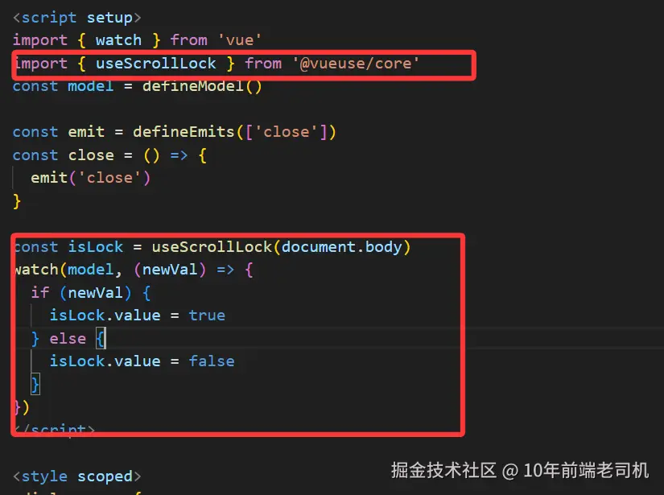
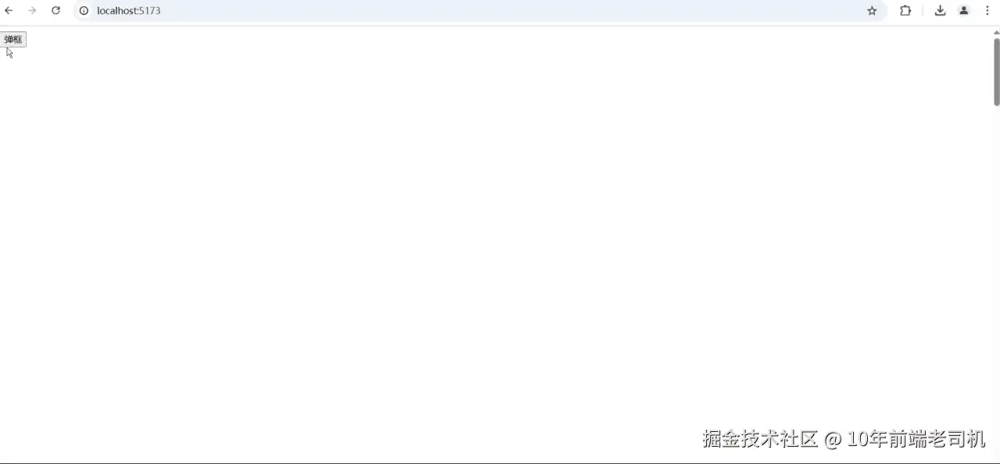
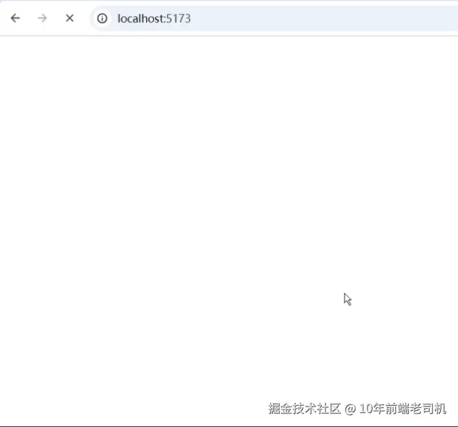
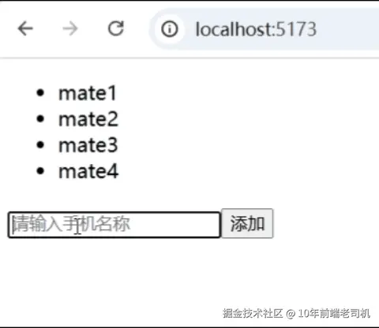

在工作中我们经常要封装一些工具函数来完成需求,但是其实很多这些工具函数，都能在一些第三方库里面能找到，我们没有必要花那么多时间去做这个事情。比如说VueUse, VueUse 是基于Vue 封装的一个功能丰富的工具库，提供了 200+ 的方法供你使用，基本上比较通用的方法都能在这里找到。用好VueUse相信你上班又多了不少摸鱼时间。

## VueUse 介绍


初始化一个项目
```bash
pnpm create vite vueuse --template -vue
cd vueuse
pnpm install

# 安装vueuse
pnpm install @vueuse/core
```
准备工作完成了，下面我们来做下需求

## VueUse 完成需求
### 弹框锁定滚动
假设现在我们要开发一个弹框，这个弹框弹出来之后，页面不允许滚动，页面也不允许滚动这个逻辑我们就可以借助VueUse来完成。

弹窗组件
```html
<template>
    <div class="dialog-wrap" v-if="model">
        <div class="dialog">
            <div class="header">
                <span>标题</span>
                <span @click="close">X</span>
            </div>
            <div class="content">内容</div>
            <div class="footer">
                底部
            </div>
        </div>
    </div>
</template>
<script setup>
const model = defineModel();

const emit = defineEmit(['close']);
const close = () => {
    emit('close');
}
</script>
<style scoped>
.dialog-wrap {
  width: 100%;
  height: 100%;
  position: fixed;
  background: rgba(0, 0, 0, 0.5)
}
.dialog {
  width: 500px;
  height: 300px;
  position: fixed;
  left: 50%;
  top: 50%;
  transform: translate(-50%, -50%);
  background: #fff;
  border-radius: 4px;
  padding: 0 20px;
}
.header {
  display: flex;
  justify-content: space-between;
  align-items: center;
  height: 60px;
}
.content {
  height: 120px;
}
.close {
  cursor: pointer;
}
</style>
```
使用弹窗组件
```html
<template>
    <div style="height: 5000px">
        <Dialog v-model="showDialog" @close="close"/>
        <button @click="showDialog = true">打开弹窗</button>
    </div>
</template>
<script setup>
import {ref} from 'vue';
import Dialog from '@/components/Dialog.vue';

const showDialog = ref(false);

const close = () => {
    showDialog.value = false;
}
<script>
```


可以看到现在是可以滚动的，测试一般会提这种bug，想当年我就经常被提这种bug，记忆犹新，现在我们就借助VueUse来解决这个问题

在弹框组件里面加入以下代码



来看下效果



这样我们就轻松实现了滚动锁定，关掉弹窗之后，滚动回复，是不是很简单呢？

### 2.图片加载
第二个需求,实现一个图片加载,没有加载完成之前显示loading... 加载完成之后正常显示图片，代码编写

```html
<template>
    <div style="width: 500px;height: 500px">
        <p v-if="isLoading" style="font-size: 30px">加载中</p>
        
    </div>
</template>
<script setup>
import {useImage} from '@vueuse/core';

const imgSrc = 'https://gips3.baidu.com/it/u=3732737575,1337431568&fm=3028&app=3028&f=JPEG&fmt=auto&q=100&size=f1440_2560'
const { isLoading } = useImage({ src: imgSrc})
</script>
```


可以看到我们使用VueUse 只用了两行代码就实现了图片加载效果。

## 3. 响应式的数据去重
第三个需求：数据去重，假设现在有这样一组数据

```js
[
  {
    id: 1,
    name: 'mate1'
  },
  {
    id: 2,
    name: 'mate2'
  },
  {
    id: 3,
    name: 'mate3'
  },
  {
    id: 4,
    name: 'mate3'
  },
  {
    id: 5,
    name: 'mate4'
  }
]
```
我们想让它根据名称进行去重，并且添加数据的时候也自动去重。这个时候我们也可以利用VueUse 轻松的完成，来看代码：

```html

<template>
  <div>
    <ul class="list">
      <li v-for="item in result" :key="item.id">
        {{ item.name }}
      </li>
    </ul>
    <input placeholder="请输入手机名称" v-model="mobileName" />
    <button @click="addName">添加</button>
  </div>
</template>

<script setup>
import { reactive, ref } from 'vue'
import { useArrayUnique } from '@vueuse/core'
const list = reactive([
  {
    id: 1,
    name: 'mate1'
  },
  {
    id: 2,
    name: 'mate2'
  },
  {
    id: 3,
    name: 'mate3'
  },
  {
    id: 4,
    name: 'mate3'
  },
  {
    id: 5,
    name: 'mate4'
  }
])

const result = useArrayUnique(list, (a, b) => a.name === b.name)

const mobileName = ref('')
const addName = () => {
  list.push({
    id: parseInt(Math.random() * 100000000),
    name: mobileName.value
  })
  mobileName.value = ''
}
</script>

<style scoped>
.list {
  margin-bottom: 20px;
}
</style>
```
效果


这样我们就轻松的实现了需求。是不是很方便呢！更多的方法使用例子可查看官方文档:

中文文档：[vueuse.nodejs.cn/](https://vueuse.nodejs.cn/)

英文文档： [v4-11-2.vueuse.org/](https://v4-11-2.vueuse.org/)
