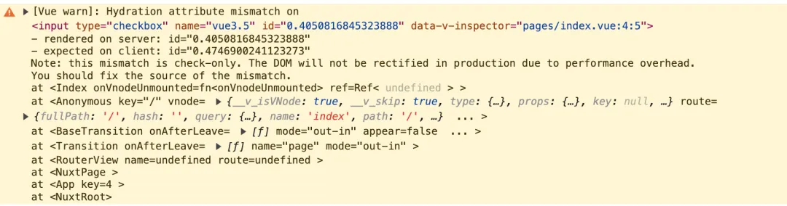
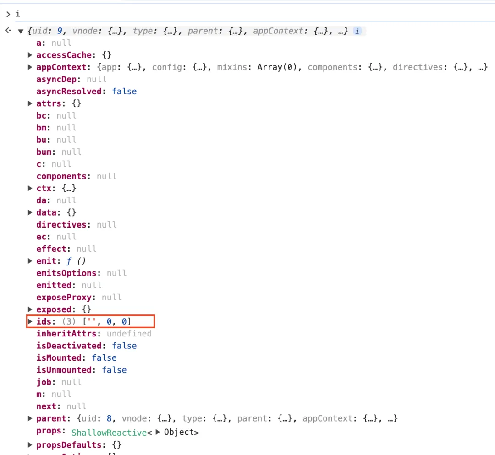
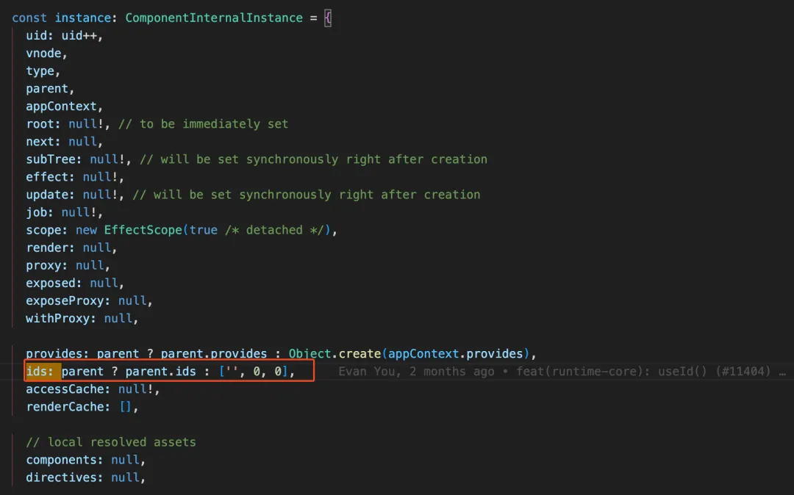

## 前言
React在很早之前的版本中加了useId,用于生成唯一ID。在Vue3.5版本中，终于也有了期待已久的useId.这篇文章带你搞清楚useId有哪些应用场景，以及它如何实现的。

## useId的作用
他的作用也是生成唯一ID，同一个vue应用里面每次调用useId生成的ID都不同

使用方法
```html
<script setup lang="ts">
import { useId } from 'vue'

const id0 = useId();
console.log(id0); // v-0

const id1 = useId();
console.log(id1); // v-1

const id2 = useId();
console.log(id2); // v-2
</script>
```
看到这里有的小伙伴会有问题,你上面的例子都是在同一个组件里调用userId。那如果我在不同的组件里面分别调用userId，这些组件生成的还是唯一的吗？

比如下面这个例子,父组件代码如下
```html
<template>
    <div>
        <UseIdChild1/>
        <UseIdChild2/>
    </div>
</template>
```
组组件 UseIdChild1 代码如下
```html
<script setup lang="ts">
import { useId } from 'vue';

const id0 = userId();
const id1 = userId();

console.log(id0);
console.log(id2);
</script>
```
子组件 UseIdChild2 代码如下
```html
<script setup lang="ts">
    import {useId} from 'vue';

    const id0 = userId();
    const id1 = userId();

    consolelog(id0)
    consolelog(id1)
</script>
```
从上面的代码可以看到两个子组件里面的代码实际是一样的，那你猜猜子组件UseIdChild1中打印的id0、id1和子组件UseIdChild2中打印的id0、id1是不是一样的呢？

答案是:<span style="color: red">不一样</span>

UseIdChild1中打印的id0的值为v-0，id1的值为v-1。

UseIdChild2中打印的id0的值为v-2，id1的值为v-3。

通过上面的这两个例子，我想你应该猜出来useId函数生成唯一ID的规律：“字符串v-加上自增的数字”。

其中的前缀v可以通过app.config.idPrefix进行自定义。

有的时候我们要渲染一个列表数据，需要列表的每一个item中有一个唯一的id，此时我们就可以使用useId去给每个item生成唯一的id。

这个是最简单的使用场景，接下来我们看看在服务端渲染(SSR)中useId的使用场景

## 在服务端渲染SSR中使用useId
首先我们要搞清楚服务端渲染时有哪些痛点？

我们来看一下服务端渲染例子

```html
<template>
    <div>
        <label :htmlFor="id">DO you like Vue3.5?</div>
        <input type="checkbox" name="vue3.5" :id="id"/>
    </div>
</template>
<script setup lang="ts">
const id = Math.random();
</script>
```
上面的代码如果是跑在客户端渲染时没有任何问题，但是如果在服务端渲染时就会有警告了。如下图：



上面警告的意思是，在服务端生成的id是0.4050816845323888。但是在客户端生成的id的值却是 0.4746900241123273。这两次生成的id值不同，所以才会警告。

可能有的小伙伴会有疑问，为什么在服务端生成一次id后，在客户端又去生成一次id呢？

为了解答上面这个问题，我们先来了解一下服务端渲染(SSR)的流程：
- 首先会在服务端(Node.js环境)发起接口请求，从后端拿到页面渲染需要的数据
- 根据拿到的数据去生成页面的HTML字符串，此时就会在服务端生成一次id，这一步叫 dehydrate(脱水)
- 将服务端生成的HTML字符串发送给客户端(浏览器)
- 浏览器拿到了服务端生产的HTML字符串可以将其作为首屏内容，直接渲染到页面上。但是此时click之类的时间还没绑定到DOM上，所以在客户端需要在渲染一次。就会在客户端在次上传一次id,这一步叫hydrate(注水)

由于我们这里使用 Math.random() 去生成的id,在服务端和客户端每次执行Math.random()生成id值当前就不同了，所以才会出现上面的警告。

有了useId，解决上面的警告就很简单了，只需要把Math.random()改成userId()就可以了。代码如下
```html
<template>
  <div>
    <label :htmlFor="id">Do you like Vue3.5?</label>
    <input type="checkbox" name="vue3.5" :id="id" />
  </div>
</template>

<script setup lang="ts">
const id = useId();
</script>
```
因为 userId 在服务器渲染时会生成v-0，在客户端渲染时依然还是v-0。

可能有的小伙伴有疑问，前面不是讲的useId每执行一次会给后面的数字+1。那么服务端执行一次后，再去客户端执行一次，讲道理应该生成的ID不一样吧？？

<span style="color: blue">useId 生成"自增数字部分"是维护在vue实例上面的ids属性上，服务端渲染那时会在Node.js端生成一个vue实例。但是客户端渲染时又会在浏览器中重新生成一个新的vue实例，此时vue实例上的ids属性也会被重置，所以在服务端和客户端执行useId生成的值是一样的。</span>

## useId是如何实现的
我们来看看useId的源码，非常简单！！简化后的代码如下：

```js
function useId(): string {
    const i = getCurrentInstance();
    if(i) {
        return (i.appContext.config.idPrefix || 'y') + '-' + i.ids[0] + i.ids[1]++
    } 
    return '';
}
```
这个 getCurrentInstance 函数我想很多同学都比较熟悉，他的作用是返回当前vue实例



从上图中可以看到vue实例上的ids属性是一个数组，数组的第一项是空字符串，第二项是数字0，第三项也是数字0

我们再来看看useId是如何返回唯一ID的，如下：

```js
return (i.appContext.config.idPrefix || 'v') + '-' + i.ids[0] + i.ids[1]++
```
生成的唯一ID由三部分组成
- 第一部分为前缀，从 app.config.idPrefix 中取得。如果没有配置，那么就是字符串v
- 第二部分为鞋子的字符串-
- 第三部分为i.ids[0] + i.ids[1]++,其中ids[0]的值为空字符串。i.ids[1]++在这里先取值，然后在执行++，所以第三部分的值为数字0。再次调用useId时，由于上一次执行过一次++了。此时数组值为1，并且再次执行++。

看到这里有的小伙伴又有疑问了,这里看上去ids属性是存在vue实例上面的。每个vue组件都有一个vue实例，那么每个组件都有各自维护的ids属性。那你前面的那个例子中那你前面的那个例子中UseIdChild1子组件和UseIdChild2子组件中各自生成的id0的值应该是一样的v-0吧，为什么一个是v-0，另外一个是v-2呢？

答案其实很简单，所有vue实例上面的ids属性都是同一个数组，指向的是顶层组件实例上面的那个ids属性。创建vue实例的源码如下图：



从上图中可以看到当没有父组件时，也就是最顶层的vue组件实例，就将其ids属性设置为数组['', 0, 0]。

当生成子组件的vue实例时，由于父组件上面有ids属性，所以就用父组件上面的了。指针都是指向的是最顶层vue实例上面的ids属性，所以才会说所有的vue组件实例上面的ids属性都是指向同一个数组。

这也就是为什么UseIdChild1子组件和UseIdChild2子组件中各自生成的id0的值一个是v-0，另外一个是v-2。

## 总结
Vue3.5新增的useId可以在Vue应用内生成唯一的ID，我们可以使用useId给列表数据中的每一个item生成一个唯一的id

并且在服务端渲染(SSR)场景中，服务端和客户端执行 useId 生成的同一个ID。利用这个特点我们可以使用useId解决在一些SSR应用中，服务端和客户端生成的ID不一致导致的警告。

最后我们将了 useId 的实现也很简单，生成的ID分为三部分
- 第一部分为前缀：app.config.idPrefix，如果没有配置，那么就是字符串V

- 第二部分字符串'-'

- 第三部分的值为一个自增的数字，存在vue实例上面的ids属性，所有的vue实例上面的ids属性都是指向同一个数组。这也就是为什么说useId可以在Vue应用内生成唯一的ID，而不是在Vue组件内生成唯一的ID。


[React的useId，现在Vue3.5终于也有了！](https://mp.weixin.qq.com/s/rUMXJ3O_Uo_OtHvqZMh7Og)