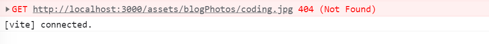
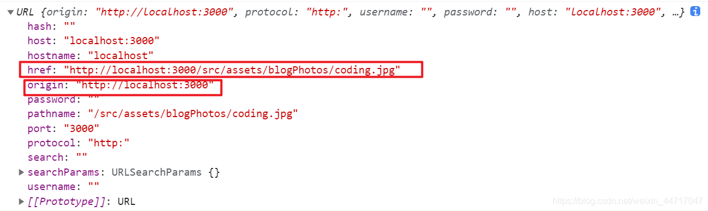
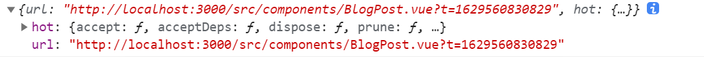

在Vite中，你可以使用JavaScript的动态导入（dynamic import）来动态加载图片。以下是一个示例
```js
const loadImage = async () => {
  const image = await import('./path/to/image.jpg');
  const imageElement = document.createElement('img');
  imageElement.src = image.default;
  document.body.appendChild(imageElement);
};

loadImage();
```
你可以使用import.meta.glob来动态加载图片文件，而不需要手动指定每个图片的路径。以下是一个示例：

```js
const loadImage = async () => {
  const images = import.meta.glob('./path/to/images/*.jpg');
  
  for (const path in images) {
    const image = await images[path]();
    const imageElement = document.createElement('img');
    imageElement.src = image.default;
    document.body.appendChild(imageElement);
  }
};

loadImage();
```

## 问题
我现在需要动态引入图片，因此要用到模板字符串和动态绑定。第一反应,当然就是如下写法

```html
"
```

但此时，控制台就报了一个错，说没有找到这张图片



但是图片明明就放在哪儿，你还说没找到

这时一顿百度，没有找到结果。只能去[vite的官方](https://cn.vitejs.dev/guide/assets),找到解决办法

## 解决方案一
根据官网的提示，我找到了最简单的方法，就是将asset前面加上src

```html

```
果然还是路径写错了

## 解决方案二
关于第二个方法，官网说"实际上，Vite并不需要在开发阶段处理这些代码！在生产构建时,Vite才会进行必要的转换保证URL在打包和资源哈希后仍指向正确的地址"

因此，以下的方法开发阶段不需要了解

首先给src绑定一个函数，然后把需要图片名字传给函数
```html

```
接着写这个函数

```js
function getImageUrl(name) {
    return new URL(`../assets/blogPhotos/${name}.jpg`, import.meta.url).href;
}
```
这里有两个知识点 new URL 和 import.meta.url

### new URL()
创建一个新URL对象的语法

```js
new URL(url, [base]);
```

- url --- 完整的URL，或仅路径(如果设置了base)
- base---可选的base URL:如果设置了此参数，且参数 url 只有路径，则会根据这个base生成URL。

../assets/blogPhotos/${name}.jpg是相对路径，而import.meta.url是base url(跟链接)

可以将这个path打印出来



```js
{
    hash: "",
    host: "localhost:3000",
    hostname: "localhost",
    href: "http://localhost:3000/src/assets/blogPhotos/coding.png",
    origin: "http://localhost:3000",
    password: "",
    pathname: "/src/assets/blogPhotos/coding.jpg",
    port: "3000",
    protocal: "http:",
    search: "",
    searchParams: URLSearchParams {},
    username: ""
}
```
其中有一个属性是href，正好是函数的返回值

### import.meta
import.meta 对象包含关于当前模块的信息。

它的内容取决于其所在的环境。在浏览器环境中，或如果它在HTML中的话，则包含当前页面的URL

因此可以把import.meta 打印出来

```js
console.log(import.meta)
```


可以看到，它有一个属性就是url。

综上，终于理解了上面的那个函数
```js
function getImageUrl(name) {
    return new URL(`../assets/blogPhotos/${name}.jpg`, import.meta.url).href
}
```