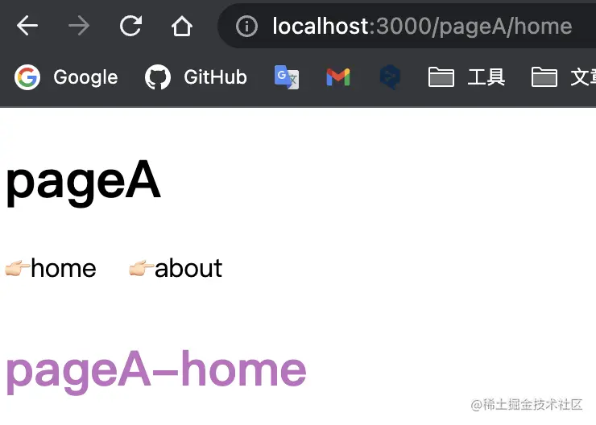

## 多入口开发业务场景
SPA是目前前端领域主流的项目形态，但如果一个项目需要重复复用部分代码逻辑接入了多个业务，业务之间直接的关联性不大，并且不需要直接路由跳转，则可以通过MPA的配置进行解耦(这里不讨论微前端那一套)。形成这样的目录结构

```css
pages
├── pageA
│   ├── App.vue
│   ├── index.html
│   ├── main.ts
└── pageB
    ├── App.vue
    ├── index.html
    └── main.ts
```
这样做的好处是我们能够在一个项目内将各个页面隔离开来，每个页面又能复用项目内公共代码逻辑，进而又可以通过monorepo的方法管理我们的代码

## 从零开始配置vite多入口开发
### 前言
vite官方提供了多入口打包与开发的配置,但是官方的案例给的目录结构并不友好，无法满足我们各个页面的在同一个目录下的平级需求.在网上搜索相关资料后，发现大家多多少少都遇到一些坑点，例如无法使用history模式的路由。本文会提供一个新的解决思路

### 创建 vite+vue+ts 项目
```bash
yarn create vite
```
### 创建多入口页面
我们还需要选择第一节提到的方式组织目录结构，先提前引入 vue-router
```bash
yarn add vue-router@4
```
接下来创建文件目录,因为vite是是基于html开始打包的，所以我们在每个项目下都创建各自的html文件
```css
└── pages
    ├── pageA
    │   ├── App.vue
    │   ├── components
    │   │   ├── about.vue
    │   │   └── home.vue
    │   ├── index.html
    │   ├── main.ts
    │   └── router.ts
    └── pageB
        ├── App.vue
        ├── index.html
        └── main.ts
```
:::tip
注意：html内引入ts文件必须使用绝对路径，也就是从根目录开始，例如 /src/pages/pageA/index.html 内引入ts文件是这样的
```html
<script type="module" src="/src/pages/pageA/main.ts"></script>
```
:::

### 编辑配置文件 vite.config.ts
参考vite的官方文档，修改build下的 rollupOptions 选项
```js
// 这个是vite官方案例
build: {
    rollupOptions: {
        input: {
            main: resolve(__dirname, 'index.html')
        }
    }
}
```
接下来我们配置我们这个项目的多入口。

聪明的前端工程师，当然不会自己手动一个个引入吧？所以写一个方法自动获取

```js
// 保存每个页面的名称和路径，后面会用到
const multiPage = {};
// 保存页面文件路径
const pageEntry = {};

function getInput() {
    const allEntry = glob.sync('./src/pages/**/index.html');
    allEntry.forEach((entry: string) => {
        const pathArr = entry.split('/');
        const name = pathArr[pathArr.length - 2];
        multiPage[name] = {
            name,
            rootPage: `/src/pages/${name}/index.html`,
        };
        pageEntry[name] = resolve(__dirname, `/src/pages/${name}/index.html`);
    })
}
// 调用一下
getInput();
```
好，现在我们获取到了每个页面的入口，接下来就可以添加进配置了
```js
export default defineConfig({
    plugins: [vue()],
    build: {
        rollupOptions: {
            input: pageEntry,
        },
    }
})
```
启动项目，通过http://localhost:3000/src/pages/pageB/index.html或者http://localhost:3000/src/pages/pageA/index.html，访问我们的页面了。


### 路由配置
在之前我们引入了路由，还没有进行配置，现在简单在pageA下简单配置一下，这里我们使用history模式的路由

```ts
// src/pages/pageA/router.ts
import { createWebHistory, createRouter } from "vue-router";

const router = createRouter({
  history: createWebHistory('/src/pages/pageA/index.html'),
  routes: [
    {
      path: "/",
      redirect: "/home",
    },
    {
      path: "/",
      name: "home",
      component: () => import("@/components/home.vue"),
    },
    {
      path: "/about",
      name: "about",
      component: () => import("@/components/about.vue"),
    },
  ],
});

export default router;
```
> **注意： 由于我们是用过http://localhost:3000/src/pages/pageB/index.html访问的页面，所以路由base应该是/src/pages/pageA/index.html。**

这样就可以通过http://localhost:3000/src/pages/pageA/index.html/about访问咱们页面下的路由了。


但是

<span style="color: red">当我们刷新页面，页面就会显示404！，显然vite的开发服务是没有对这块进行处理。并且，我们部署也没时，通过这么一长串url去访问非常不友好，所以路由的base也不能设置这么长。我们最终要的效果就是可以直接通过http://localhost:3000/pageA/about可以访问我们的页面。</span>

### 编写插件重写开发服务路径
既然是开发服务的问题，那么我们就对他的开发服务动手，vite插件暴漏处了 configureServer 这个钩子给我们操作;

我们引入一个第三方中间件： connect-history-api-fallback,可以帮助我们对访问路径进行重写，例如我们访问/home,可以重写为/inex.html/home.这里就不具体介绍它的作用了，[具体可以查看官方文档](https://github.com/bripkens/connect-history-api-fallback/)

```bash
yarn add connect-history-api-fallback -D
```
我们需要实现的目标是通过访问 http://localhost:3000/pageA 与访问 http://localhost:3000/src/pages/pageA/index.html的效果相同。那么我们可以这样编写我们的插件

```js
import history from "connect-history-api-fallback";

function pathRewritePlugin() {
  const rules: any[] = [];
  Reflect.ownKeys(mutliPage).forEach((key) => {
    rules.push( {
      from: `/${mutliPage[key].name}`,
      to: `${mutliPage[key].rootPage}`,
    })
  })
  return {
    name: 'path-rewrite-plugin',
    configureServer(server) {
      return () => {
        server.middlewares.use(history({
            htmlAcceptHeaders: ['text/html', 'application/xhtml+xml'],
            disableDotRule: true,
           rewrites: rules
        }))
      }
    }
  }
}

// 这里的multiPage是之前获取目录结构时保存的 比如
{
    pageA: { name: 'pageA', rootPage: '/src/pages/pageA/index.html' },
    pageB: { name: 'pageB', rootPage: '/src/pages/pageB/index.html' }
}
```
<span style="color: blue;font-weight:bold">既然是直接访问http://localhost:3000/pageA,那么在路由配置中的base也可以改成/pageA</span>

```js
import { createWebHistory, createRouter } from "vue-router";

const router = createRouter({
  history: createWebHistory("/pageA"),
  routes: [
    {
      path: "/",
      redirect: "home",
    },
    {
      name: "home",
      component: () => import("../pageA/components/home.vue"),
      path: "/home",
    },
    {
      name: "about",
      component: () => import("../pageA/components/about.vue"),
      path: "/about",
    },
  ],
});

export default router;
```
我们再次访问http://localhost:3000/pageA/home，页面就能展示出来了，并且刷新也不会再404了，大功告成。



## 小结
通过开发服务的路径重写，解决了刷新页面404的问题，并且简化了url的长度，开发体验大幅提高。但还是有个问题就是我们打包之后的路径是这样的，这就需要我们根据具体的部署方式去调整了

```css
dist
├── assets
│   ├── about.5052946a.js
│   ├── about.6eb1a9e1.css
│   ├── home.9d0be310.js
│   ├── home.cf51e8ea.css
│   ├── pageA.2b5e835c.css
│   ├── pageA.8b201e14.js
│   ├── pageB.6f5bd5c0.js
│   └── plugin-vue_export-helper.ccddabf8.js
├── favicon.ico
└── src
    └── pages
        ├── pageA
        │   └── index.html
        └── pageB
            └── index.html
```
如果你想要这样的输出结构，就需要调整root的路径。
```css
dist
├── assets
│   ├── about.5052946a.js
│   ├── about.6eb1a9e1.css
│   ├── home.9d0be310.js
│   ├── home.cf51e8ea.css
│   ├── pageA.7212b367.js
│   ├── pageA.c4b1b587.css
│   ├── pageB.6f5bd5c0.js
│   └── plugin-vue_export-helper.ccddabf8.js
├── pageA
│   └── index.html
└── pageB
    └── index.html
```
这里是我的配置方法。
```js
export default defineConfig({
  base: "./",
  root: "src/pages",
  plugins: [vue(), pathRewritePlugin()],
  build: {
    outDir: "../../dist",
    rollupOptions: {
      input: pageEntry,
    },
  },
});
```
>注意: 如果你修改了根路径，那么你其他文件使用了绝对路径也需要随之更改。

附上vite.config.ts整体文件内容
```js
import { defineConfig } from "vite";
import vue from "@vitejs/plugin-vue";
import { resolve } from "path";
import history from "connect-history-api-fallback";
import glob from "glob";
const multiPage = {};

const pageEntry = {};

function getInput() {
  const allEntry = glob.sync("./src/pages/**/index.html");
  allEntry.forEach((entry: string) => {
    const pathArr = entry.split("/");
    const name = pathArr[pathArr.length - 2];
    multiPage[name] = {
      name,
      rootPage: `/src/pages/${name}/index.html`,
    };
    pageEntry[name] = resolve(__dirname, `/src/pages/${name}/index.html`);
  });
}
function pathRewritePlugin() {
  const rules: any[] = [];
  console.log(multiPage);

  Reflect.ownKeys(multiPage).forEach((key) => {
    rules.push({
      from: `/${multiPage[key].name}`,
      to: `${multiPage[key].rootPage}`,
    });
  });
  return {
    name: "path-rewrite-plugin",
    configureServer(server) {
      server.middlewares.use(
        history({
          htmlAcceptHeaders: ["text/html", "application/xhtml+xml"],
          disableDotRule: false,
          rewrites: rules,
        })
      );
    },
  };
}
getInput();

// https://vitejs.dev/config/
export default defineConfig({
  // plugins: [vue()],
  plugins: [vue(), pathRewritePlugin()],
  build: {
    rollupOptions: {
      input: pageEntry,
    },
  },
});
```

## 资料
[原文](https://juejin.cn/post/7091282876288909319)