> 在NetWork 面板中发送 mock请求！！！

前端开发在调试过程中，经常需要各种不同的数据来反复调试，所以我们前端程序员会经常在脚手架中集成 mock 或者通过代理的方式去hack的实现，但是现在再也不用这么麻烦了，Chrome 117 原生就支持了，而且体验相当丝滑。

你可以实现什么效果呢？
- 拦截 HTML 文件，读取本地文件
- 拦截 JS 文件，读取本地文件
- 拦截CSS 文件，读取本地文件
- 拦截 请求，读取本地文件

也就是，一个页面上所有的资源包括图片,理论上七内容都可以自由修改，并且保存在本地的。

## 修改返回响应数据
想要修改接口返回的数据,设置成特定的数据,首先打开 网络(Network) 面板，找到你需要Mock的接口，右键然后选择替换内容(Override content).

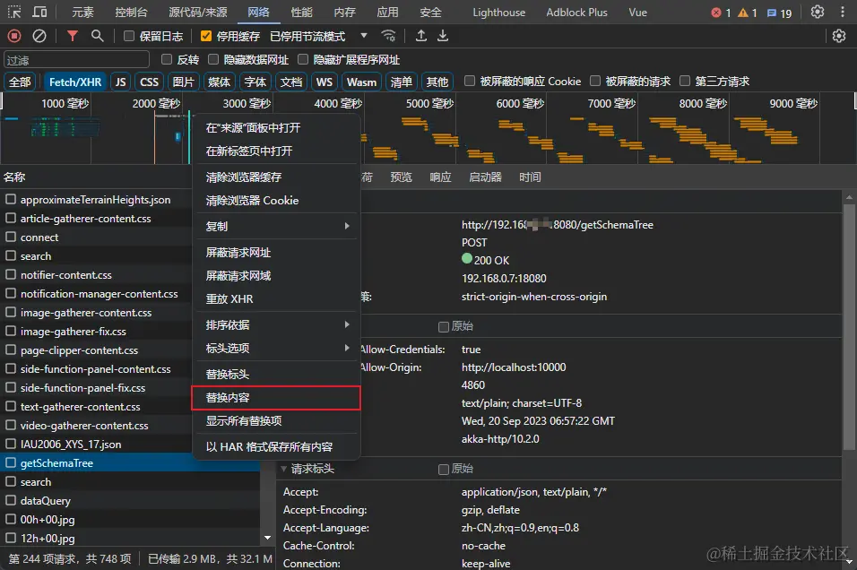

这时候浏览器会提示：选择要用来存储替换文件的文件夹,这个文件夹主要作用是用来 **保存Mock的替换文件**，方便下次Mock请求直接使用

点击 选择文件夹

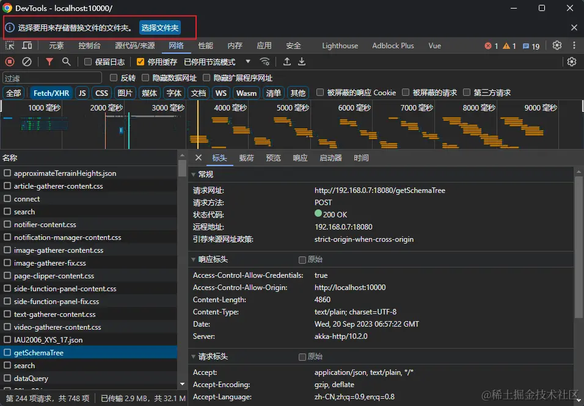

选择我们刚刚新建的文件夹，我是在电脑桌面上新建了一个空的文件夹 chrome_devtools, 选择之后会提示 **允许完整的访问权限**，一定要注意点击允许

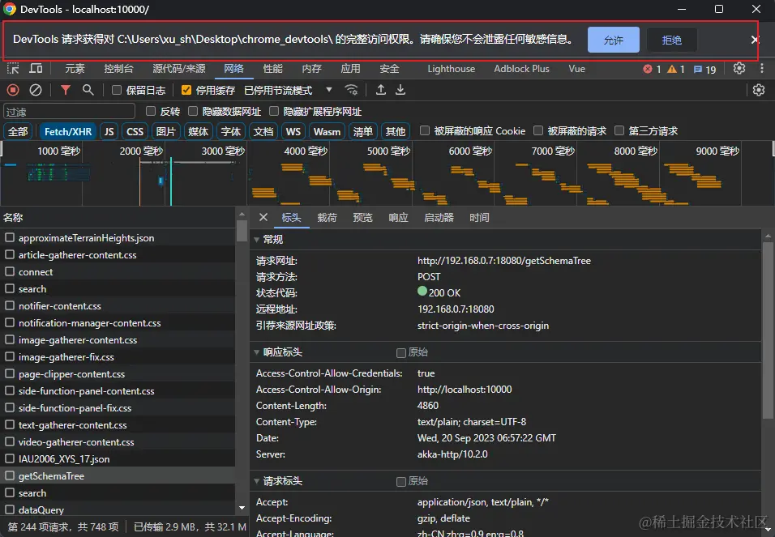

这个时候 DevTools 会自动跳转到 源代码/来源(Sources) 面板，并且会生成对应请求的Mock文件：

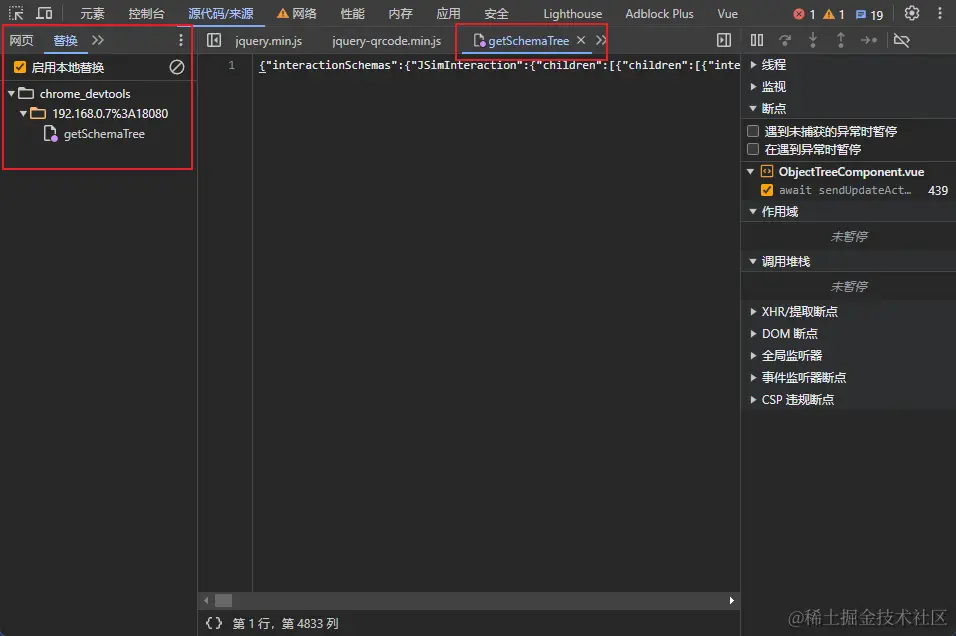

编辑Mock文件，自定义一个JSON数据格式然后保存

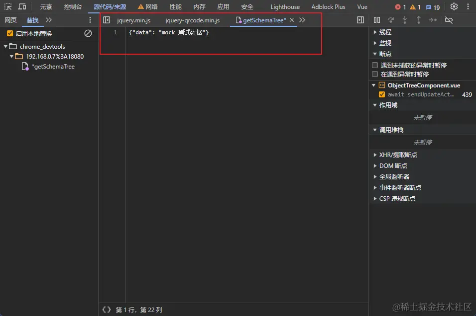

重新发起请求,发现被拦截的接口会有一个**高亮的标识**，鼠标移入会提示对应的信息，并且响应的数据已经变成了我们 修改后 的数据

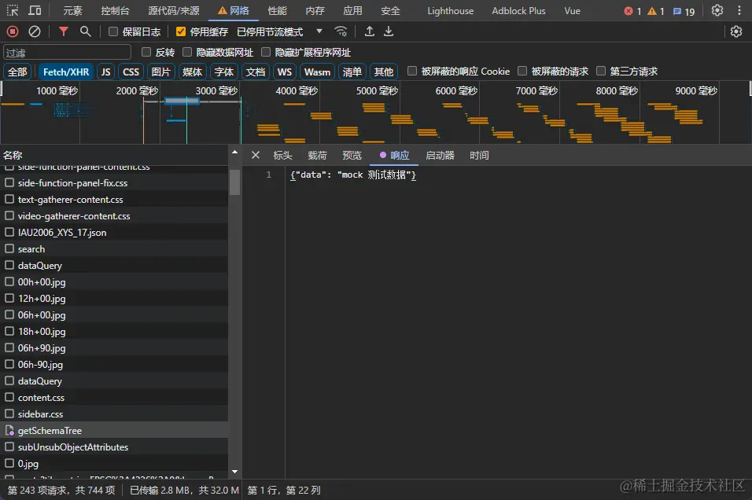

当然处了修改接口返回的内容以外，沃恩还可以修改返回的 响应头

## 修改返回的响应头
想要修改接口返回的响应头，增加我们想要返回的 key:value, 首先打开 网络(Network) 面板，找到你需要Mock的接口，右键然后选择 替换标头(Override headers)

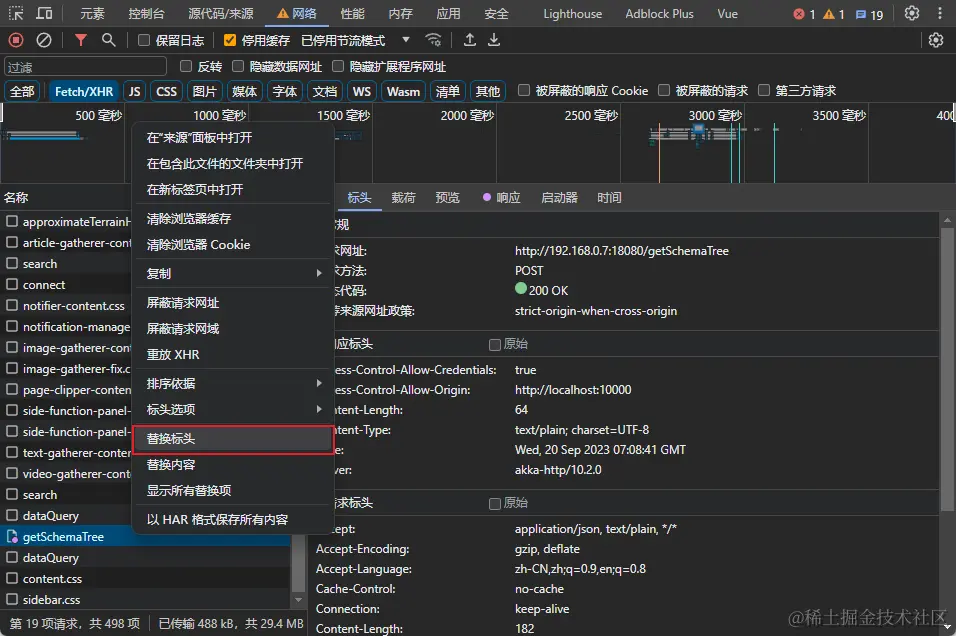

右侧面板会直接出现 添加标头 按钮

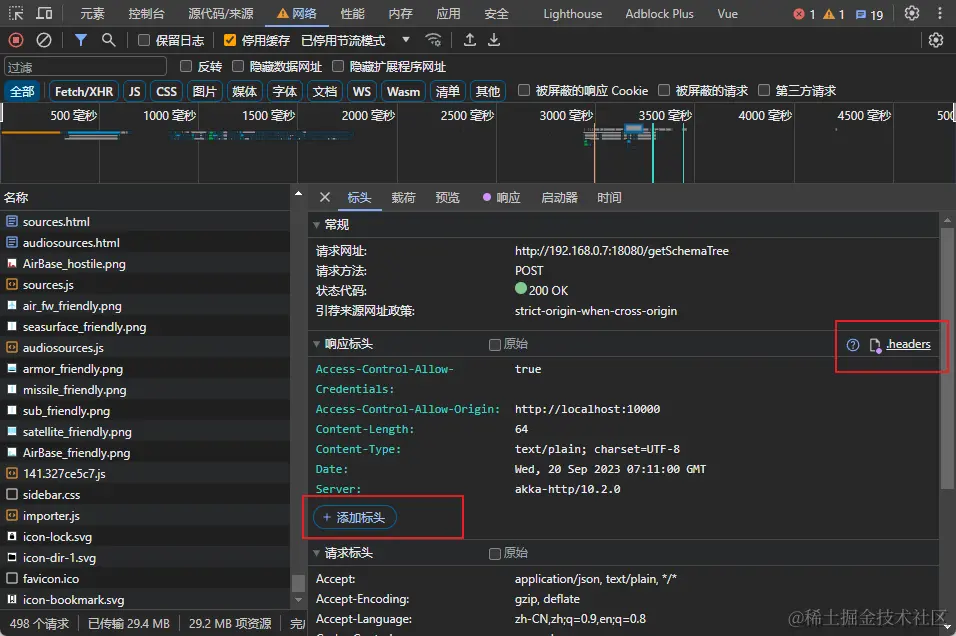

点击添加，这里我们添加一个 Test-Header: testHeader 做个简单的测试

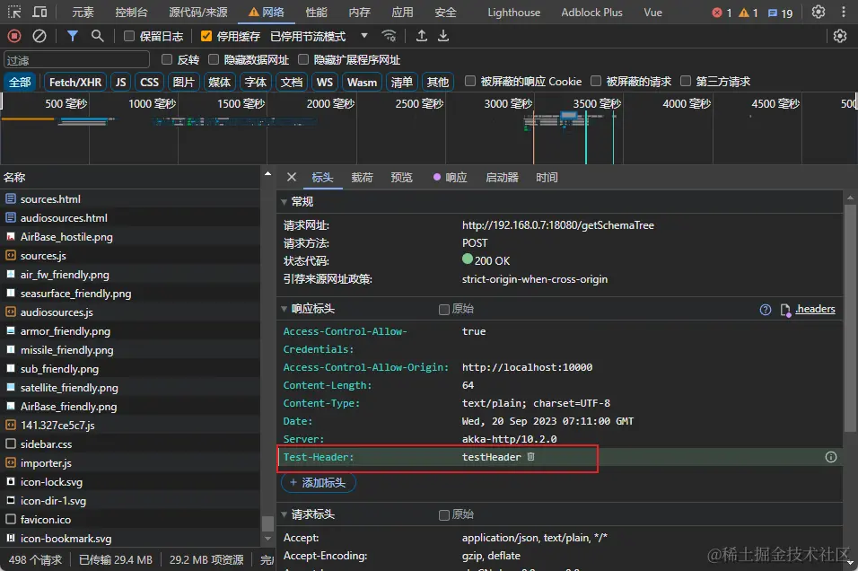

也可以直接打开 源代码/来源(Sources) 面板，找到对应的文件 .headers 文件中直接添加，两种添加方式效果一样

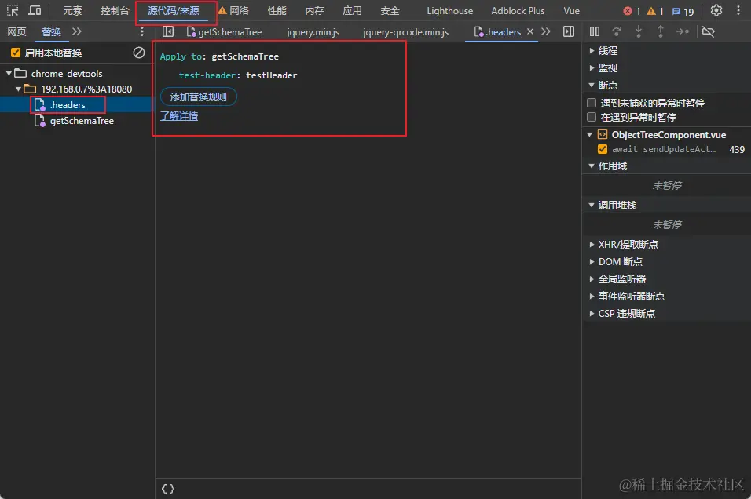

再次重新发起请求，发现响应头中已经返回了我们设置的 Test-Header: testHeader

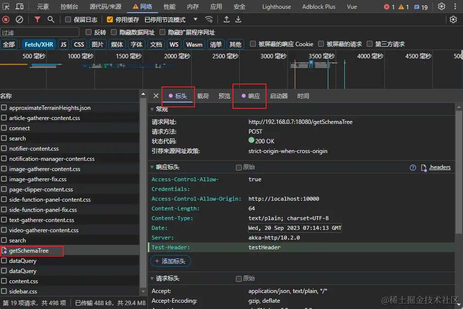

查看我们开始新建的 chrome_devtools 文件夹，发现Mock的数据都已经保存到了文件夹中了

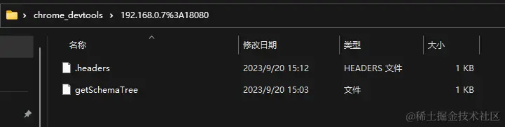

## 清除拦截的Mock数据
当我们 Mock 数据程序调试完成之后，想要调用真实的接口数据，这个时候一定要记得清除 Mock替换文件

打开 源代码/来源(Sources) 面板，取消勾选 启动本地替换 或者直接点击清除图表即可

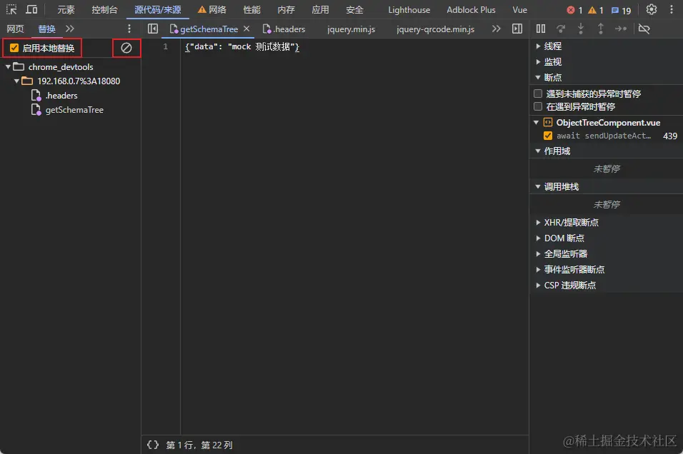

## 资料
[原文](https://juejin.cn/post/7281210797959561227?utm_source=gold_browser_extension)