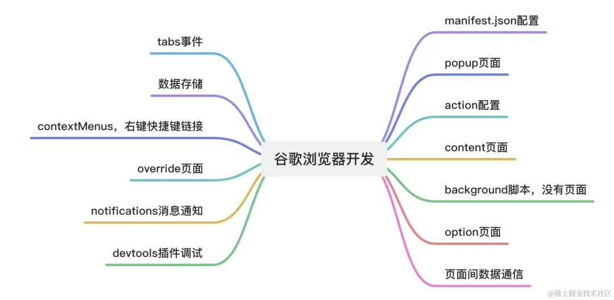
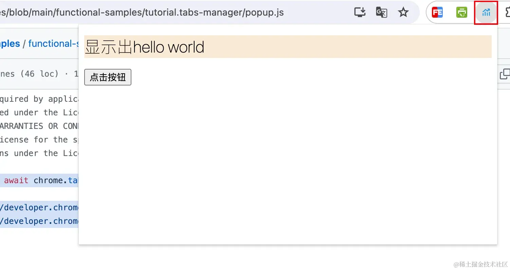
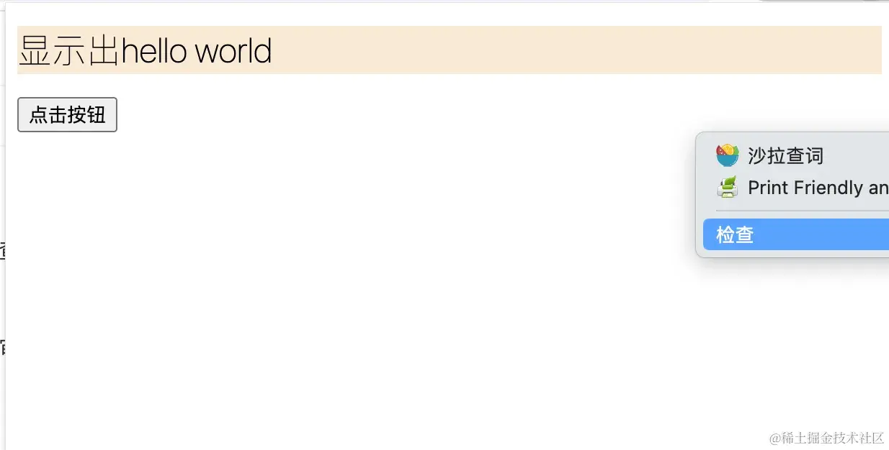
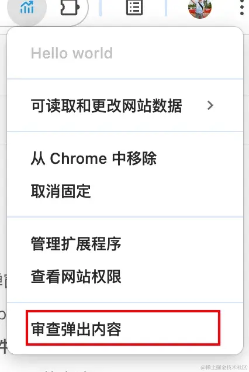
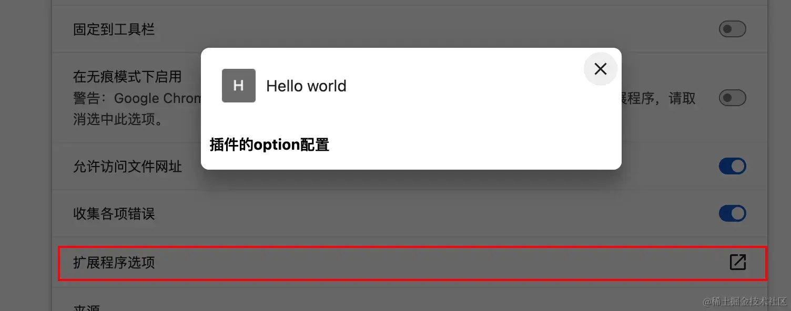
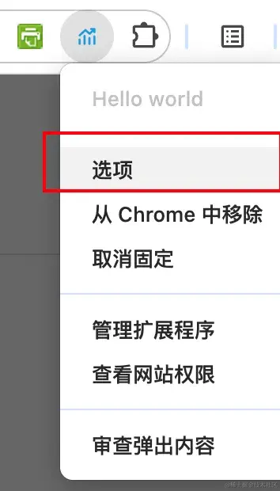
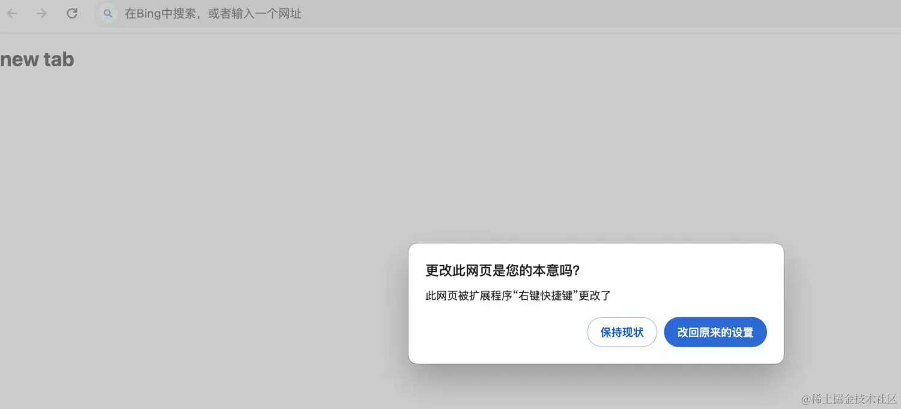
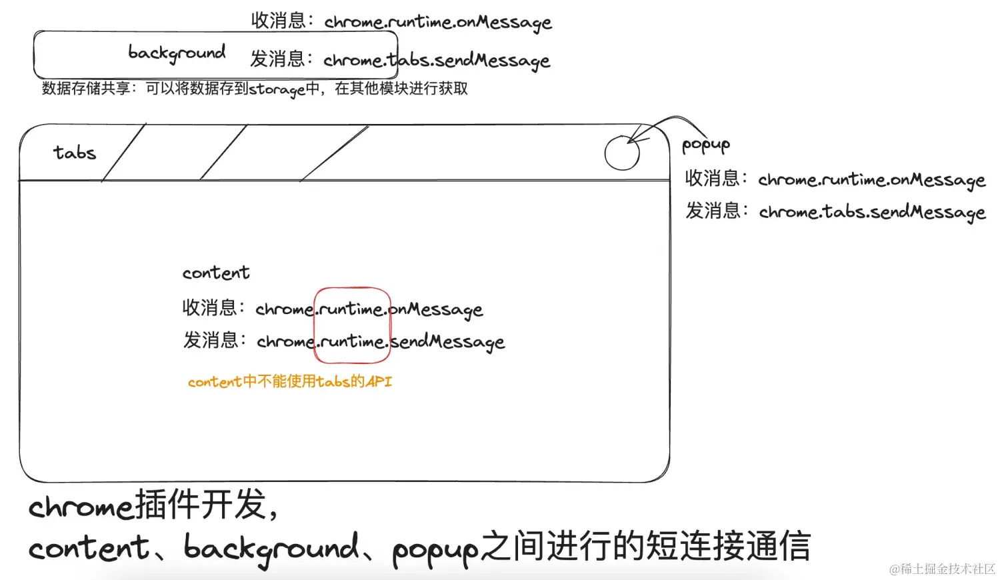
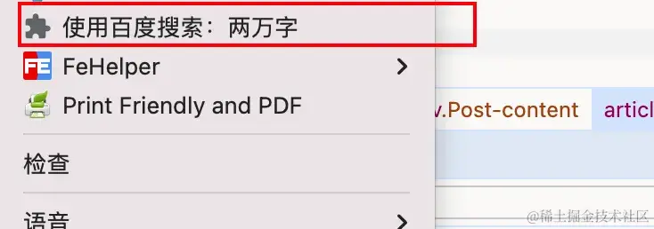

谷歌浏览器插件开发是指开发可以在谷歌浏览器中运行的扩展程序,可以为用户提供额外的功能和定制化的体验。**谷歌浏览器插件通常由HTML、CSS和Javascript组成，非常利于前端开发者**。开发者可以利用这些技术在浏览器中添加新的功能、修改现有功能与网页进行交互。

要开发谷歌浏览器插件，<span style="color: blue">开发者通常需要创建一个包含**清单文件(manifest.json)、背景脚本(background script)、内容脚本(content script)**</span>等文件的项目结构。清单文件是插入的配置文件，包含插件的名称、版本、描述、权限以及其他相关信息。背景脚本用于处理插件的后台逻辑，而内容脚本则用于在网页中执行Javascript代码。

谷歌浏览器插件可以实现各种功能，例如添加新的工具栏按钮、修改网页内容、捕获用户输入、与后台服务器进行通信等。开发者可以通过谷歌浏览器插件API来访问浏览器的各种功能和数据，实现各种定制化的需求。插件开发设计的要点



## 基础配置
开发谷歌浏览器插件，最重要的文件manifest.json

```js
{
    "name": "Getting Started Example",  // 插件名称
    "description": "Build an Extension!", // 插件描述
    "version": "1.0", // 版本
    "manifest_version": 3, // 指定插件版本，这个很重要，指定什么版本就用什么样的api，不能用错了
    "background": {
        "service_worker": "background.js" // 指定background脚本的路径
    },
    "action": {
        "default_popup": "popup.html", // 指定popup的路径
        "default_icon": {  // 指定popup的图标，不同尺寸
            "16": "/images/icon16.png",
            "32": "/images/icon32.png",
            "48": "/images/icon48.png",
            "128": "/images/icon128.png"
        }
    },
    "icons": { // 指定插件的图标，不同尺寸
        "16": "/images/icon16.png",
        "32": "/images/icon32.png",
        "48": "/images/icon48.png",
        "128": "/images/icon128.png"
    },
    "permissions": [],// 指定应该在脚本中注入那些变量方法，后文再详细说
    "options_page": "options.html",
    "content_scripts": [ // 指定content脚本配置
        {
            "js": [ "content.js"], // content脚本路径
            "css":[ "content.css" ],// content的css
            "matches": ["<all_urls>"] // 对匹配到的tab起作用。all_urls就是全部都起作用
        }
    ]
}
```
- name: 插件名称

    manifest_version：对应chrome API插件版本，浏览器插件采用的版本，目前共2种版本，是2和最新版3

- version: 插件版本，和发布相关
- action: 点击图标时，设置一些交互
    - 16、32、48、128
    - default_icon: 展示图标
    - default_popup: popup.html,一个弹窗页面
    - default_title: 显示的标题
- permissions: 拥有的权限
    - tabs: 监听浏览器tab切换事件
- options_ui
- background:
    - service_workder: 设置打开独立页面

[官方实例1](https://github.com/GoogleChrome/chrome-extensions-samples/tree/7b66cabcb1a7cf72f62dcc5045f630c37cbc9762/functional-samples)

[官方实例2](https://developer.chrome.com/docs/extensions/get-started/tutorial/hello-world?hl=zh-cn)

## 打开pop弹窗页面
设置action的default_popup属性

```js
{
  "name": "Hello world",
  "description": "show 'hello world'!",
  "version": "1.0",
  "manifest_version": 3,
  "action": {
    "default_popup": "popup.html",
    "default_icon": {
      "16": "/images/icon16.png",
      "32": "/images/icon32.png",
      "48": "/images/icon48.png",
      "128": "/images/icon128.png"
    }
  },
  "permissions":["tabs", "storage", "activeTab", "idle"],
  "background": {
    "service_worker": "background.js"
  },
  "content_scripts": [
    {
      "js": [ "content.js"],
      "css":[ "content.css" ],
      "matches": ["<all_urls>"]
    }
  ]
}
```
### 创建popup.html
```html
<!DOCTYPE html>
<html lang="en">

  <head>
    <meta charset="UTF-8">
    <meta name="viewport" content="width=device-width, initial-scale=1.0">
    <title>显示出hello world</title>
    <link rel="stylesheet" type="text/css" href="popup.css">
  </head>

  <body>
    <h1>显示出hello world</h1>
    <button id="clickBtn">点击按钮</button>
    <script src="popup.js"></script>
  </body>
</html>
```
文件可以通过链接引入css、js
```css
body {
    width: 600px;
    height: 600px;
}
h1 {
    background-color: antiquewhite;
    font-weight: 100
}
```

```js
console.log(document.getElementById('clickBtn'));
document.getElementById('clickBtn').addEventListener('click', function() {
    console.log('clicked');
})
```
### 点击插件图标
点击图标可以看到如下


### 调试popup.js的方法
- 通过弹窗,在弹窗内部点击右键，选择审查内容

    

- 通过插件图标，进行点击鼠标右键，选择审查弹出内容

    

## 通过background打开独立页面
基于 background 的 service_worker API可以打开一个独立后台运行脚本。此脚本随着插件安装，初始化执行一次，然后一直在后台运行。可以用来存储浏览器的全局状态数据。background脚本是长时间运行在后台，随着浏览器打开就运行，知道浏览器关闭而结束运行。通常把需要一直运行的、启动就运行的、全局公用的数据放到background脚本。

```js
chrome.action.onClicked.addListener(function() {
    chrome.tabs.create({
        url: chrome.runtime.getURL('newPage.html')
    })
})
```
为了打开独立页面,需要修改manifest.json

```js
{
  "name": "newPage",
  "description": "Demonstrates the chrome.tabs API and the chrome.windows API by providing a user interface to manage tabs and windows.",
  "version": "0.1",
  "permissions": ["tabs"],
  "background": {
    "service_worker": "service-worker.js"
  },
  "action": {
    "default_title": "Show tab inspector"
  },
  "manifest_version": 3
}
```
为了实现打开独立页面，在manifest.json中就不能在配置 action:default_popup 在 newPage.js文件中可以使用 **chrome.tabs 和 chrome.windows API**,可以使用chrome.runtime.getUrl跳转一个页面
```js
chrome.runtime.onInstalled.addListener(async () => {
    chrome.tabs.create({
        url: chrome.runtime.getURL('newPage.html')
    })
})
```
## content内容脚本
content-scripts(内容脚本)是在网页上下文中运行的文件。通过使用标准的文档对象模型(DOM),它能够**读取浏览器访问的网页的详细信息**,可以对打开的页面进行更改，还可以将DOM信息传递给其父级插件。内容脚本相对于background还有一些访问API上的限制，它可以直接访问一下chrome的API。

- i18n
- storage
- runtime:
    - connect
    - getManifest
    - getURL
    - id
    - onConnect
    - onMessage
    - sendMessage
content.js运行于一个独立、隔离的环境，他不会和主页面的脚本或其他插件的内容脚本发生冲突，有2种方式添加content脚本

### 在配置中设置
```js
"content_scripts": [
    {
        "js": ["content.js"],
        "css": ["content.css"],
        "matches": ["<all_urls>"]
    }
]
```
content_scripts属性除了配置js，还可以设置css样式，来实现修改页面的样式。matches表示需要匹配的页面；除了这3个属性还有
- run_at:脚本运行时刻，有以下三个选项
    - document_idle，默认；浏览器会想廁一个合适的时间注入，并是在dom完成加载
    - document_start:css加载完成，dom和脚本加载之前注入
    - document_end: dom加载完成之后
- exclude_matches: 排除匹配到的url地址。作用和matches想法

### 动态配置注入
在特定时刻才进行注入，比如点击了某个按钮，或者指定的时刻，需要在popup.js或background.js中执行注入代码。

```js
chrome.tabs.executeScript(tabs[0].id, {
  code: 'document.body.style.backgroundColor = "red";',
});
```
也可以将整个content.js注入
```js
chrome.tabs.executeScript(tabs[0].id, {
    file: 'content.js'
})
```
### 利用content制作一个弹窗工具
某天不小心让你的女神生气了，为了能够道歉争取到原谅，你是否可以写一个道歉信贴到每一个页面上，当女神打开网站，看到每个页面都会有道歉内容。


道歉信内容自己写哈，这个具体看你的诚意。 下面设置2个按钮，原谅和不原谅。 点击原谅，就可以关闭弹窗。 点击不原谅，这个弹窗调整css布局位置继续显示。（有点像恶意贴片广告了）

下面设置content.js的内容
```js
let newDiv = document.createElement('div');
newDiv.innerHTML = `<div id="wrapper">
  <h3>小仙女～消消气</h3>
  <div><button id="cancel">已消气</button>
  <button id="reject">不原谅</button></div>
</div>`;
newDiv.id = 'newDiv';
document.body.appendChild(newDiv);
const cancelBtn = document.querySelector('#cancel');
const rejectBtn = document.querySelector('#reject');
cancelBtn.onclick = function() {
    document.body.removeChild(newDiv);
    chrome.storage.sync.set({ state: 'cancel'}, data => {})
}

rejectBtn.onclick = function() {
  newDiv.style.bottom = Math.random() * 200 + 10 + "px";
  newDiv.style.right = Math.random() * 800 + 10 + "px";
}
// chrome.storage.sync.get({ state: '' }, (data) => {
//   if (data.state === 'cancel') {
//     document.body.removeChild(newDiv);
//   }
// });
```
content.css 布局样式
```css
#newDiv {
    font-size: 36px;
    color: burlywood;
    position: fixed;
    bottom: 20px;
    right: 0;
    width: 300px;
    height: 200px;
    background-color: rgb(237, 229, 216);
    text-align: center;
    z-index: 9999;
}
```
## 打开option页面
options页，就是插件的设置页面，有2个入口

- 点击插件详情，找到扩展程序选项入口

    

- 插件图标，点击右键，选择'选项菜单'

    


可以看到设置的option.html页面
```html
<!DOCTYPE html>
<html lang="en">
<head>
    <meta charset="UTF-8">
    <meta name="viewport" content="width=device-width, initial-scale=1.0">
    <title>插件的option配置</title>
</head>
<body>
    <h3>插件的option配置</h3>
</body>
</html>
```
此页面也可以进行js、css的引入。

## 替换浏览器默认页面
override功能,是可以替换掉浏览器默认功能的页面，可以替换newtab、history、bookmark三个功能，将新开页面、历史记录页面、书签页面设置为自定义的内容。修改manifest.json 配置

```js
{
    "chrome_url_overrides": {
        "newtab": "newtab.html",
        "history": "history.html",
        "bookmarks": "bookmarks.html"
    }
}
```
创建一个newtab的html页面
```html
<!DOCTYPE html>
<html lang="en">
  <head>
    <meta charset="UTF-8">
    <meta name="viewport" content="width=device-width, initial-scale=1.0">
    <title>Document</title>
  </head>
  <body>
    <h1>new tab</h1>
  </body>
</html>
```
插件更新后，点开新的tab，就会出现我们自定义的页面。第一次的情况会让用户进行选择，是进行更换还是保留原来的配置。



很多插件都是使用newtab进行自定义打开的tab页，比如掘金的浏览器插件，打开新页面就是[掘金网站插件](https://juejin.cn/extension?utm_source=jj_nav)。

## 页面之间进行数据通信


如需将单条消息发送到扩展程序的其他部分并选择性的接收相应，请调用 [runtime.sendMessage()](https://developer.chrome.com/docs/extensions/reference/api/runtime?hl=zh-cn#method-sendMessage)或[tabs.sendMessage()](https://developer.chrome.com/docs/extensions/reference/api/tabs?hl=zh-cn#method-sendMessage)。通过这些方法，您可以从内容脚本想扩展程序发送一次性JSON可序列化消息，或者从扩展程序向内容脚本发送。如需处理相应，请使用返回的promise，来源地址 [https://developer.chrome.com/docs/extensions/develop/concepts/messaging?hl=zh-cn#simple](https://developer.chrome.com/docs/extensions/develop/concepts/messaging?hl=zh-cn#simple)

### content中脚本发送消息
<span style="color: red">chrome.runtime.sendMessage 只能放在content的脚本中</span>

```js
(async () => {
    const response = await chrome.runtime.sendMessage({greeting: 'hello'});
    // do something with response here,not outside the function
    console.log(response)
})()
```
### 其他页面发送消息
其他页面需向内容脚本发送消息，请指定请求应用于哪个标签页，如下所示。此示例适用于Service Worker、弹出式窗口和作为标签页打开的 chrome-extension://页面

```js
(async () => {
    const [tab] = await chrome.tabs.query({active: true, lastFocusedWindow: true});
    const response = await chrome.tabs.sendMessage(tab.id, {greeting: 'hello'});
    // do something with response here, not outside the funciton
    console.log(response);
})
```
### 接收消息使用onMessage
在扩展程序和内容脚本中使用相同的代码
```js
chrome.runtime.onMessage.addListener(function(request, render, sendResponse) {
    console.log(sender.tab ? 'from a content script:' + sender.tab.url : 'from the extension');
    if(request.greeting === 'hello') {
        sendResponse({farewell: 'goodbye'})
    }
})
```
## 添加右键菜单
### 创建菜单
首先在manifest.json的权限中添加配置
```js
{
    "permissions": ["contextMenus"]
}
```
在background.js中添加创建菜单的代码
```js
let menu1 = chrome.contextMenus.create({
    type: 'radio', // 可以是 【normal、checkbox、radio】默认是normal
    title: 'click me',
    id: 'myMenu1Id',
    contexts: ['image']
}, function() {

})

let menu2 = chrome.contextMenus.create({
    type: 'normal', // 可以是 【normal、checkbox、radio】，默认是normal
    title: 'click me222',
    id: 'myMenu222Id',
    contexts: ['all'] // 所有类型都展示
}, function() {

})

let menu3 = chrome.contextMenus.creat({
    id: 'baidusearch1',
    title: '使用百度搜索：%s', 
    contexts: ['selection'], //选择页面上的文字
})

// 删除一个菜单
chrome.contextMenus.remove('myMenu222Id'); // 被删除菜单的id munuItemId
// 删除所有菜单
chrome.contextMenus.removeAll();

// 绑定菜单点击事件
chrome.contextMenus.onClicked.addListener(function(info, tab) {
    if(info.menuItemId === 'myMenu222Id') {
        console.log('xxx')
    }
})
```
以下是其他可以使用的API
```js
// 删除某一个菜单项
chrome.contextMenus.remove(menuItemId)；
// 删除所有自定义右键菜单
chrome.contextMenus.removeAll();
// 更新某一个菜单项
chrome.contextMenus.update(menuItemId, updateProperties);
// 监听菜单项点击事件, 这里使用的是 onClicked
chrome.contextMenus.onClicked.addListener(function(info, tab)) {
  //...
});
```
### 绑定点击事件，发送接口请求
首先需要在manifest.json的hosts_permissions中添加配置
```js
{
    "host_permissions": ["http://*/*", "https://*/*"]
}
```
创建node服务器，返回json数据
```js
// server.mjs
const { createServer } = require('node:http');
const url = require('url');

const server = createServer((req, res) => {
    var pathname = url.parse(req.url).pathname;

    if(pathname.includes('api')) {
        res.writeHead(200, {'Content-Type': 'application/json'});
        res.write({
            name: 'John Doe',
            age: 30
        })
        res.end();
    } else {
        res.writeHead(200, {'Content-Type': 'text/plain'});
        res.end('Hello World!\n' + pathname)
    }
})

server.listen(8080, '127.0.0.1', () => {
    console.log('Listening on 127.0.0.1:8080')
})
```
编辑background.js
```js
// 插件右键快捷键
// 点击右键进行选择
chrome.contextMenus.onClick.addListener(function(info, tab) {
    if(info.menuItemId === 'group1') {
        console.log('分组文字1', info)；
    }
    if(info.menuItem === 'group2') {
        console.log('分组文字2');
    }
    // 点击获取到数据
    if(info.menuItemId === 'fetch') {
        console.log('fetch 获取数据');
        const res = fetch('http://localhost:8080/api', {
            method: 'GET',
            headers: {
                'Content-Type': 'application/json'
            },
        }).then(res => {
            console.log(res, '获取到http://localhost:8080/api接口数据');
            chrome.storage.sync.set({color: 'red'}, function(err, data) {
                console.log('store success!')
            })
        })
    }
    // 创建百度搜索,并跳转到搜索结果页
    if (info.menuItemId === 'baidusearch1') {
        // console.log(info, tab, "baidusearch1")
        // 创建一个新的tab页面
        chrome.tabs.create({
        url:
            'https://www.baidu.com/s?ie=utf-8&wd=' + encodeURI(info.selectionText),
        });
    }
})
// 创建右键快捷键
chrome.runtime.onInstalled.addListener(function () {
  // Create one test item for each context type.
  let contexts = [
    'page',
    'selection',
    'link',
    'editable',
    'image',
    'video',
    'audio',
  ];
  // for (let i = 0; i < contexts.length; i++) {
  //   let context = contexts[i];
  //   let title = "Test '" + context + "' menu item";
  //   chrome.contextMenus.create({
  //     title: title,
  //     contexts: [context],
  //     id: context,
  //   });
  // }

  // Create a parent item and two children.
  let parent = chrome.contextMenus.create({
    title: '操作数据分组',
    id: 'parent',
  });
  chrome.contextMenus.create({
    title: '分组1',
    parentId: parent,
    id: 'group1',
  });
  chrome.contextMenus.create({
    title: '分组2',
    parentId: parent,
    id: 'group2',
  });
  chrome.contextMenus.create({
    title: '获取远程数据',
    parentId: parent,
    id: 'fetch',
  });

  // Create a radio item.
  chrome.contextMenus.create({
    title: '创建单选按钮1',
    type: 'radio',
    id: 'radio1',
  });
  chrome.contextMenus.create({
    title: '创建单选按钮2',
    type: 'radio',
    id: 'radio2',
  });

  // Create a checkbox item.
  chrome.contextMenus.create({
    title: '可以多选的复选框1',
    type: 'checkbox',
    id: 'checkbox',
  });
  chrome.contextMenus.create({
    title: '可以多选的复选框2',
    type: 'checkbox',
    id: 'checkbox2',
  });

  // 在title属性中有一个%s的标识符，当contexts为selection，使用%s来表示选中的文字
  chrome.contextMenus.create({
    id: 'baidusearch1',
    title: '使用百度搜索：%s',
    contexts: ['selection'],
  });

  // Intentionally create an invalid item, to show off error checking in the
  // create callback.
  chrome.contextMenus.create(
    { title: 'Oops', parentId: 999, id: 'errorItem' },
    function () {
      if (chrome.runtime.lastError) {
        console.log('Got expected error: ' + chrome.runtime.lastError.message);
      }
    }
  );
});
```
点击鼠标右键，效果如下


如果在页面选择几个文字，那么就显示出百度搜索快捷键，



## 缓存,数据缓存
首先在manifest.json的权限中添加storage配置
```js
{
    "permissions": ['storage']
}
```
```js
chrome.storage.sync.set({color: 'red'}, function() {
    console.log('background js storage set data ok!')
})
```
然后就可以在content.js或popup.js中获取到数据
```js
// 这里的参数是，获取不到数据时的默认参数
chrome.storage.sync.get({color: 'yellow'}, function() {
    console.log('background js storage get data ok!')
})
```
## tabs创建页签
首先在manifest.json的权限中添加tabs配置
```js
{
    "permissions": ["tabs"]
}
```
添加tabs的相关操作
```js
chrome.tabs.query({}, function(tabs) {
    console.log(tabs);
})
function getCurrentTab() {
    let [tab] = chrome.tabs.query({active: true, lastFocusedWindow: true});
    return tab;
}
```
## notifications消息通知
Chrome提供chrome.notifications的API来推送桌面通知；首先在manifest.json中配置权限
```js
{
    "permissions": [
        "notifications"
    ]
}
```
然后在background脚本中进行创建
```js
// background.js
chrome.notifications.create(null, {
    tyupe: 'basic',
    iconUrl: 'drink.png',
    title: '喝水小助手',
    message: "看到此消息的人可以和我一起来喝一杯水",
})
```
## devtools 开发扩展工具
在manifest中配置一个devtools.html
```js
{
    "divtools_page": "devtools.html"
}
```
devtools.html中只引用了devtools.js，如果写了其他内容也不会展示
```html
<!DOCTYPE html>
<html lang="en">
  <head> </head>
  <body>
    <script type="text/javascript" src="./devtools.js"></script>
  </body>
</html>
```
创建devtools.js文件
```js
// devtools.js
// 创建扩展面板
chrome.devtools.panels.create(
  // 扩展面板显示名称
  "DevPanel",
  // 扩展面板icon，并不展示
  "panel.png",
  // 扩展面板页面
  "Panel.html",
  function (panel) {
    console.log("自定义面板创建成功！");
  }
);

// 创建自定义侧边栏
chrome.devtools.panels.elements.createSidebarPane(
  "Sidebar",
  function (sidebar) {
    sidebar.setPage("sidebar.html");
  }
);
```
然后在创建自定的Panel.html和sidebar.html页面。

[相关代码下载](https://gitee.com/shenshuai89/learn-chrome-extension)


## 资料
[原文](https://juejin.cn/post/7350571075548397618)

[用 Vue 开发自己的 Chrome 扩展程序](https://mp.weixin.qq.com/s/jVUrqO-RGkxdY-EANKJF8Q)

[使用 React.js 开发 Chrome 插件](https://mp.weixin.qq.com/s/4MvHQX2RK4KAVCtm1OXhoQ)