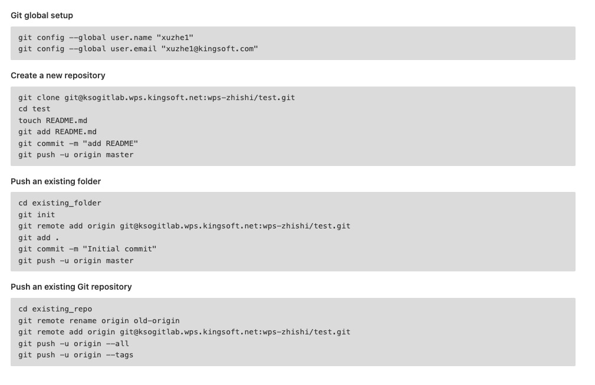

---
title: Git相关
--- 



## 查看cofig
```js
git config -l | git config --list

git config --local --list
git config --global --list
git config --system --list
```
## 本地项目关联远程仓库
```js
git remote add origin git@xxx.gitlab.com:zhiliao/web-client/zhiliao-site.git

```

## Git push问题

```js
git add .
git ci -m 'first my'
git push origin HEAD:refs/for/master
```
** 解释 **

git push <remote 名字> <本地分之的名字> : <远程库的名字>

git push 推送

origin 远程库的名字

HEAD是一个特别的指针，它是一个指向你正在工作的本地分之的指针，可以把它当做本地分之的别名，git这样就可以知道你工作在哪个分之

<span style="color: red">refs/for意义在于我们提交代码到服务器之后是需要code review之后才能进行merge的</span>

<span style="color: red">refs/heads 不需要</span>

```
//撤销
git reset --hard <commit_id>
```

## 切换分支
```js
git branch -r // 查看所有远程分支
// 拉取远程分支并创建本地分支
// 方法一
git checkout -b 本地分支名x origin/远程分支名

git checkout -b mobile_1.0.0 origin/mobile_1.0.0 // 例子 自动切换到分支 存在映射关系
 
// 方法二
git fetch origin 远程分支名x:本地分支名x // 不会建立映射关系
```
[git拉去远程分支并创建本地分支](https://blog.csdn.net/tterminator/article/details/52225720)
## fetch VS pull

1. 简单概括


<span style="color: red">git fetch是将远程主机的最新内容拉到本地，用户在检查了以后决定是否合并到工作本机分支中。</span>

<span style="color: red">而git pull则是将远程主机的最新内容拉下来后直接合并，即git pull = git fetch + git merge,这样可能会产生冲突，需要手动解决。</span>

2. 分支的概念

> 分支是用来标记特定代码的提交，每一个分支通过SHA1sum值标识，所以分支分支的操作是轻量级的，你可以改变的仅仅是SHA1sum值

如，当前两个分支，A,C,E属于master分支，而A,B,F属于dev分支
```
A---C---E(master)
 \ 
  B---D---F(dev)
```
它们的head指针分别指向E和F，对上述做如下操作
```
git checkout master //选择or切换到master分支
git merge dev //讲dev分支合并到当前分支master中
```
合并完成后
```
A---C---E----G（master）
\           /
 B---D----F(dev)
```
现在ABCDEFG属于master分支，G是一次合并后的结果，是将E和F的代码合并后的结果，可能会出现冲突，而ABDF依然属于dev分支，可以继续在dev分支上开发
```
A---C---E----G（master）
\           /
 B---D----F-----I(dev)
```
分支的基本操作
```js
git branch //查看本地所有分支
git branch -r //查看远程所有分支
git branch -a //查看本地和远程的所有分支
git branch <branchname> //新建分支
git branch -d <branchnae> //删除本地分支

git push origin --delete [branch_name] // 直接删除远程分支
git branch -d -r <branchname> //删除远程分支，删除后还需推送到服务器
git push origin:<branchname> //删除后推送至服务器

git branch -m <oldbranch> <newbranch> //重命名本地分支

//git中的一些选项解释

-d 
--delete：删除

-D
--delete --force的快捷键(强制)

-f
--force 强制

-m
--move移动或重命名

-M
--move --force的快捷键

-r
--remote远程

-a
--all 所有
```

3. git fetch用法

git fetch命令

```js
// 重要
git fetch <远程主机> //这个命令是将某个远程主机的更新全部取回到本地
```

<span style="color: red">**如果只想取回特定分支的更新，可以指定分支名**</span>
```
git fetch <远程主机> <分支名>
```

最长见的命令是取回origin主机的master分支
```js
git fetch origin master

git checkout -b daily-jingxiong-v2 origin/daily-jingxiong-v2 // 拉取远程切换本地分支----
```
取回更新后，会返回一个FETCH_HEAD,指的是某个branch在服务器上的最新状态，我们可以在本地通过它查看刚去会的更新信息
```js
git log -p FETCH_HEAD
```
可以看到返回的信息更新的文件名，更新的作者和时间，以及跟新的代码

我们可以通过这些信息判断是否产生冲突，以确定是否更新merge到当前分支

4. git pull 用法

git pull的过程可以理解为
```js
git fetch origin master //从远程主机master分支拉去最新内容
git merge FEATCH_HEAD//将拉去下来的最新内容合并到当前所在的分支中
```
即将远程的某个分支更新取回，并与本地指定的分支合并
```
git pull <远程主机名> <远程分支名>:<本地分支名>
//如果远程分支与当前分之合并，则冒号后面的部分可省略
git pull origin dev
```


## Git Tag

```
git tag // 查看tag
git tag test_tag c809ddbf83939a89659e51dc2a5fe183af384233 // 在某个commit上打tag
git tag

git push origin test_tag // 本地推送到线上
...

git tag -d test_tag // 本地删除tag
git push origin :refs/tags/test_tag // 本地tag删除了,在执行该句，删除线上tag


用git ls-remote -t 查看远程tags                 git tag -l查看本地tag

然后用 git tag -d xxx删除本地tag

最后远程拉取远程tags   git fetch origin --prune-tags

```
### git 切换到某个tag

```
git checkout tag_name
```
但是，这时候git可能会提示你当前处于一个"detached Head状态"。

因为tag相当于一个快找，是不能更改他的代码的

如果要在tag代码的基础上做修改，你需要新建一个分支

```
git checkout -b branch_name tag_name
```

## Git rebase

### 合并多个commit

在使用Git作为版本控制的时候，我们可能会由于各种各样的原因提交了许多临时的commit，而这些commit拼接起来才是完整的任务。那么我们未了避免太多的commit而造成版本控制的混乱，通常我们推荐将这些commit合并成一个。

##### 查看提交历史，git log

首先你要知道自己想要合并的是哪几个分支，可以使用git log命令来查看提交历史，例如最近4条历史如下
```
commit 3ca6ec340edc66df13423f36f52919dfa3......

commit 1b4056686d1b494a5c86757f9eaed844......

commit 53f244ac8730d33b353bee3b24210b07......

commit 3a4226b4a0b6fa68783b07f1cee7b688.......
```
历史记录是按照时间排序的，时间近的排在前面

##### git rebase

想要合并1-3条，有两个方法

1. 从HEAD版本开始往过去数3个版本
```
git rebase -i HEAD~3
```
2. 指名要合并的版本之前的版本号
```
git rebase -i 3a226a
```
请注意3a226a这个版本是不参与合并的，可以把它当做一个坐标

3. 选取要合并的提交

  1.执行了rebase命令之后，会弹出一个窗口，头几行如下
  ```
  pick 3ca6ec3   '注释**********'

  pick 1b40566   '注释*********'

  pick 53f244a   '注释**********'

  ```
  2.将pick改为squash或者s,之后保存并关闭文本编辑窗口即可。改完之后文本内容如下：

  ```
  pick 3ca6ec3   '注释**********'

  s 1b40566   '注释*********'

  s 53f244a   '注释**********'

  ```
  3.然后保存退出，Git会压缩提交历史，如果有冲突，需要修改，修改的时候要注意，保留最新的历史，不然我们的修改就丢弃了。修改以后要记得敲下面的命令：
  ```
  git add .  

  git rebase --continue  
  ```
  如果你想放弃这次压缩的话，执行以下命令：
  ```
  git rebase --abort
  ```
  4.如果没有冲突，或者冲突已经解决，则会出现如下的编辑窗口
  ```
  # This is a combination of 4 commits.  
  #The first commit’s message is:  
  注释......
  # The 2nd commit’s message is:  
  注释......
  # The 3rd commit’s message is:  
  注释......
  # Please enter the commit message for your changes. Lines starting # with ‘#’ will be ignored, and an empty message aborts the commit.
  ```
  5.输入wq保存并推出, 再次输入git log查看 commit 历史信息，你会发现这两个 commit 已经合并了。

### git rebase切换分支提交
假设Git目前只有一个分支master，开发人员的工作流程是
- git clone master branch
- 在自己本地checkout -b local创建一个本地开发分支
- 在本地的开发分支上开发和测试
- 阶段性开发完成后(包含功能代码和单元测试)，可以准备提交代码
  - 首先切换到master分支，git pulll拉去最新的分支状态
  - 然后切回local分支
  - 通过git rebase -i 将本地的多次提交合并为一个，以简化提交历史。**本地有多个提交时，如果不进行这一步，在git rebase master时会有多次解决冲突(最坏情况下，每一次提交都会响应解决一个冲突)**
  - git rebase master 将master最新的分支同步到本地，这个过程可能需要手动解决冲突(**如果进行了上一步的话，只用解决一次冲突**)
  - 然后切换到master分支，git merge将本地的分支合并到master分支
  - git pull 将master分支的提交上传
- 本地开发分支可以灵活管理
```
git checkout master
git pull 
git checkout local
git rebase -i HEAD~2 // 合并提交 ---- 2表示合并两个
git rebase master -----> 解决冲突-----> git rebase --continue
git checkout master
git merge local
git push
```
提交历史就是这样的----是不是相比于git merge来说看起来很清爽☺☺☺

### 例子
```
git pull origin mobile_1.0.0
git rebase origin/mobile_1.0.0
git push origin mobile_xz
```


[git rebase篇](https://blog.csdn.net/nrsc272420199/article/details/85555911)

[rebase 用法小结](https://www.jianshu.com/p/4a8f4af4e803)

## git cherry-pick
```
git cherry-pick ff63dd2f6db7e0f88c7b87ae2a6b0649a28b7a30 6080c6ace9fd8eea290922f33a9ed0184f034a15 4945c98169d1312cdca4a7dcbb065c8a00cef394

// 解决冲突
git add .

git cherry-pick --continue
```

[git cherry-pick 教程](http://www.ruanyifeng.com/blog/2020/04/git-cherry-pick.html)
## 使用git remove而不删除文件
如果使用Git，那么随着项目的不断发展，可能一直都在添加文件。但是有时，您实际上可能需要从Git存储库中删除文件，而不是从本地文件中删除文件。例如，假设你忘记将文件添加到.gitignore但又不想从本地开发环境中删除。这可能是由于错误造成的,或者您没有意识到新的程序包或某些东西创建了一些您不想在回购中使用的讨厌的日志文件。无论那种方式，这实际上都很容易做到的。

### 使用Git删除单个文件而不是删除它
此方法将从您的Git存储库中删除一个文件，而不会从本地环境中删除该文件，然后当您运行git push，文件将在远程仓库中删除。
```
git rm --cached filexample.txt
```
### 使用Git删除多个文件
以类似的方式，您可以一次对多个文件执行此操作
```
git rm --cached file.txt file2.txt file2.txt
```
### 删除整个目录而不删除文件
只要您将-r标志添加到命令中，这也可以递归的用于文件夹
```
git rm -r --cached folder
```


## 清除所有untracked file

  有时候我们第一次进入公司从这个服务器上clone下来了这个工程，然后我们运行了。领导当我们修改了一点点小东西，然后准备提交了，很多人习惯 git add . 结果导致很多编译的文件也都add汲取了，当然也可以撤销这次提交重新做。但是我们建议。

  1. 添加修改过的单个或多个文件，不要视图去 git add .
  2. 提交时情记得过一遍进行过的修改，保证没问题
  3. 我们如果想保证有一个干净的工程(没有编译过的文件，大部分都是untracked file)，我们可以这样

  ```
  git clean -f ---是清除untracked文件
  git clean -df --是清除untracked目录和文件
  ```
  这样我们为add的文件就不会被以为操作添加进来了

  另外我们如果想撤销当前修改可以

  ```
  git reset --hard ---回到干净的时候
  ```

:::tip
git clean命令用来从你的工作目录中删除所有没有tracked过的文件
git clean经常和git reset --hard一起结合使用，记住reset只影响被track过的文件，所以需要clean来删除没有trank过的文件，结合使用这两个命令能让你的目录完全回到一个指定的commit的状态
:::
[git clean](https://blog.csdn.net/allanGold/article/details/79213606)


## git --amend用法

```
git commit --amend
```
这个命令是然我可以对上一次提交有修改，可以修改文件也可以修改说明，不产生新的commit

在我们有一次提交，然后提交之后评审发现代码有问题，我们没有进行合入，需要重新修改，但是我们又不能产生新的commit

### 第一种办法

```
git rest --soft origin/branchname
```
然后重新提交

### 第二种办法---amend
这种方法更简单，不用重新reset,直接修改commit信息就可以

如果不修改信息
```
git commit --amennd -no-edit
```
## git diff
```js
git diff origin/feature-xz-0617 > 1.diff
```

## 强推
```js
1、在gitlab上找到要恢复的版本号，如：

139dcfaa558e3276b30b6b2e5cbbb9c00bbdca96

2、在客户端执行如下命令（执行前，先将本地代码切换到对应分支）：

git reset --hard 139dcfaa558e3276b30b6b2e5cbbb9c00bbdca96

3、强制push到对应的远程分支（如提交到develop分支）

git push -f -u origin develop

```
[参考文档](https://zhuanlan.zhihu.com/p/100243017)

[git 修改之前的某次commit 注释和常见问题和解决方法](https://blog.csdn.net/w6718189/article/details/108873270)