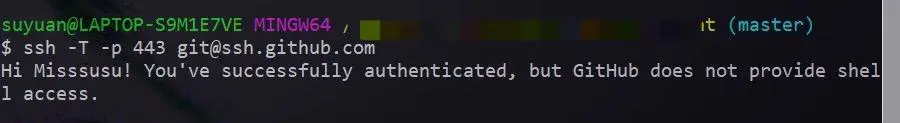
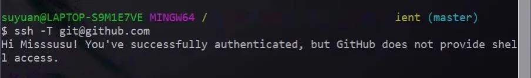

最近在更新了本地代码 node 版本后，提交代码时报错如下

```
$ git pull project develop
ssh: connect to host github.com port 22: Connection timed out
fatal: Could not read from remote repository.
```

本以为是网络的问题或者被墙了，在确认本地 git 可以访问和几次尝试后依旧报这个错，查了各种资料，最后参考 git 官网给的解决办法（https://help.github.com/en/github/authenticating-to-github/using-ssh-over-the-https-port），使用 ssh 443端口

1. 先测试可用性

    ```shell
    ssh -T -p 443 git@ssh.github.com
    ```

    如果提示如下说明可用
    

2. 然后编辑 ~/.ssh/config 文件，如果没有config文件的话就直接 vim ~/.ssh/config加入以下内容

    ```shell
    Host github.com
    Hostname ssh.github.com
    Port 443
    ```
3. 再次测试

    ```shell
    ssh -T git@github.com
    ```
    提示如下说明成功了
    

