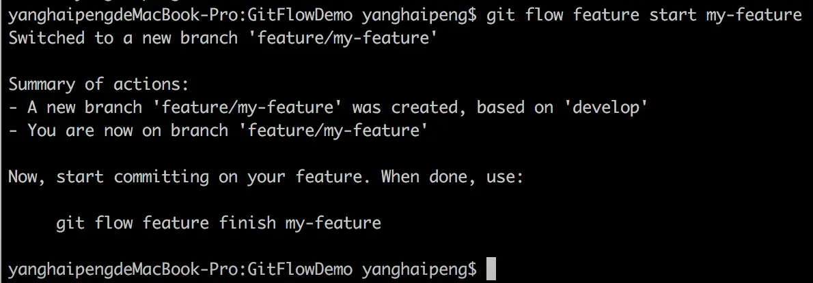

git 大家都比较熟悉，下面来简单说说git flow。通过几个简单的使用，来比较一下git flow的方便之处。为了演示方便，我现在在远程新建一个代码仓库，名字叫做GitflowDemo。

要使用 git flow,我们的先进行git flow的安装

## 安装
- mac

    ```shell
    # Homebrew
    $ brew install git-flow-avh

    # Macports
    $ port install git-flow-avh
    ```
- Linux

    ```shell
    $ apt-get install git-flow
    ```
- Windows

    ```shell
    $ wget -q -O - --no-check-certificate https://raw.github.com/petervanderdoes/gitflow-avh/develop/contrib/gitflow-installer.sh install stable | bash
    ```

我们以mac Homebrew为例进行安装。安装完成后，会提示安装成功。因为我已经安装过，所以提示已经安装完成。

安装完成后，我们进行git flow的初始化。

接下来将远程GitflowDemo仓库克隆到本地，并进入GitflowDemo目录。

## 初始化
```js
git flow init
```
执行完后，会出现一些命名提示，如图，一般使用默认就好。

到此，git flow的安装以及初始化已经完成。下面来简单说说如何使用它。

## 开发新功能
需求: 新建一个test.txt，并添加内容

### 使用 git flow
```shell
$ git flow feature start my-feature
Switched to a new branch 'feature/my-feature'
```
结果如下


根据图中的提示，我们知道一个新的分支'feature/my-feature'基于'develop'分支创建好了，并且目前我们所在的分支为'feature/my-feature'

```shell
$ git add test.txt
$ git commit -m 'create test.txt'
1 file changed, 1 insertion(+)
create mode 100644 test.txt
```
我们来验证一下是不是完成了feature分支的开发。

```shell
$ git status
On branch feature/my-feature
nothing to commit, working tree clean
```
好，完成了。下一步：

```shell
$ git flow feature finish my-feature
Switched to branch 'develop'
Updating bde3a64..e783fdf
Fast-forward
 test.txt | 1 +
 1 file changed, 1 insertion(+)
 create mode 100644 test.txt
Deleted branch feature/my-feature (was e783fdf).

Summary of actions:
- The feature branch 'feature/my-feature' was merged into 'develop'
- Feature branch 'feature/my-feature' has been locally deleted
- You are now on branch 'develop'
```
根据提示，我们看到了git flow feature finish my-feature这条语句的作用。
1. feature/my-feature 分支被merge到了develop分支
2. 本地feature/my-feature分支被删除。我们现在处于develop分支

来，我们验证下
```shell
$ git branch
* develop
  master
```
发现确实处于develop分支。

### 不适用 git flow
那么如果不适用git flow我们会怎么做呢？
1. 新建一个分支

    ```shell
    $ git checkout -b my-feature develop
    ```
2. 当开发完成后，合并分支

    ```shell
    $ git merge --no-ff my-feature
    Already up-to-date
    ```
3. 删除本地my-feature分支

    ```js
    $ git branch -d my-feature
    ```

4. 提交更改到远程 develop分支

    ```shell
    $ git push oriing develop
    ```
比较两种方式就会发现，git flow方便了分支的管理,使用上更为简单。

## 发布
需求: 新建readMe.txt并加入版本号与日期。

### 使用 git flow
一、新建一个分支


## 资料
[Git 工作流程](https://www.ruanyifeng.com/blog/2015/12/git-workflow.html)

[git flow的使用](https://www.jianshu.com/p/36292d36e41d)