## 示例
1. git回滚代码到某个commit
  回退命令

  ```
  git reset --hard HEAD^ 回退到上个版本
  git reset --hard HEAD~3 回退到前3次提交之前，依次类推，回退到n次提交之前
  git reset --hard commit_id 推到/进到，指定commit的哈希码(这次提交之前或之后的提交都会回滚)
  ```
  回滚后提交可能会失败，必须强制提交

2. 强推到远程:可能需要解决对应分支的保护状态
  git push HEAD --force

## 导语
Git是一个灵活和强大的版本管理工具，正确使用能够有效促进团队协作，防止版本丢失。然而实践中，有些开发人员会有意或五一误用部分Git的功能，给团队造成损失。不恰当的代码回滚操作是其中的主要问题之一。

本文主要分享针对不同场景的代码回滚操作，以及如何抢救误删的内容

## 一个典型案例
我们先通过一个项目团队真实出现过的典型案例，来看看不恰当的代码回滚可能带来的问题。

1. 小红、小黄、小兰共同工作在同一分支上

  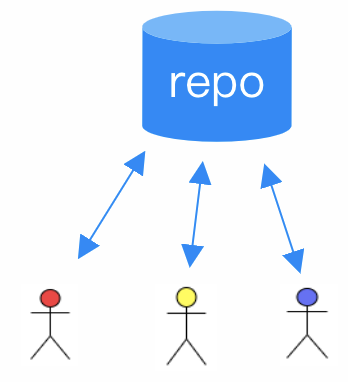

2. 小红利用reset回滚了一些内容，发现 push 失败，最后用 push -f 操作成功。 更甚者，push -f提示目标是保护分支（例如master）而无法推送成功，于是小红**取消了分支保护**，从而使得push -f成功。

  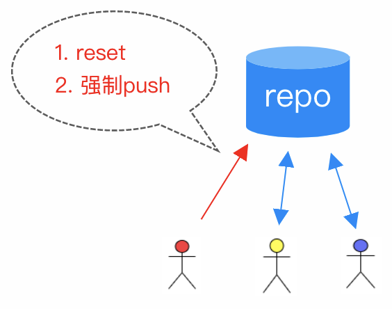

3. 小黄小兰进行常规git pull，遇到了一大堆冲突，并且commit历史都乱了

  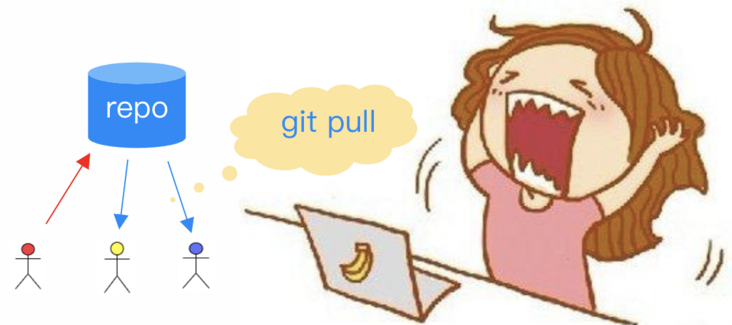

4. 过一段时间，需要查看某次发布的源代码，却发现无法找到准确的代码！原来它刚好被小红之前reset掉了。

## 认识Git的四个工作区域
在盘点常见的代码回滚场景之前，有必要认识一下git的四个工作区域

平常我们 clone 一个代码库之后，本地看起来就是一个包含所有项目文件的目录。其实从逻辑上可以分为四个工作区域：

- 工作区

  也称为工作目录、工作副本，简单来说就是clone后我们看到的包含项目文件的目录。我们日常开发操作也是在工作区中进行的

- 本地仓库(.git)

  在工作区有个隐藏目录.git，这就是Git本地仓库的数据库。工作区中的项目文件实际上就是从这里签出(checkout)而得到的，修改后的内容最终提交后记录到本地仓库中

- 暂存区

  也称缓存区，逻辑上处于工作区和本地仓库之间，主要作用是标记修改内容，暂存区里的内容默认将在下一次提交时记录到本地仓库中

- 远端仓库

  团队协作往往需要指定远端仓库（一般是一个，也可以有多个），团队成员通过跟远端仓库交互来实现团队协作。

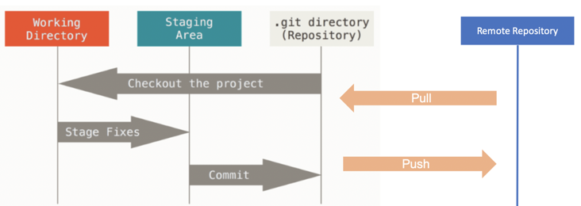

## 常见的代码回滚场景
### 回滚场景:仅在工作区中修改时
当文件在工作区修改，还没有提交到暂存区和本地仓库时，可以用git checkout -- 文件名  来回滚这部分修改

不过需要特别留意的是**这些改动没有提交到Git仓库，Git无法追踪其历史，一旦回滚就直接丢弃了**

示例：用git status查看，还没有提交到暂存区的修改"changes not staged for commit"部分

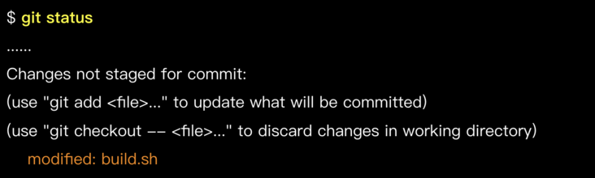

执行以下命令回滚工作区的修改：
```
git checkout -- build.sh
```

### 回滚场景:已添加到暂存区时
即执行过git add 添加到暂存区，但还没有commit，这时可以用git reset HEAD 文件名回滚。通过git status可以看到相关提示

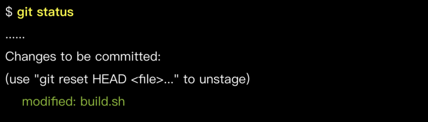
执行一下命令回滚暂存区的修改
```
git reset HEAD build.sh
```
回滚后工作区会保留该文件的改动，可重新编辑在提交，或者git checkout -- 文件名 彻底丢弃修改

### 回滚场景:已commit，但还没有push时
即已经提交到本地代码库了，不过还没有 push 到远端。这时候可用 git reset 命令，命令格式为：

git reset <要回滚到的 commit> 或者 git reset --hard <要回滚到的 commit>

需注意的是，提供的是 要回滚到的 commit，该 commit 之后的提交记录会被丢弃。

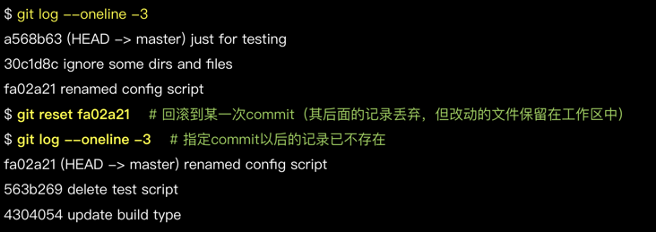

**git reset 默认会将被丢弃的记录所改动的文件保留在工作区中，以便重新编辑和再提交。加上 --hard 选项则不保留这部分内容，需谨慎使用。**

### 回滚场景：修改本地最近一次commit
有时 commit 之后发现刚才没改全，想再次修改后仍记录在一个 commit 里。利用 "git reset" 可达到这个目的，不过，Git 还提供了更简便的方法来修改最近一次 commit。

命令格式如下：
```
git commit --amend [-m <commit说明>]

```
如果命令中不加-m &lt;commit说明&gt;部分，则Git拉起编辑器输入日志说明

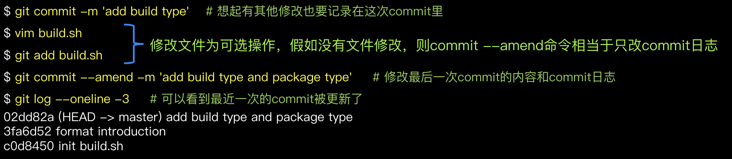

**请注意，"git commit --amend"只可用于修改本地未push的commit，不要改动已push的commit!**

### 回滚场景:已push到远端时
**注意！此时不能用 "git reset"，需要用 "git revert"！**

**注意！此时不能用 "git reset"，需要用 "git revert"！**

**注意！此时不能用 "git reset"，需要用 "git revert"！**

重要的事情说三遍!之所以这样强调，是因为"git reset"会抹掉历史，用在已经push的记录上会带来各种问题；而"git revert"用于回滚某次提交的内容，并生成新的提交，不会抹掉历史

命令| 是否抹掉历史 | 使用场景
---|---|---
git reset | 是，回滚的历史将小时 | 本地未push的记录
git revert | 否，历史记录保留，回滚后重新生成提交记录 | 回滚已push的内容

示例：
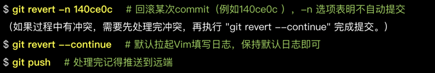
过程中如果遇到问题(如处理冲突时搞乱了),可用"git revert --abort"取消本次回滚行为

:::tip
如果要回滚的是一个合并commit，revert时要加上"-m &lt;父节点序号&gt;",指定回滚后以哪个父节点的记录作为主线。合并的commit一般有2个父节点，按1、2数字排序，对于要回滚"分支合入主干的commit"，常用"-m 1",即用主干记录作为主线。回滚合并commit是一个较为复杂的话题，作为一般性建议，应避免回滚合并commit，对该话题感兴趣的可进一步了解：https://github.com/git/git/blob/master/Documentation/howto/revert-a-faulty-merge.txt
:::

## Rest与revert对比
本节在讲一个示例，以便大家更好的理解git reset和git revert的差异

分支初值状态如下

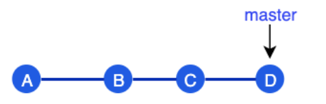

- 如果执行 git reset B 工作区会指向 B，其后的提交（C、D）被丢弃。

  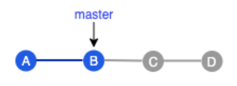

  此时如果做一次新提交生成C1,C1跟C、D没有关联

  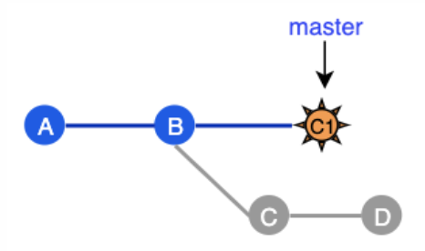

- 如果执行git revert B回滚到B提交的内容后生成一个新的commit E，原有的历史不会被修改

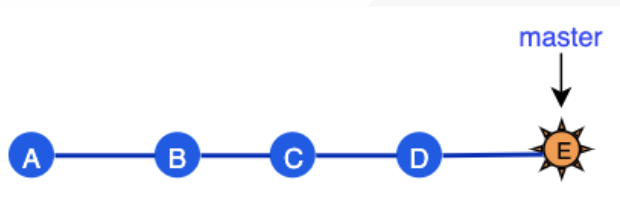

## 找回已删除的内容
虽说 Git 是一款强大的版本管理工具，一般来说，提交到代码库的内容不用担心丢失，然而某些特殊情况下仍免不了要做抢救找回，例如不恰当的 reset、错删分支等。这就是 git reflog派上用场的时候了。

git reflog是恢复本地历史的强力工具，几乎可以恢复所有本地的记录，录入被reset丢弃掉的commit、被杀出的分支等，称得上代码找回的最后一根救命稻草

然而需要注意， **并非真正所有记录git reflog都能恢复**，有些情况仍然无能为力
1. 非本地操作的记录， "git reflog"能管理的是本地工作区操作记录，非本地（如其他人或在其他机器上）的记录它就无从知晓了。
2. 未commit的内容，例如只在工作区或暂存区被回滚的内容（git checkout -- 文件 或 git reset HEAD 文件）。
3. 太久远的内容， "git reflog"保留的记录有一定时间限制（默认 90 天），超时的会被自动清理。另外如果主动执行清理命令也会提前清理掉。

### Reflog--恢复到特定的commit
一个典型场景是执行reset进行回滚，之后发现回滚错了，要恢复到另一个commit状态

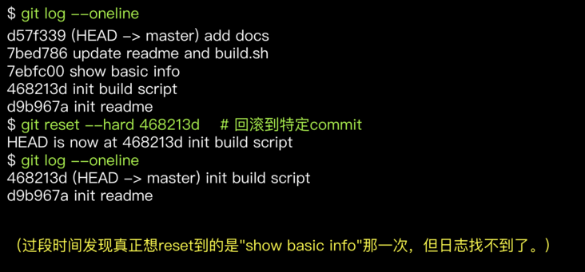

我们通过git reflog查看commit操作历史，找到目标commit，在通过reset恢复到目标commit

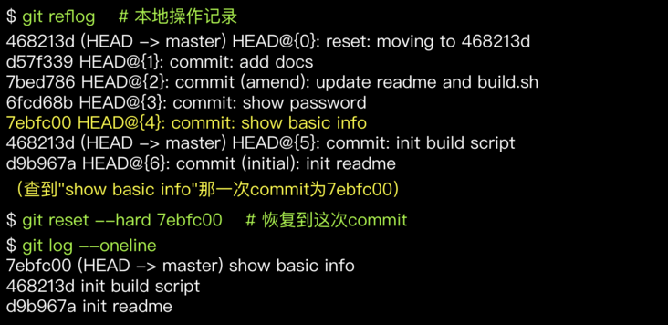

通过这个示例我们还可以看到清晰、有意义的commit log非常有帮助。加入commit日志都是update、fix这类无明确意义的说明，那么即使有git reflog这样的工具，想找回目标内容也是意见艰苦的事

### Reflog--恢复特定commit中的某个文件
场景：执行reset进行回滚，之后发现丢弃的commit中部分文件是需要的。解决方法:通过reflog找到目标commit，在通过以下命令恢复目标commit中特定的文件

```
git checkout <目标commit> -- <文件>
```

**示例:Reset回滚到commit 468213d之，发现原先最新状态中(即commit d57f339)的 build.sh 文件还是需要的，于是将该文件版本单独恢复到工作区中。**

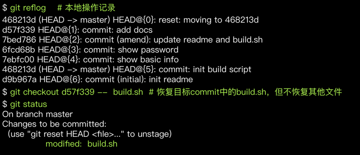

### Reflog-找回本地误删除的分支
场景：用"git branch -D"删除本地分支，后发现删错了，上面还有未合并内容！ 解决方法：通过 reflog 找到分支被删前的 commit，基于目标 commit 重建分支。

```
git branch <分支名> <目标commit>
```

Reflog 记录中，"to <分支名>"（如 moving from master to dev/pilot-001） 到切换到其他分支（如 moving from dev/pilot-001 to master）之间的 commit 记录就是分支上的改动，从中选择需要的 commit 重建分支。

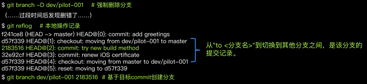

### 找回合流后删除的分支
:::tip
作为Git优秀实践之一，开发分支合流之后即可删掉，以保持代码库整洁，只保留活跃分支。
一些同学合流后仍保留着分支，主要出于分支以后很可能还用得到的想法。其实大可不必，已合入主干的内容不必担心流失，随时可以找回，包括从特定commit重建开发分支。冰鞋，实际需要用到就开发分支的情况真的很少，一般来说，即使功能有bug，也是基于主干拉出新的分支修复和验证
:::

例如要重建已合流分支，可通过主干历史找到分支合并记录，进而找到分支节点，基于改commit新建分支
```
git branch dev/feature-abc 1f85427
```
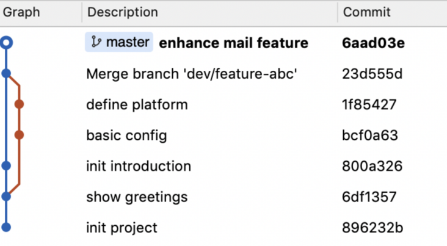

## 关于代码回滚的一些建议
以下是关于特定命令的使用建议
命令| 特点 | 建议
---|---|---
git checkout -- 文件 | 回滚本地工作区未暂存的改动，被丢弃的内容不可恢复 | 操作前务必确认要回滚的改动是不在需要的
git reset HEAD 文件 | 回滚暂存区里的文件改动 | 一般不加『--hard』选项
git reset &lt;commit&gt; | 回滚到目标commit，丢弃掉该commit之后的提交记录，将被丢弃记录所有的改动保留在工作区中 | **1.只操作本地记录，禁止操作已push的记录**。2. 慎用"--hard"选项
git commit --amend | 修改最后一次commit的内容和提交日志 | 只操作记录，禁止操作已push的记录
git revert &lt;commit&gt; | 回滚相关commit所做的改动，再次提交将生成新的commit，历史记录不受影响 | 已push的内容如果要回滚只能使用revert

此外，总体来讲，回滚要谨慎，不要过于依赖回滚功能，避免使用"git push -f"。正如某哲人所说：如果用到"git push -f"，你肯定哪里做错了！


## 资料
[Git 代码回滚与找回的艺术](https://segmentfault.com/a/1190000039320926)