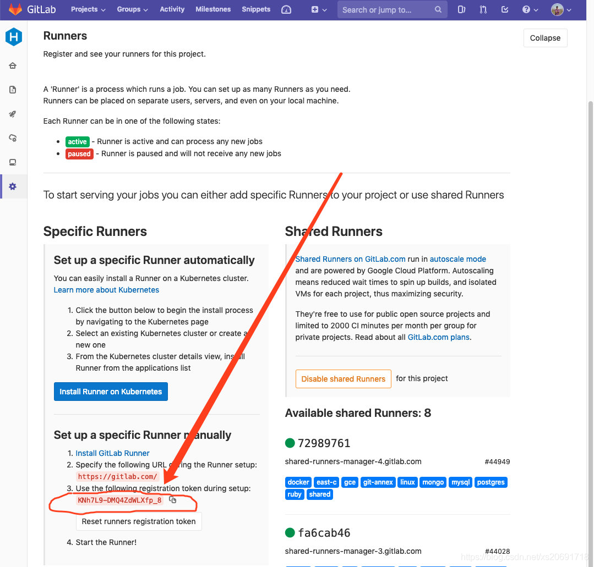
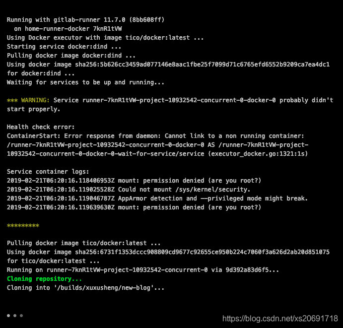
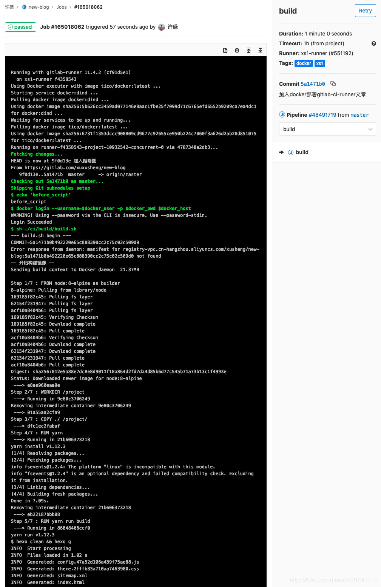

## 背景
当项目比较少，或者更新不频繁的时候(或者技术比较菜的时候)，手动部署还能够接受，但是一旦部署次数频繁，手动操作就是一件痛苦万分的事情了。

公司内部使用的是jenkins，从成熟稳定的角度来看，是非常符合要求的，但是针对个人项目，第一没有公司的项目那么复杂，第二在流程上也不需要多人协作、测试等需求，这时候jenkens就显的过去庞大了一点(奇丑无比)

调研了一圈目前可以使用的主流(免费)CI工具，最终决定采用GitLab CI来作为自己的博客和个人项目的CI平台

## 简介
GitLab CI的UI非常简介，文档也非常全棉，同时使用起来也非常方便，健身是程序员居家必备的好帮手

GitLab CI本身只是作为仓库里附件的一个功能，并不提供项目构建的环境，或者可以将Gitlab CI理解成一个调度员，所做的事情就是决定合适触发构建任务，以及在哪个环境下执行构建任务等

## 初识GitLab Runner
> GitLab Runner是一个开源项目，用于运行您的任务并将结果发送回GitLab.它与GitLab CI 一起使用，GitLab CI是GitLab随附的开源持续集成服务，用于协调任务

英文好的同学建议（英文不好的铜须也建议）直接阅读[官方文档](https://docs.gitlab.com/runner/)

就我个人理解来看，GitLab Runner其实就是将某台服务器，注册成为GitLab Ci的任务执行单元，用于在CI过程中，执行相应的任务，类似于一个分布式系统的master和slave的角色

而GitLab CI对Runner并没有严格的要求，可以是一台linux实体机，也可以是Virtual box里的虚拟机，甚至可以是某个Docker容器

针对不同的Runner，可以在注册时划分不同的固有角色(可执行的任务不同，详情参见文档：[Executors](https://docs.gitlab.com/runner/executors/index.html)),以及打上不同的自定义标签，以便于GitLab CI在调度时灵活分配任务，多个Runner并行执行任务等等。

GitLab 针对免费用户，提供了每个月 2000 分钟的免费构建时间，在不超过这个时间时，可以直接使用 GitLab 提供的共享 Runner。

但是使用别人的服务器来进行构建任务，总是会暴露一些敏感信息出去，所以自建 GitLab Runner，就是最佳选择了。

## 自建GitLab Runner
前面提到了GitLab Runner其实就是一台执行任务的的机器而已，GitLab也提供了现成的脚本，将当前机器注册为Runner。

但是**当我们期望在同一个系统下，部署不同的种类的Runner来执行不同的任务，比如一个Runner专门执行构建任务，另一个Runner专门执行部署任务。**

或者说我们期望注册一个Runner，但是又不希望影响系统现有的环境时候，直接执行脚本将宿主机注册为Runner的方式就不太合适了。

Virtual Box创建多个虚拟机当然可以解决问题，但是创建多个虚拟机对资源的消耗问题也是显而易见的

这个时候Docker就出现成就世界了

早在调研jenkins的时候，就期望能够使用docker来部署jenkins，然后在这个jenkins容器中，执行包含了docker命令的构建脚本，这就涉及了在docker容器中执行docker命令的问题，解决起来真是一把辛酸泪

得益于docker in docker (参见：https://hub.docker.com/_/docker?tab=description&page=1)，这个坑总算是天平了

GitLab CI对Docker的支持非常好，文档之前的东西非常全名，建议直接阅读官方文档饥渴

- [Run GitLab Runner in a container](https://docs.gitlab.com/runner/install/docker.html)

- [Docker section of Registering Runners](https://docs.gitlab.com/runner/register/index.html#docker)

实在不想看官方文档，也额可以继续往下阅读

### 创建Runner容器
创建一个gitlab-runner-docker目录，然后新建一个docker-compose.yml文件，内容如下：
```
version: "3"
services: 
  app: 
    image: gitlab/gitlab-runner
    container_name: gitlab-runner-docker
    restart: always
    volumes:
        - ./config:/ets/gitlab-runner
        - /var/run/docker.sock:/val/run/docker.sock
```
在gitlab-runner-docker目录下执行docker-compose up -build -d命令，docker ps -a即可看见刚才创建的容器，同时目录下回生成一个config目录，用于存放Runner的配置文件

### 注册Runner
执行命令docker exec -it gitlab-runner-docker gitlab-runner register(或者进入容器内部执行gitlab-runner register也可以)

接下类会看到一系列的输入项，一步一步输入即可

**a)输入GitLab的地址**

如果是使用官方的GitLab，就输入https://gitlab.com，自建的GitLab就输入自己的IP或者域就可
```
Please enter the gitlab-ci coordinator URL (e.g. https://gitlab.com )
https://gitlab.com
```
**b)输入Token来注册Runner**
在GitLab的仓库Setting->CI/CD设置页面中，展开Runners部分，即可看到生成的Token，复制粘贴即可



```
Please enter the gitlab-ci token for this runner
xxxToken
```

**c)输入一段Runner的描述，之后可以在GitLab管理页面进行修改**
```
Please enter the gitlab-ci description for this runner
[hostame] my-runner
```

**d)输入Runner关联的标签，之后可以在GitLab管理页面进行修改**

```
Please enter the gitlab-ci tags for this runner (comma separeted):
my-tag,another-tag
```

**e)Enter the Runner executor**

GitLab Runner内置了多种executor,不同类型的executor的区别，可以参考：[Excutors](https://docs.gitlab.com/runner/executors/README.html)

这里我们填写docker
```
Please enter the executor: ssh, docker+machine, docker-ssh+machine, kubernetes, docker, parallels, virtualbox, docker-ssh, shell:
 docker
```

**f) If you chose Docker as your executor, you’ll be asked for the default image to be used for projects that do not define one in .gitlab-ci.yml:**

如果选择了executor为docker,那么就需要选择一个默认的镜像。

最开始接触的时候，这里可能会有点难以理解，需要说明的是，我们刚才使用docker创建的这个Runner容器，并不是构建脚本直接执行的环境。

打个比方，在构建任务中，我们需要执行一段js脚本，那么我们就需要nodejs环境，也就是说需要创建一个nodejs容器，那么这个容器会有刚才创建的Runner容器来进行创建。

也就是说我们实际上是在Docker容器中，在创建一个容器，而再次创建出来的这个容器，才是构建任务实际运行的环境。

针对GitLab CI的每一阶段的构建任务，我们都可以指定不同的Docker镜像，当执行到某个任务时，Runner就会根据这个任务指定的镜像创建出相应的容器，再在这个容器内执行任务。

而这一步需要指定的默认镜像，就是当.gitlab-ci.yml文件中没有指定任务需要的镜像时使用的
```
Please enter the Docker image(eg. ruby:2.1)
alpine:latest
```
官方文档的例子中，默认镜像使用的是apline:latest,是个精简版的linux镜像，也就意味着啥工具都没有，每次执行构建任务前先装git等一系列工具显然不合理

推荐使用tico/docker做为默认镜像，[参见https://hub.docker.com/r/tico/docker](https://hub.docker.com/r/tico/docker),这个镜像在官方docker的基础上，加入了curl、php、git等等一些列常用的工具

是的，没错，这个镜像是基于官方docker镜像的，这就意味着，我们仍然可以在这个镜像生成容器中执行docker命令，这样在构建脚本中，就可以完美调用docker命令了

### 配置Runner
进入config目录，会发现一个config.toml文件，里面是gitlab-runner相关的配置信息
```
concurrent = 1
check_interval = 0

[session_server]
  session_timeout = 1800

[[runners]]
  name = "home-runner-docker"
  url = "https://gitlab.com"
  token = "xxxxxxxxxxxxxxx"
  executor = "docker"
  [runners.docker]
    tls_verify = false
    image = "tico/docker"
    privileged = false
    disable_entrypoint_overwrite = false
    oom_kill_disable = false
    disable_cache = false
    volumes = ["/cache"]
    shm_size = 0
  [runners.cache]
    [runners.cache.s3]
    [runners.cache.gcs]
```
当执行构建任务时如果出现以下报错，请将上面的配置文件中的privileged的值改为true

[参考：Use docker-in-docker with privileged mode](https://docs.gitlab.com/runner/executors/docker.html#use-docker-in-docker-with-privileged-mode)




## 使用心得
以我的博客为例,首先是一个专门用来执行构建任务Runner容器

当接收到博客的构建任务时，创建一个基于 tico/docker镜像的容器，然后再在这个容器中执行构建脚本

而构建脚本中，又调用docker命令创建了一个node.js容器进行打包编译，然后再将build之后生成的静态文件移入到一个nginx镜像，作为最终部署使用的镜像并上传到阿里云容器服务。

接着Gitlab CI会将部署任务发送至另一个专门用来执行部署任务的的Runner容器，这个Runner容器会ssh登录上目标服务器，拉取最新的镜像并运行。

然后博客自动部署完毕，欢迎访问

贴出.gitlab-ci.yml文件
```
stages:
  - build
  - test
  - release

# 构建
build:
  stage: build
  tags:
    - xs1
    - docker
  image: tico/docker:latest
  services:
    - docker:dind
  variables:
    DOCKER_HOST: tcp://docker:2375/
    DOCKER_DRIVER: overlay2
    DOCKER_REPO: $docker_repo
  before_script:
    - echo 'before_script'
    - docker login --username=$docker_user -p $docker_pwd $docker_host
  script:
    - sh ./ci/build/build.sh
  only:
    - master

# 发布
release:
  stage: release
  tags:
    - xs1
    - ssh
  variables:
    DOCKER_REPO: $docker_repo
    PROJECT_NAME: $project_name
    SERVER: $deploy_server
    PORT: $port
  script:
    - sh ./ci/release/release.sh
  environment:
    name: production
  only:
    - master
```
构建过程



## 资料
[使用docker 部署GitLab CI Runner](https://blog.csdn.net/xs20691718/article/details/89361881)

