## 概要
因为移动端操作系统分为 iOS 和 Android 两派，所以本文的调试技巧也会按照不同的系统来区分。寻找最合适高效的方式，才能让你事半功倍。

## IOS设备
> Safari: iphone调试利器，差错改样式首选，需啊哟我们做如下设置
- 浏览器设置：Safari - 偏好设置- 高级- 勾选「在菜单栏显示开发」菜单
- iphone设置：社会-Safari-高级-打开Web检查器

大功告成，这时候通过手机的Safari来打开H5页面，我们通过浏览器开发选项可以看到

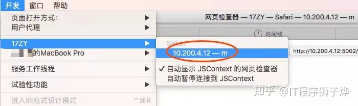


> IOS模拟器：不需要真机，适合调试 Webview 和H5有频繁交互的功能页面

首先下载Xcode,运行项目，选择模拟器 iphonex，编译后就会打开模拟器，如下

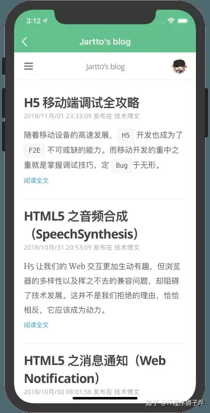

可以看到 H5 已经在「壳子」中运行起来了，下来就可以尝试调用 Webview 的方法，和「壳子」交互了。更多的调试技巧可以参考文章：iOS 模拟器调试。

## 抓包
> Charles:Mac OS系统首选的抓包工具，适合查看、控制网络请求，分析数据情况

Charles 抓包首先需要配置手机代理，Wifi-配置代理(IP地址)-手动

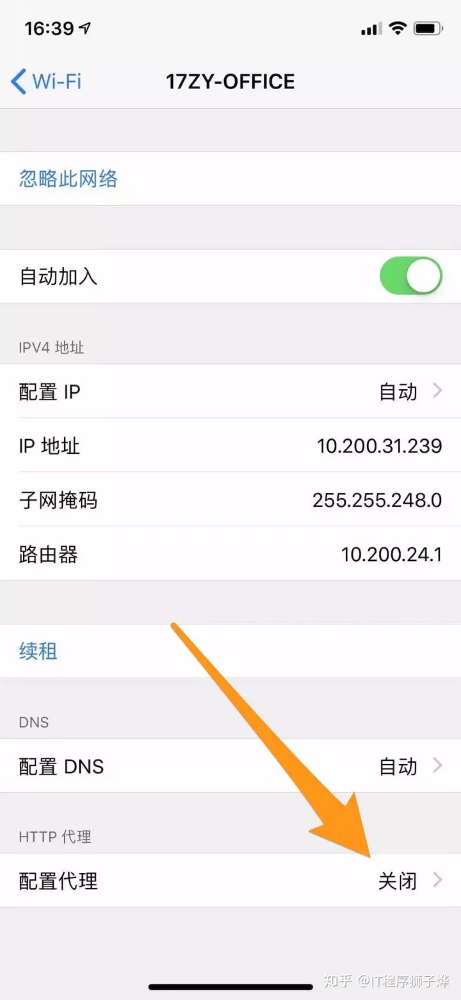

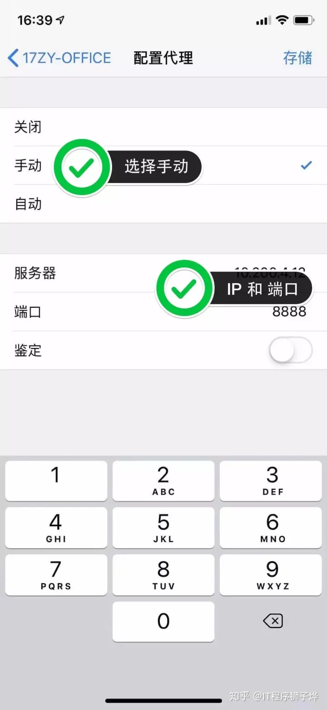

配置好手机代理，这时候打开 Charles ，就会收到确认提醒，选择允许。接下来就可以捕获手机的请求了，但是这些都是常规操作，我们来点高级的。

> 有意思的是，我们可以用本地文件来替换线上文件，方便调试，远程定位线上问题。

选择 Structure, 找到需要替换的文件，右键菜单-Map Local

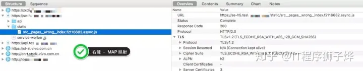

这时候会打开一个弹窗，填写具体的配置

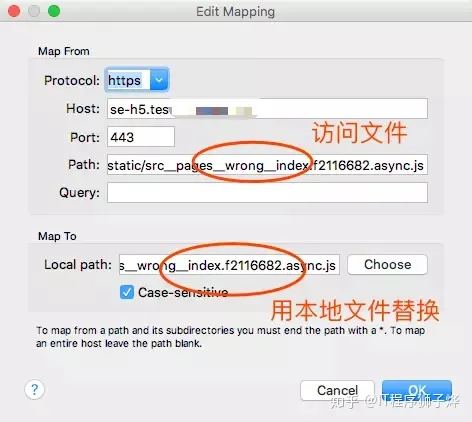

OK，大功告成，快去改动本地文件吧，从此再也不怕线上调试了。需要注意的是如果抓取 HTTPS 请求，要安装信任证书，下文会详细说明。

> 与之相应的是 Windows 平台的 Fiddler，功能大致相似，这里就不细说了。

## Spy-Debugger
> Spy-Debugger：移动端调试的利器，便捷的远程调试手机页面、抓包工具

我们先来安装
```shell
sudo npm install spy-debugger -g
```
启动命令
```shell
spy-debugger
```
这时，控制台会打印出如下信息，说明服务已经启动了
```
正在启动代理
本机在当前网络下的IP地址为：10.200.24.46
node-mitmproxy启动端口: 9888
浏览器打开 ---> http://127.0.0.1:50389
```
最后一步，设置手机代理：10.200.24.46，端口号9888。补充说明一下

- Android设置代理步骤：设置-WLAN-长安选中网络-修改网络-高级-代理设置-手动
- IOS设置代理步骤：设置-无线局域网-选中网络-HTTP代理手动

接下来，尝试一下抓包

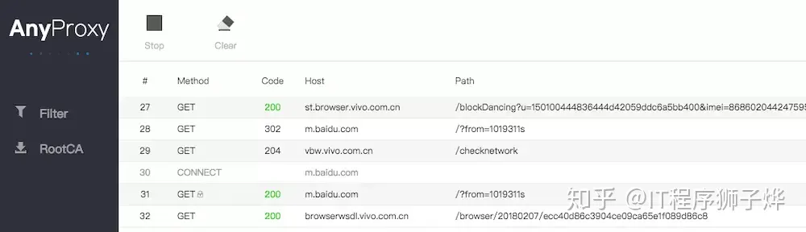

在打开调试页面

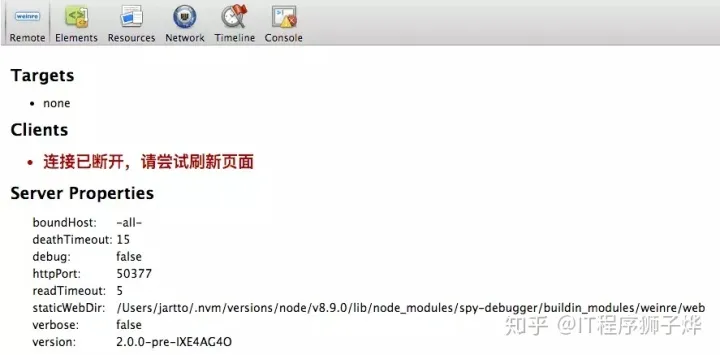

> HTTPS抓包，需要安装根证书，下文会详细说明

## Whistle
上面推荐了一款操作简单的调试利器，升级一下，看看更加强大的调试工具 whistle

> whistle:基于Node实现的跨平台 Web调试代码工具

whistle(读音[ˈwɪsəl]，拼音[wēisǒu])是基于Node实现的跨平台抓包调试代理工具，有以下基本功能
1. 查看HTTP、HTTPS请求响应内容
2. 查看WebSocket、Socket收发的帧数据
3. 设置请求hosts、上有http/socks代理
4. 修改请求url、方法、头部、内容
5. 修改响应状态码、头部、内容，并支持本地替换
6. 修改WebSocket 或 Socket 收发的帧数据
7. 内置调试移动端页面的 weinre 和 log
8. 作为HTTP代理或反向代理
9. 支持用Node编写插件扩展功能

大致了解后，我们来尝试安装
```shell
sudo npm install -g whistle
```
> 淘宝镜像：npm install whistle -g –registry=https://registry.npm.taobao.org

whistle 安装完成后，执行命令 whistle help或 w2 help,查看whistle的帮助信息

```shell
run       Start a front service
start     Start a background service
stop      Stop current background service
restart   Restart current background service
help      Display help information
```
> 这里只列出部分命令，更多请 w2 help 查看。

看到上面的操作，我们何不试试缩写 w2 start 来启动服务
```shell
w2 start
```
这时在浏览器打开链接，同时手机上配置代理(同Charles)，接下来我们可以愉快的调试了。值得注意的是，whistle的功能远非如此，更多的扩展请移步官方文档。

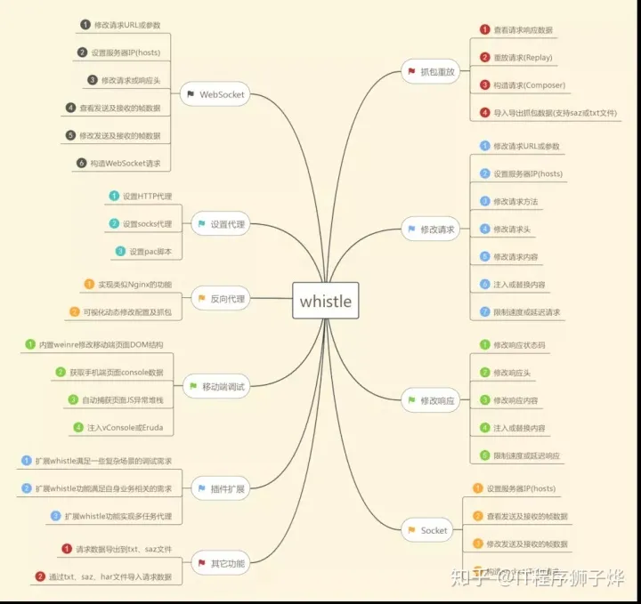

> 记得开启拦截 HTTPS：勾选 Capture HTTPS CONNECTs

### 安装HTTPS证书
对于Charles，按照如下操作安装证书
```shell
http-SSL - Proxyiing - install Charles  root
```
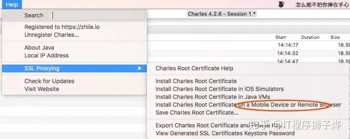

弹出安装证书的提示框：
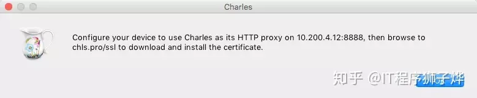

> 按照提示去手机浏览器打开：chls.pro/ssl，安装信任证书即可。

对于 spy-debugger,HTTPS抓包，需要安装证书，选择 RootCA,扫描二维码按照提示信息安装证书。安装证书需要注意以下事情

1. 手机必须先设置完代理后再通过(非微信)手机浏览器访问 http://s.xxx (地址二维码)安装证书；
2. 手机首次调试需要安装证书，已安装了证书的手机无需重复安装；
3. 手机和 PC 保持在同一网络下（比如同时连到一个 WIFI 下）；

> 切记：移动设备和PC必须在一个WIFI下

### 真机调试
上面说了很多，但是实际开发过程中，我们不会等上线了才去验证兼容性，所以你可能需要提前「真机调试」。这里提供两种方式：

> Chrome Remote Devices:依赖Chrome进行远程调试，适合安卓手机

首先，开启 Android 手机的「开发者选项」，勾选 「USB 调试」。
然后，Chrome 中输入：chrome://inspect，进入调试页面。

很全面的一篇文章，可以参考：Chrome 远程调试。

> localhost 转 ip，扫描二维码手机显示，这个比较简单。

可以在浏览器安装一个 Chrome 插件，用于将当前页面链接转换成二维码，这样就能边开发边真机预览，非常方便。

### 调试工具
这里推荐一款调试工具：vConsole，一个轻量、可拓展、针对手机网页的前端开发者调试面板。安装很简单：

```shell
npm install vconsole
```
如果未使用 AMD/CMD 规范，可直接在 HTML 中引入 vConsole 模块。为了便于后续扩展，建议在 &lt;head&gt; 中引入：

```html
<head>
  <script src='path/to/vconsole.min.js'></script>
  <script>
 var vConsole = new VConsole();
  </script>
</head>
```
如果使用了 AMD/CMD 规范，可在 module 内使用 require() 引入模块：

```js
var VConsole = require('path/to/vconsole.min.js');
var vConsole = new VConsole();
```
> 请注意，VConsole 只是 vConsole 的原型，而非一个已实例化的对象。

所以在手动 new 实例化之前，vConsole 不会被插入到网页中。大概功能如下图：

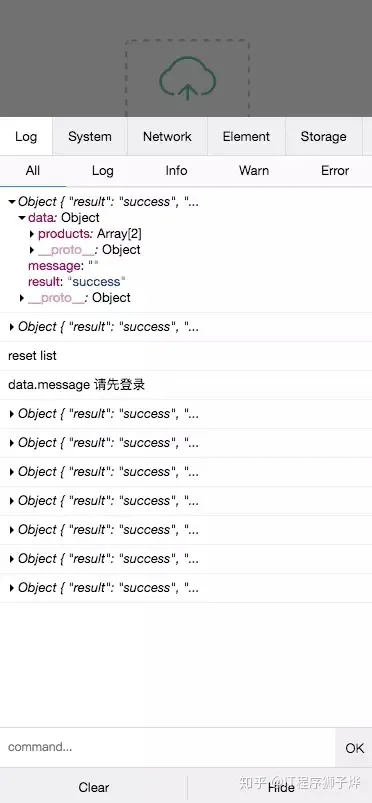

看起来很完美，但是有个小缺点：网络请求，需要刷新页面，可是很多内嵌的 H5 页面是没有机会刷新页面的，所以需要客户端童鞋配合增加刷新的功能方便调试。

### 场景分析
说了这么多钟方案，这里总结一下各个方案的适用场景，根据不同的场景去选择最佳的调试方案，这样才能更快速的输出，Carry 全场

1. Safari：iPhone 调试利器，查错改样式首选；
2. iOS 模拟器：不需要真机，适合调试 Webview 和 H5 有频繁交互的功能页面；
3. Charles：Mac OS 系统首选的抓包工具，适合查看、控制网络请求，分析数据情况；
4. Fiddler：适合 Windows 平台，与 Charles 类似，查看、控制网络请求，分析数据情况；
5. Spy-Debugger：移动端调试的利器，便捷的远程调试手机页面、抓包工具；
6. Whistle：基于 Node 实现的跨平台 Web 调试代理工具；
7. Chrome Remote Devices：依赖 Chrome 来进行远程调试，适合安卓手机远程调试静态页；
8. localhost 转 ip：真机调试，适合远程调试静态页面；
9. vConsole：内置于项目，打印移动端日志，查看网络请求以及查看 Cookie 和 Storage；

### 白屏处理
> 移动端的白屏是最头疼的问题，这里顺带提供几种分析问题的思路，以供参考

1. 方案分析

    一般上线后出现问题，我们最容易想到的就是：是否是新代码引起的问题。所以有效解决手段就是控制变量法

2. 代码注释法

    莫名其妙白屏，适合页面无异常的日志。同时无请求发送，问题集中在单一页面的情况。这种问题比较傲直观，肯定是某一页面出现了代码异常或是无效的 return，导致页面渲染终止，但并不属于异常。这时候，「代码注释法」将是你的最佳选择，逐行去注释可以代码，直到定位问题。

3. 类库异常，兼容问题

    这种场景也会经常遇到，我们需要用可以调试页面异常的方式，如 Safari，Spy-Debugger，Whistle，vConsole 查看异常日志，从而迅速定位类库位置，从而找寻替换或是兼容方案。

4. try catch

    如果你的项目没有异常监控，那么在可疑的代码片段中去 Try Catch 吧。

5. Debug包

    在你的项目中装上 [vConsole](https://link.zhihu.com/?target=http%3A//jartto.wang/2018/11/01/mobile-debug/)，并配合客户端 debug 插件，360 度无死角监控异常，这才是最有效的方式。

6. ES语法兼容

    一般我们都会通过 Babel 来编译 ES6 ，但是额外的第三方类库如果有不兼容的语法，低版本的移动设备就会异常。所以，先用上文讲述的调试方法，确定异常，然后去增加 [polyfill](https://link.zhihu.com/?target=https%3A//polyfill.io/v2/docs/examples) 来兼容吧。


[原文](https://mp.weixin.qq.com/s/_U1jmlQdSb8EqCqQNxPFyA)