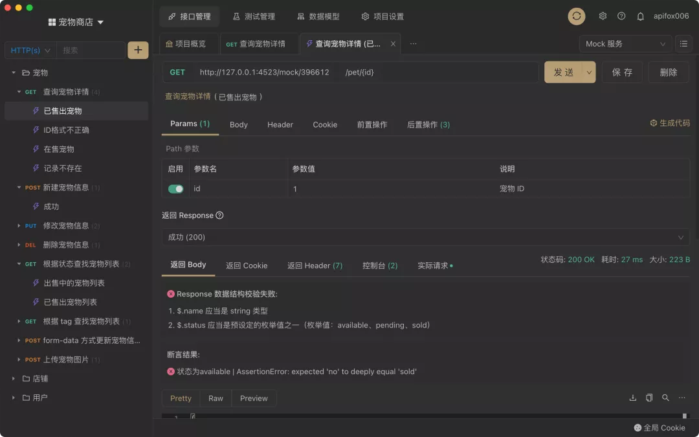
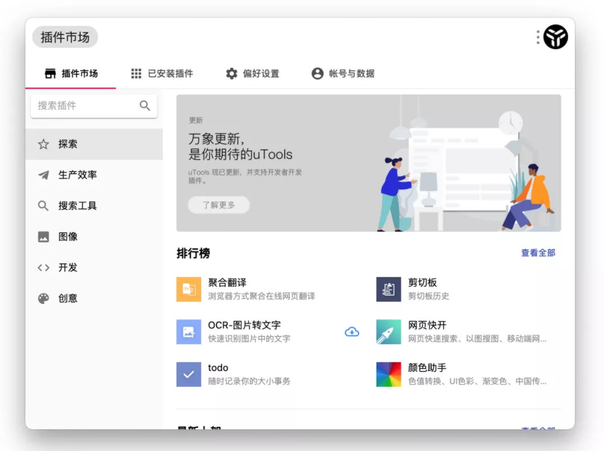
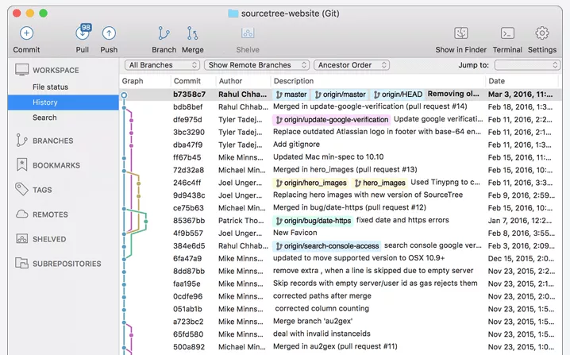
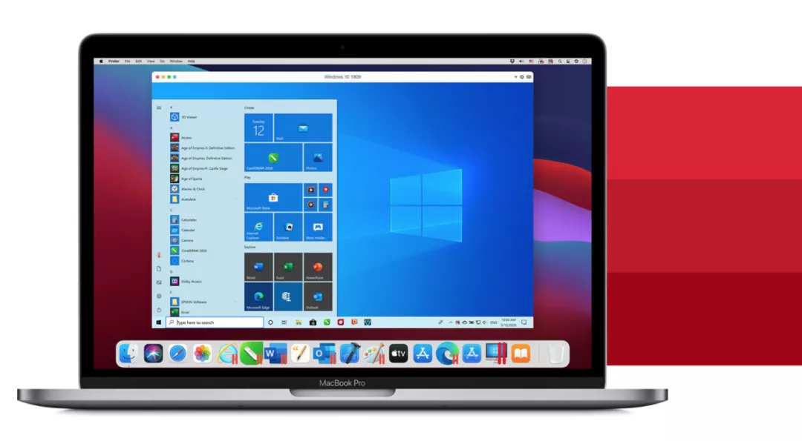

## Apifox
最好用的接口管理神器，没有之一，秒杀市面上所有同类产品

Apifox 是 API 文档、API 调试、API Mock、API 测试一体化协作平台，定位 Postman + Swagger + Mock + JMeter。

通过一套系统、一份数据，解决多个系统之间的数据同步问题。只要定义好 API 文档，API 调试、API 数据 Mock、API 自动化测试就可以直接使用，无需再次定义；API 文档和 API 开发调试使用同一个工具，API 调试完成后即可保证和 API 文档定义完全一致。高效、及时、准确！

更多介绍看这里：[《是时候扔掉 Postman 了，Apifox 真香！》](https://mp.weixin.qq.com/s?__biz=MzU3ODE1NDU4Nw==&mid=2247483954&idx=1&sn=0162d68ce94d9eddecc332c4c42b1da2&chksm=fd78fb06ca0f7210cd12061bcf6c2c7287f02e4eb3242b5fe9eaa1f518c098189ac597b10380&scene=21#wechat_redirect)官网地址：https://www.apifox.cn/

## uTools
uTools 是一个极简、插件化的现代桌面软件，通过自由选配丰富的插件，打造得心应手的工具集合。

官网地址：https://u.tools/

## SourceTree
如果你习惯使用命令行操作 Git，请忽略。SourceTree 是非常好用的 Git 图形界面工具，它是由Atlassian开发的免费Git图形界面工具，可以操作任何 Git 库。

官网地址：https://www.sourcetreeapp.com/

## Charls
## iTerm2
## FeHelper
## Navicat
## CodeLF
## Coding.net

## Typora
## MdNice 

## Parallel DesktopMac
系统最强虚拟机！有的软件没有windows版本，，或多或少需要一个虚拟机安装其他系统。

官网地址：https://www.parallels.cn/

## Alfred
## SwitchHosts
15
## 资料
[程序员必备的十四款工具，你都用过吗？](https://mp.weixin.qq.com/s/s0aL6EH9s1cK1fElDiIaDg)
