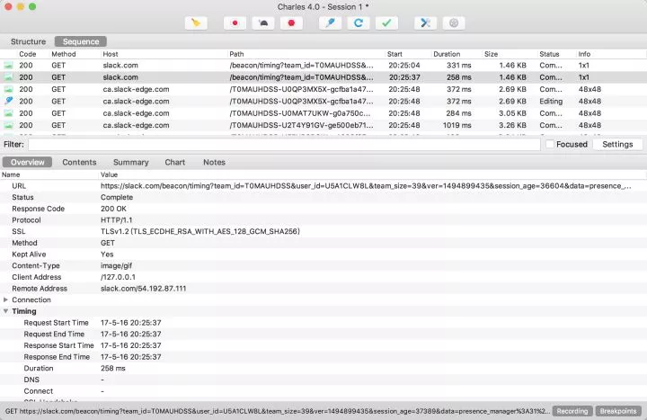
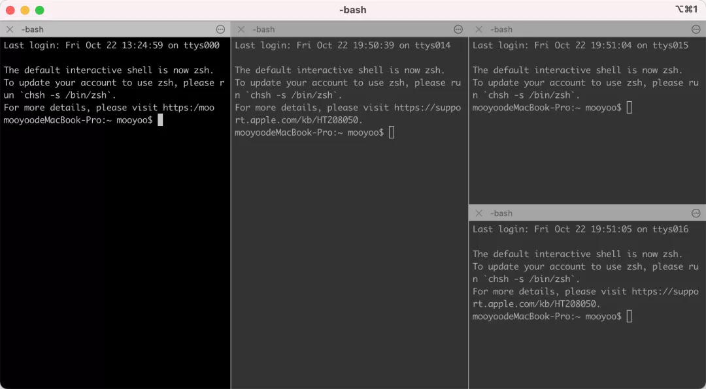
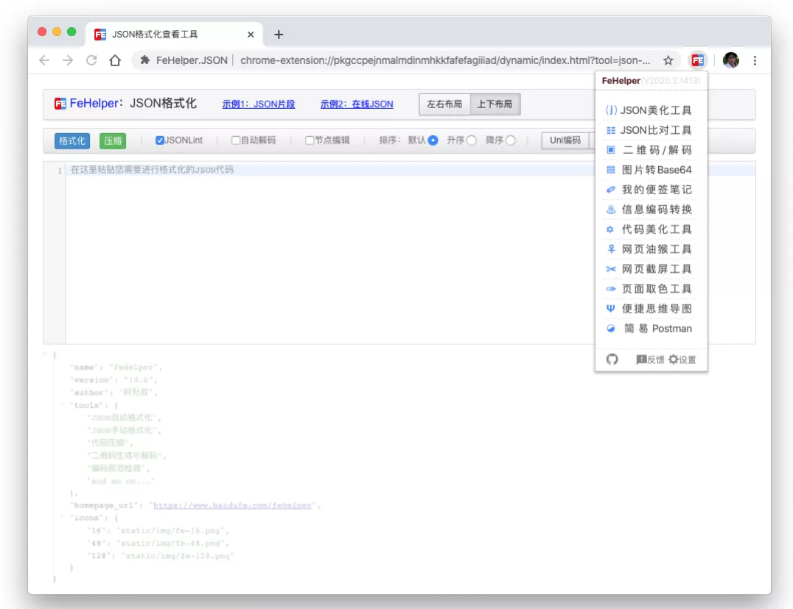
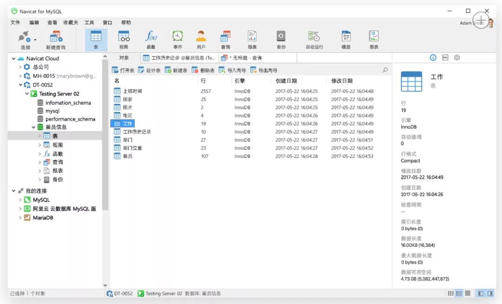
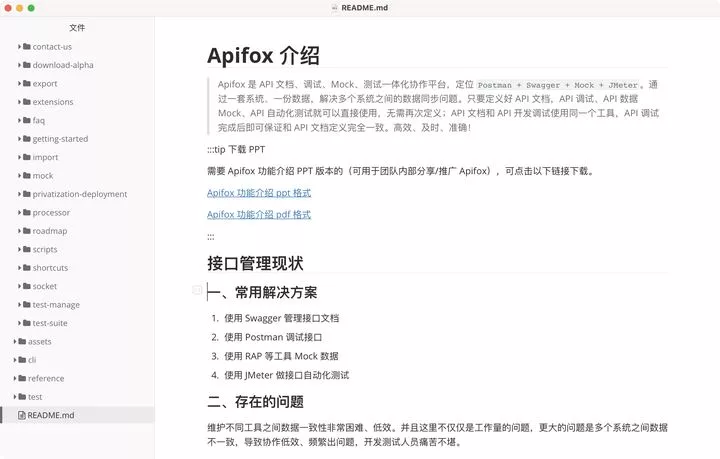
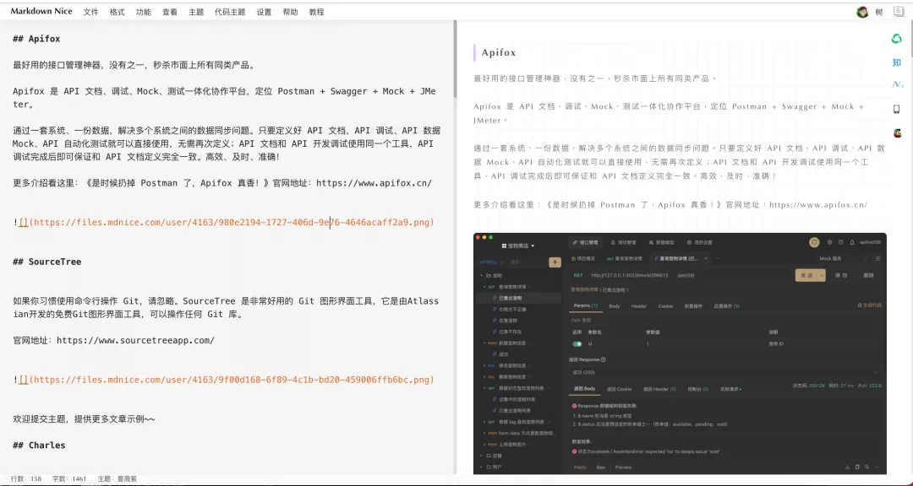

## Apifox
最好用的接口管理神器，没有之一，秒杀市面上所有同类产品

Apifox 是 API 文档、API 调试、API Mock、API 测试一体化协作平台，定位 Postman + Swagger + Mock + JMeter。

通过一套系统、一份数据，解决多个系统之间的数据同步问题。只要定义好 API 文档，API 调试、API 数据 Mock、API 自动化测试就可以直接使用，无需再次定义；API 文档和 API 开发调试使用同一个工具，API 调试完成后即可保证和 API 文档定义完全一致。高效、及时、准确！

更多介绍看这里：[《是时候扔掉 Postman 了，Apifox 真香！》](https://mp.weixin.qq.com/s?__biz=MzU3ODE1NDU4Nw==&mid=2247483954&idx=1&sn=0162d68ce94d9eddecc332c4c42b1da2&chksm=fd78fb06ca0f7210cd12061bcf6c2c7287f02e4eb3242b5fe9eaa1f518c098189ac597b10380&scene=21#wechat_redirect)官网地址：https://www.apifox.cn/

## uTools
uTools 是一个极简、插件化的现代桌面软件，通过自由选配丰富的插件，打造得心应手的工具集合。

官网地址：https://u.tools/

## SourceTree
如果你习惯使用命令行操作 Git，请忽略。SourceTree 是非常好用的 Git 图形界面工具，它是由Atlassian开发的免费Git图形界面工具，可以操作任何 Git 库。

官网地址：https://www.sourcetreeapp.com/

## Charls
最好用的抓包工具。Charles是一个支持多平台的HTTP代理器、HTTP监控、反向代理器。它能够让开发者查看本地机器与互联网之间的所有HTTP以及SSL/HTTPS传输数据。

[官网地址](https://www.charlesproxy.com/)

## iTerm2
对于需要长期与终端打交道的工程师来说，拥有一款称手的终端管理器是很有必要的，对于 MacOS 用户来说，仍然毋庸置疑，iTerm2 就是你要的利器，如果你觉得不是，那是你的问题，不是 iTerm2 的问题。

官网地址：https://iterm2.com/

只上一张效果图，大家感受一下吧

## FeHelper
FeHelper是 Web 开发者助手，目前包括 JSON自动/手动格式化、JSON内容比对、代码美化与压缩、信息编解码转换、二维码生成与解码、图片Base64编解码转换、Markdown、 网页油猴、网页取色器、脑图(Xmind)等贴心工具，甚至在目前新版本的FeHelper中，还集成了FH开发者工具， 如果你也想自己搞一个工具集成到FeHelper中，那这一定能满足到你。

官网地址：https://www.baidufe.com/fehelper/index/index.html

## Navicat
最好用的数据库管理工具，没有之一。我们 Apifox 团队都用这个工具管理数据库。Navicat 是一个可多重连接的数据库管理工具，它可以连接到 MySQL、Oracle、PostgreSQL、SQLite、SQL Server 和/或 MariaDB 数据库，让数据库管理更加方便

## CodeLF
变量命名神器。CodeLF通过搜索在线开源平台GitHub,Bitbucket,Google cod、/Codeplex, Sourceforge, Fedora Projec的项目源码，帮开发者从中找出已有的匹配关键字的变量名。

官网地址：https://unbug.github.io/codelf

## Coding.net
腾讯全资子公司，项目管理工具提供一站式开发协作工具，帮助研发团队快速落地敏捷开发与 DevOps 开发方式，实现研发效能升级。我们团队（Apifox）一直用 Coding 来管理项目，做 CI/CD 持续集成等。顺便说下我们的软件升级包都是放在 Coding 制品库的，免 CDN 费，薅腾讯羊毛，不用白不用。

官网地址：https://coding.net/

## Typora
Typora 是一款支持实时预览的 Markdown 文本编辑器。看到Typora的第一眼，我就爱上了它。它没有专业软件那么复杂而难以上手的功能，却也没有为了简洁而妥协到难以使用，它的每一寸肌肤都恰到好处，与它相处的每一刻都十分愉悦。

Apifox 的帮助文档就是用 Typora 写的。

官网地址：https://www.typora.io

## MdNice 
Markdown Nice(简称MdNice)是一款样式丰富的Markdown编辑器，同时支持微信公众号、知乎和稀土掘金等平台的文章排版(能用富文本编辑器写文章的平台基本都支持)。

MdNice支持多达20种样式，支持多达20种样式，总有一款适合你！

官网地址：https://editor.mdnice.com/

## Parallel DesktopMac
系统最强虚拟机！有的软件没有windows版本，，或多或少需要一个虚拟机安装其他系统。

官网地址：https://www.parallels.cn/

## Alfred
这个我觉得根本无需介绍，神器，使用 macOS 的同学应该都知道。一句话来说就是，Alfred 是 macOS 上神级的效率应用，能够在实际操作中大幅提升工作效率。

官网地址：https://www.alfredapp.com/

## SwitchHosts
SwitchHosts是一个管理、快速切换Hosts小工具，开源软件，一键切换Hosts配置，非常实用，高效。开发Web过程成，部署有多套环境，网址域名都相同，部署在不同的服务器上，有开发环境、测试环境、预发布环境、生产环境。经常要切换 Hosts 来访问，测试以及验证 bug，如果纯手工修改这会花掉不少时间。

官网地址：https://github.com/oldj/SwitchHosts

## 资料
[程序员必备的十四款工具，你都用过吗？](https://mp.weixin.qq.com/s/s0aL6EH9s1cK1fElDiIaDg)
