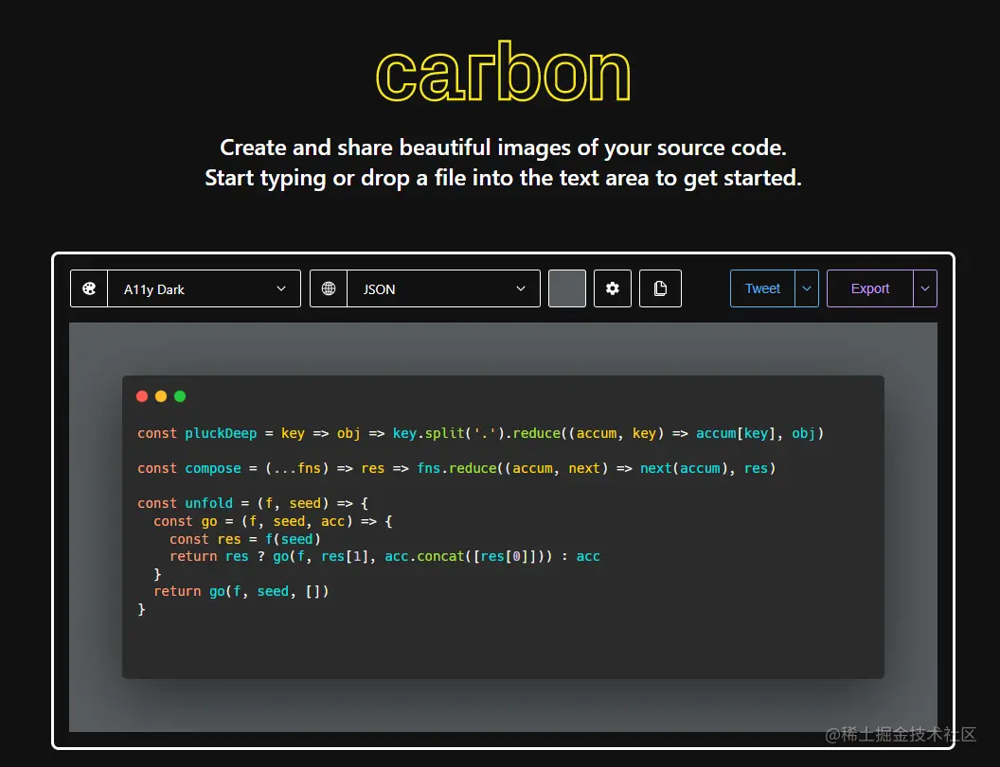
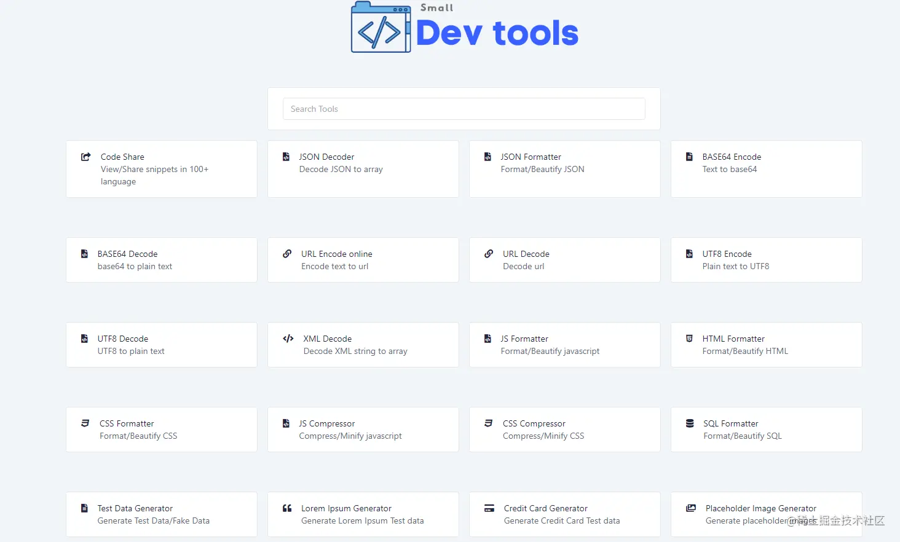

## 开发环境
1. git/svn

    版本控制首选，[git下载](https://git-scm.com/)、[svn下载](https://tortoisesvn.net/)
2. node(nvm)

    作为前端，必备的一个环境，不用多解释作为前端，必备的一个环境，不用多解释了，[node官网](https://nodejs.org/en/)、[node github地址](https://github.com/nodejs/node)、[node中文地址](http://nodejs.p2hp.com/) 。 nvm是node的多版本管理器，如有需要在多版本node之间切换可使用nvm，[安装教程](https://juejin.cn/post/7002016966189776909#heading-5)
3. 包管理器

    视自身需求选择cnpm、pnpm、yarn

4. python

    现在前端很多npm包都会用到python的编译，比如node-sass，我们自己开发node脚本也会常用到python，所以python基本上也成了前端电脑上必装的环境了，[python下载地址](https://www.python.org/)。

    提示：在安装node的时候，可以勾选上一起安装python
5. vscode/webstorm/HBuilder

    前端用的最多的两款编辑器就是vscode/webstorm，webstorm收费，我平时用vscode比较多，这里就不多介绍webstorm了，下载地址也留下，webstorm下载。 HBuilder下载地址

    主要还是记录vscode的内容：
    - 安装

        [vscode下载地址](https://code.visualstudio.com/)

    - vscode好用的插件系列

        - git相关插件：gitLens、Git History、Git History Diff
        - 汉化插件： Chinese (Simplified)
        - 开发提示相关插件： Tabnine AI（强推）、Path Intellisense（路径提示）、Vetur、Volar、Auto - - - Close Tag、Auto Complete Tag、Auto Rename Tag、HTML Snippets、Wrap Console Log Lite
        - 浏览器调试插件： JavaScript Debugger、Debug Visualizer、scode-js-debug
        - 静态服务器：Live Server
        - 代码运行器： Code Runner
        - 正则提示插件： any-rule、Regex Previewer（辅助验证正则结果）
        - Docker插件： Docker
        - 格式化类插件： EditorConfig for VS Code、ESLint
        - 进制文件查看： Hex Editor
        - TODO提示： Todo Tree
        - 流程图绘制： drawio
        - PDF查看： vscode-pdf
        - Markdown预览：Markdown Preview Enhanced
        - SVG文件预览：SVG Viewer
        - 图片预览（在html或者css写地址的时候可直接预览）：Image Preview
        - 文件依赖分析（如：.vue文件可以通过该插件看到引用了哪些依赖）：Dependency Cruiser Extension
        - 颜色选择、设置：Color Highlight、Color Picker
        - 快速生成注释：vscode-fileheader 和 koroFileHeader 
        - npm模块导入智能提示： npm Intellisense
        - 接口请求：REST Client
6. docker

    docker可以帮助前端快速获取一些偶尔使用的环境（偶尔使用的环境，又不想在电脑上安装一大堆），如：nginx、mysql、redis等之类的，之前发过一篇简单的使用，可以参考一下，[地址](https://juejin.cn/post/7000652858353778695)

## 好网站
1. [代码图生成 carbon](https://carbon.now.sh/)

    
2. [代码图生成 ray](https://ray.so/)
3. [图片压缩-tinypng](https://tinypng.com/)
4. [图片压缩-picdiet](https://picdiet.eula.club/)
5. [图片压缩-compresspng](https://compresspng.com/zh/)
6. [图片背景消除](https://www.remove.bg/zh)

    

### 开发文档
1. [聚合类开发文档](https://devdocs.io/)
2. [聚合类开发文档-overapi](https://overapi.com/)
3. [docschina.org/](https://docschina.org/)
4. [菜鸟教程](https://www.runoob.com/)
5. [roadmap.sh/](https://roadmap.sh/)

### 在线IDE/代码美化
1. [codepen.io/](https://codepen.io/)
2. [codesandbox.io/](https://codesandbox.io/)
3. [code.juejin.cn/](https://code.juejin.cn/)
4. [stackblitz.com/](https://stackblitz.com/)
5. [代码美化](https://codebeautify.org/)

### 响应式开发、多平台测试、性能分析
1. [多设备调试](多设备调试)
2. [多平台测试](https://www.lambdatest.com/)
3. [性能分析](https://pagespeed.web.dev/)

### css
[css 动画演示](https://www.webhek.com/post/css3-animation-sniplet-collection/#/)

### 常用开发小工具
1. [smalldev](https://smalldev.tools/)

    
2. [tool](https://tool.lu/)

### 简历
1. [resume](https://resume.io/)
2. [500丁](https://www.500d.me/)

### AI
[AI视频生成 AI代码](https://www.tabnine.com/)

### CDN

## 资料
[前端仔电脑里的秘密](https://juejin.cn/post/7187272143657730108#heading-11)