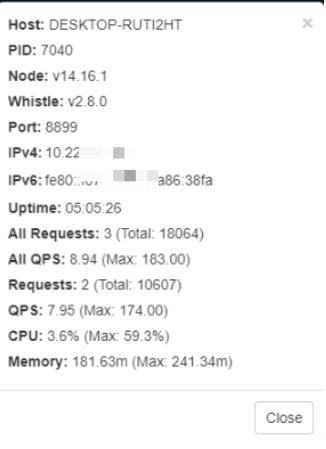
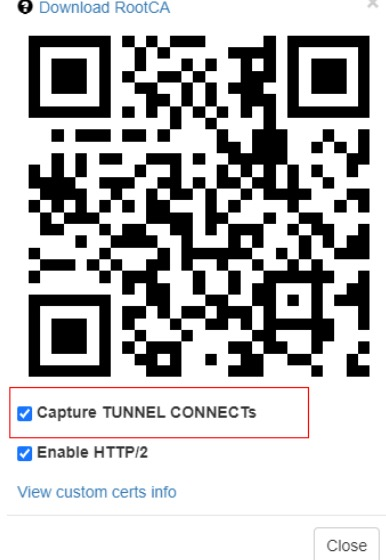
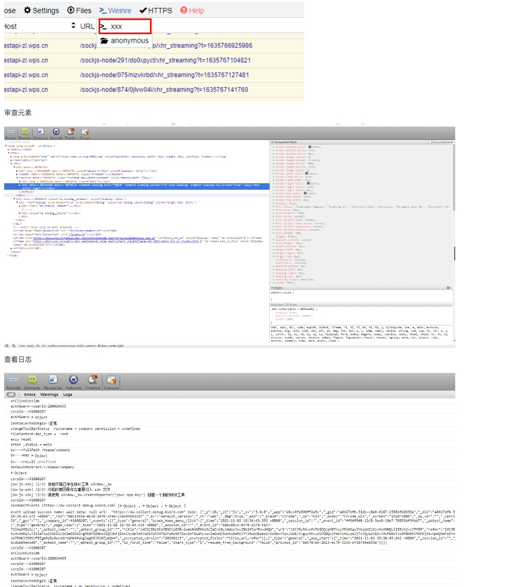

## whistle
可以做什么？

- 修改请求和响应
- 抓包
- 调试

常用命令
```shell
# 安装
npm install whistle -g --registry=https://registry.npm.taobao.org
# 升级版本
npm update whistl -g 
# 启动
w2 start
# 停止
w2 stop
# 重启
w2 restart
# 更新配置
w2 add --force
```

查看whistle信息，可以快速查看ip端口



## 证书
https协议需要证书，证书加密用来防止中间人攻击

证书类型--ssl nginx

根证书root、nginx证书

## 实践

### 查看移动端日志
```shell
testapi-zl.xx.cn log://
```

### ipad显示手机页面
```js
local.zhiliao.xx.cn ua://Mozilla/5.0 (iPhone; CPU iPhone OS 13_2_3 like Mac OS X) AppleWebKit/605.1.15 (KHTML, like Gecko) Version/13.0.3 Mobile/15E148 Safari/604.1
```

### 在xx中打开了本地页面，调式test环境接口
```shell
# 前端页面走本地代码，接口走后端
# 接口不代理
https://testapi-zl.xxx.cn/api  https://testapi-zl.xxx.cn/api
# 代理前端页面资源
https://testapi-zl.xxx.cn/ http://127.0.0.1:8080
```

### 修改返回值
```js
# 修改接口返回值
//  test.json
{
  "code": 0,
  "msg": "ok",
  "data": []
}
local.***.***.cn replaceStatus://200
https://local.***.***.cn/a resBody://{test.json}
```

## 修改js、css内容
```js
local.***.***.cn 127.0.0.1:8081
//  test.js
alert(1);

local.***.***.cn/1.js jsAppend://{test.js}
// test.css
body{
background:red;
}
local.***.***.cn/1.css cssAppend://{test.css}
```

### 使用weinre插件
可以审查元素修改样式、看网络请求、看日志

开启配置
```shell
testapi-zl.xxx.cn weinre://xxx
```
点击这里打开面板


## 参考
[whistle](https://avwo.github.io/whistle/)

[Nohost](https://github.com/Tencent/nohost)