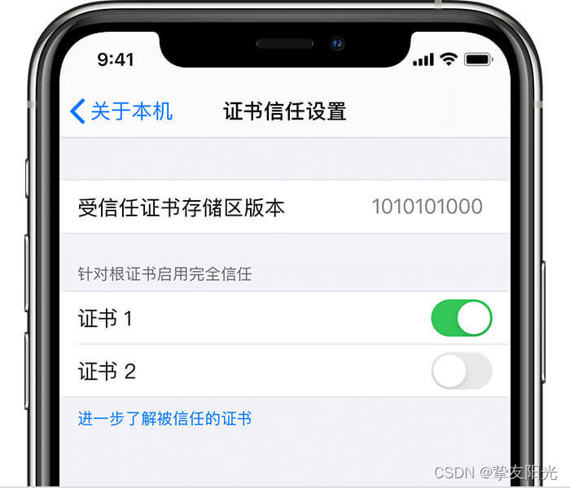

**whistle 是一个基于Node实现的跨平台web调试代理工具，类似Windows上的Fiddle,Mac上的Charles，主要用于查看、修改HTTP、HTTPS、Websocket的请求、响应，也可以作为HTTP代理服务器使用**，不同于Fiddler通过断点修改请求响应的方式，whistle采用的是类似配置系统hosts的方式，一切操作都可以通过配置实现，支持域名、路径、正则表达式、通配符、通配路径等多种匹配方式，且可以通过Node模块扩展功能。

虽然长期以来一直使用的工具是Fiddler，但当我看到whistle的第一眼，就果断抛弃了Fiddler，转而使用whistle，诸多原因，我们下面一一来聊：

1. 我们先看看whistle的[官方文档](https://wproxy.org/whistle)，点进去看的第一感觉这工具很强大，很灵活，而对比Filddler和Charles，功能比较弱，而且使用不是太灵活。
2. 支持多重匹配规则的配置方式，而且规则还支持变量，使用下来就是两个字：舒服，而Fiddle和Charles规则配置都有些困惑，特别死Charles规则的配置方式很死板。
3. 支持使用动态规则，通过w2 use来导入动态的规则，很容易可以和项目编译流程打通，比如我们在项目根目录下新建whistle.cfg.js，内容：

    ```js
    const {name} = require('./package.json');
    const path = require('path');

    function resolve(pathname) {
        return path.resolve(__dirname, pathname);
    }

    module.exports = {
        name, 
        rules: `
            /www.test.com/commons.js/ ${resolve('./dist/common.js')}
        `
    }
    ```
    然后在编译命令运行之前，运行w2 use ./whistle.cfg.js，我们就可以导入一个以我们的项目为名字的规则列表(目前只有一条),而这段${resolve('./dist/commons.js')}代码也会被替换成真实的项目路径

4. 支持hosts指向更改，而且无缓存,我们再也不需要去一层层去找hosts文件，再也不用关心更改的hosts是否生效了，再也不用去纠结Windows和Mac下hosts文件的存放位置，一条规则搞定

    ```js
    www.test.com 118.1118.1118.1118
    ```
5. 支持各种请求和响应更改
6. <span style="color: red;font-weight:bold">原生支持远程调试，我们只需要加一条规则就可以搞定</span>

    ```js
    www.example.com weinre://example
    ```
…, 好处实在是太多，这里就不再多做介绍，有兴趣的朋友可以自行去研究，我们还是回到本文的主旨，手机端抓包和调试。

要进行手机端抓包，我们需要在手机上设置代理指向运行的whistle机器的特定端口（默认8899），IPhone和安卓手机设置代理的方式大同小异，这里主要介绍一下IPhone的设置方式：

1. 打开手机上面的“设置”功能，进入手机的系统功能设置，如图所示。

2. 进入手机的设置功能之后，选择无线局域网，点击进入，如图所示

3. 进入无线局域网之后，选择一个要设置HTTP代理的网络，点击进入，如图所示。

4. 进入该网络配置之后，下拉页面，找到HTTP代理模块的“配置代理”，点击进入，如图所示。

5. 进入配置代理的模块后，可以看到状态是关闭的，点击其中的“手动”，如图所示。

6. 点击手动之后，就会出来一个模块让填写代理服务的ip和端口，正确输入即可，然后点击右上角的“存储”，如图所示。

设置完代理后，我们已经可以抓http网站的包，**但是如果我们访问https的网站，会发现会提示证书有问题，我们需要安装并信任证书，证书安装我们可以通过Safari（一定要是Safari）访问：http://电脑ip:8899**

依次点击步骤一和步骤二下载证书，步骤三开启https抓包，证书下载完毕后，我们可以在描述文件中找到下载的证书并点击安装：


<span style="color: red;font-weigth: bold">安装证书后我们需要信任证书，在"设置->通用->关于本机->证书信任设置"。在"针对根证书启动完全信任下",开启对这个证书的信任</span>



到这里我们就可以抓手机上的https包了，但是我们如何调试手机端的页面呢？

1. 我们可以通过上面介绍的 weinre 来开启 whistle 自带的远程调试工具
2. 我们可以利用log来远程查看远程控制台或打印变量
3. 我们可以通过 resPrepend 或 resAppend 配合本地文件或者变量来向手机页面注入调试面板，比如 eruda。例

    新建规则
    ```js
    www.example.com resaPPEND://{append}
    ```
    新建变量append，内容为
    ```html
    <script src="http://cdn.jsdelivr.net/eruda/1.0.5/eruda.min.js"></script>
    ```
    开启规则后，我们在请求www.example.com网站的时候就会自动注入eruda调试面板，通过调试面板我们可以方便的对手机端页面进行调试。

写在最后：

1、如果上面步骤都完成后，我们依然无法抓包，考虑是电脑端防火墙的原因，我们可以选择关闭防火墙和本地的杀毒软件，当然也可以放行8899端口，不过设置稍微有些繁琐。

2、手机抓包结束后，记得恢复代理为关闭，不然会影响后续正常情况下的请求发送。


## 资料
[使用whistle进行手机抓包并调试](https://blog.csdn.net/qq_41366114/article/details/123127025)