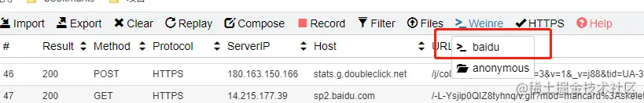
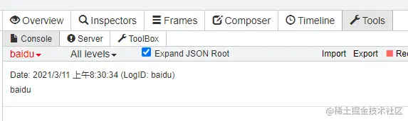

[whistle](https://github.com/avwo/whistle/blob/bd55e0d5664cd0279ebcf1177470db9063574806/README.md)是一个基于Node实现的跨平台抓包调试工具

快速安装
```js
npm i whistle -g 

w2 -h // 帮助信息
```

## 常用命令

```shell
# 启动
w2 start

# 重启
w2 restart

# 更换代理接口
w2 start -p 8080

# 停止
w2 stop
```
更多命令: [命令行操作](http://wproxy.org/whistle/cli.html)

## 使用小技巧
### 1.匹配模式
匹配关键字符: ^(统配路径标识符)、$(精确匹配)、*(通配符)、！(取非)

#### 域名匹配

```shell
# 匹配域名 www.test.com 下的所有请求，包括http、https、ws、wss/tunnel
www.test.com operatorURI

# 匹配域名 www.test.com 下所有 http 请求
http://www.test.com operatorURI

# 匹配域名 www.test.com 下的所有 https 请求
https://www.test.com operatorURI

# 上述匹配也可以限定域名的端口号
www.test.com:8888 operatorURI # 8888 端口
www.test.com/ operatorURI # http 为 80 端口，其它 443 端口
```
#### 路径匹配

```shell
# 限定请求协议，只能匹配http请求
http://www.test.com/xxx operatorURI
http://www.test.com:8080/xxx operatorURI

# 匹配指定路径下的所有请求
www.test.com/xxx operatorURI
www.test.com:8080/xxx operatorURI
```
#### 正则匹配

```shell
# 匹配所有请求
/./ operatorURI

# 匹配 url 里面包含多个关键字的请求
/keyword/ operatorURI

# 通过正则匹配，同样的 $1~$9捕获分组，$0 表示整个URL
/(\d+).html/ operatorURI
```

#### 通配符匹配
匹配模式必须以 ^ 开头(如果需要限制结束位置可用),'*'为通配符，支持通过0...9获取挺佩服匹配的字符串，其中 $0 表示整个请求url。

```shell
^www.example.com/test/*** referer://http://www.test.com/$1
```

### 2.替换返回内容
文本类请求追加返回内容、替换返回内容

```shell
# 会把内容 append到请求后面
http://www.text.com/style.css resAppend://{append.css}

# 完全替换请求内容
http://www.text.com/style.css resBody://{resBody.css}
```

### 3.超时模拟
超时模拟，也就是返回延迟。如下延迟3000ms

```shell
www.text.com resDelay://3000
```

### 4. 修改请求cookie
有些时候，我们需要模拟一些额外的cookie

```js
// rules
www.test.com reqCookies:{reqCookies.json}

// key-value (reqCookies.json)
name: 路人甲
age: 18
```

### 5. 重定向
重定向只需如下：

```shell
www.test.com/index.html redirect://https://ke.qq.com/test;
```

### jsonp模式
要代理jsonp，这里就要用到tpl，其内置了一个简单的模板引擎，可以把文件内容里面{name}替换请求参数对应的字段(如果不存在对应的自动则不会进行替换)

如下请求

```shell
fetch("https://test.com/get.jsonp?jsonpcallback=jsonp_cb");

// 返回值
jsonp_cb({code: 0});
```
使用tpl，我们可以这样匹配

```shell
// rules
/\.jsonp/i  tpl://{test.json}

// key-value (test.json)
{jsonpcallback}({code: 0}) 
```
注意，这里的jsoncallback就是请求的字段名

### 7.修改状态码
修改状态码有两种模式：statusCode 和 replaceStatus

- statusCode

    设置响应状态码(状态码范围100~999),请求会直接根据设置的状态码返回，不会请求到线上。

    ```shell
    www.test.com statusCode://500
    ```
- replaceStatus

    替换响应的状态码(状态码范围100~999)，请求响应后再修改状态码。
    
    ```shell
    www.test.com replaceStatus://500
    ```

### 8.真机调试
调试移动页面有两种方式，一种是Weinre,另一种是log日志输出

#### Weinre
weinre 可以用于调试远程页面

```shell
https://www.baidu.com weinre://baidu
```
xxx表示页面的唯一ID

当用手机打开配置的页面时，在顶部操作栏的Weinre栏，在下拉列表就可以找到设置的weinre id的，点击会新开一个weinre调试页面，就可以开始使用weinre。



#### log
通过自动监控 html 页面或 js 文件出现的错误及 console.xxx 打印出来的信息，会自动在 whistle 界面的 log 模块显示这些错误及信息日志。

```shell
https://www.baidu.com log://baidu
```
xxx表示页面的唯一标识，当设置多个log时，会以可选择列表的形式展示。



### 9.捕获https
whistle支持抓取https 请求，具体配置方法参见：[HTTPS拦截](http://wproxy.org/whistle/webui/https.html)

## 匹配规则
相同协议规则的默认优先级从上到下，即前面的规则优先级匹配高于后面


## 蝉蛹快捷键

快捷键|说明
---|---
Ctrl + x | 清除选择的请求

## 参考文档
[关于whistle](https://link.juejin.cn/?target=http%3A%2F%2Fwproxy.org%2Fwhistle%2F)


原文链接： [whistle 实用小技巧](https://laixiazheteng.com/article/page/id/OkrrpRWbB85G)