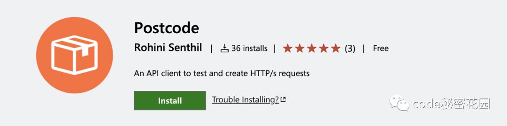
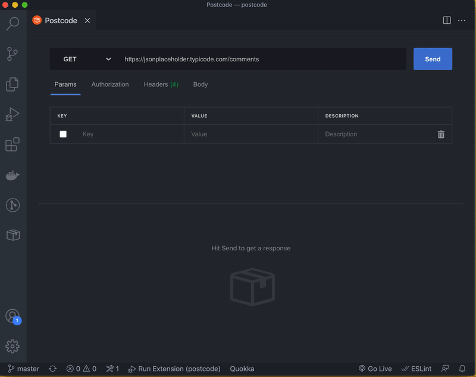
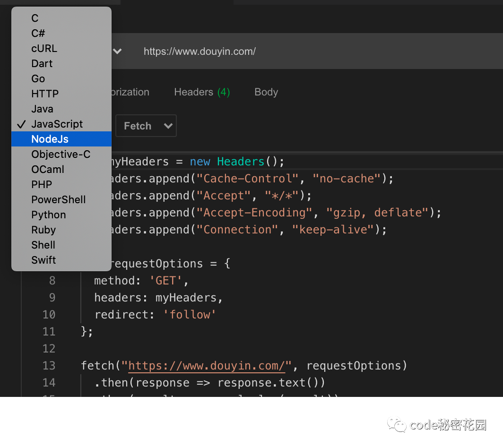
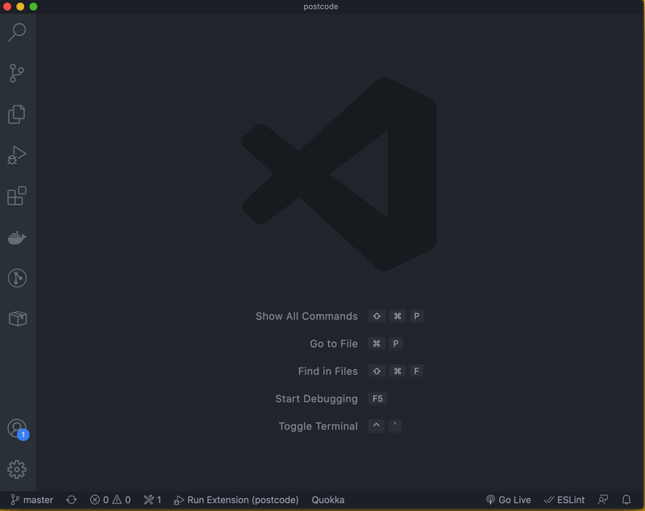
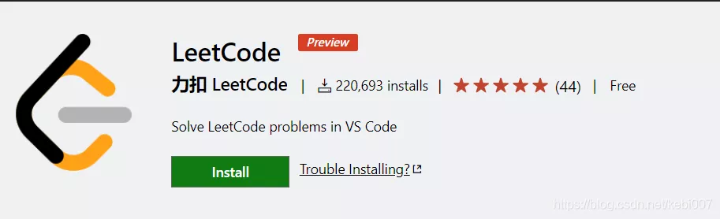
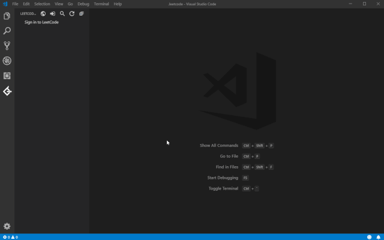
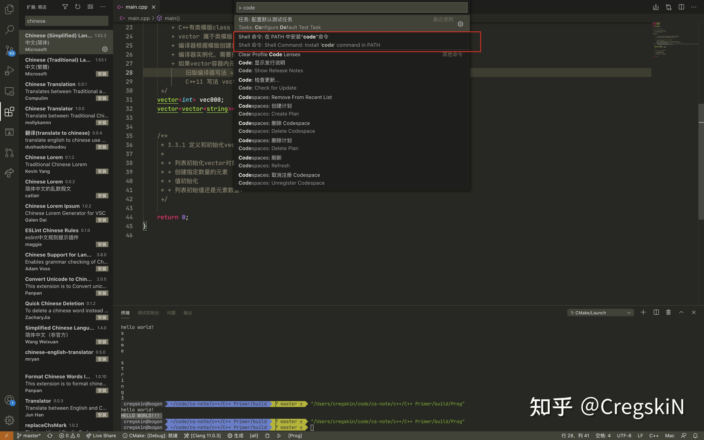
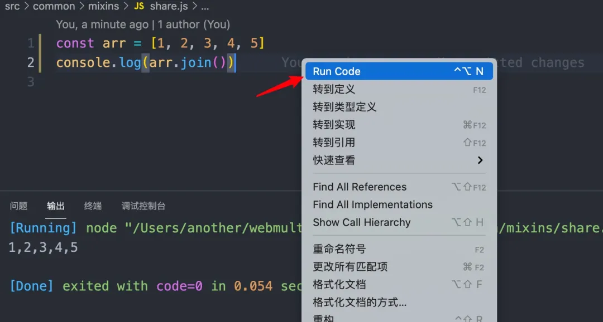
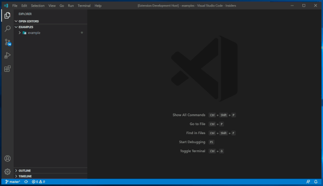

---
title: VScode插件
--- 

## Postcode

Postcode是一个Visual Studio Code扩展



它可以看做是Postman的替代品，基本上Postman的常用功能它都有

;

- 类似于Postman的直观UI，与任何vsCode主体无缝匹配

- 支持GraphQL请求

- 支持从请求中生成代码片段

;

并且，可以使用vscode的命令快捷启动

;


## Rainbow Fart
开源地址：https://github.com/SaekiRaku/vscode-rainbow-fart


萌妹子语音在线吹彩虹屁陪你写代码！彩虹屁，真香！

在你写代码的时候，可根据关键字播放接近代码含义的语音。

商店链接：https://marketplace.visualstudio.com/items?itemName=saekiraku.rainbow-fart

## Leetcode
下载量：22万+ 开源地址：https://github.com/LeetCode-OpenSource/vscode-leetcode


进大厂，必须刷题！这个插件直接在VSCode中刷LeetCode！


## Markdown Preview Enhanced

实时预览markdown，markdown使用者必备

## copilot
copilot 是一个基于 AI 的编程辅助工具。目前已经集成在了 vscode 中，后续可能集成到更多平台和工具，目前还是测试阶段。官网地址：https://copilot.github.com/

写注释提示代码

## 添加code指令到shell
ctrl/command + p，搜索code，按下图选择：


如此，可以在cmd窗口/终端中，**执行 code . 用vscode打开当前目录**

vscode可以拖动文件到控制台显示路径

## Volar---Vue3完美的配套工具

[Volar---Vue3完美的配套工具](Volar ——Vue3 完美的配套工具)


## Code Runner
运行代码片段或多重语言的代码文件，支持C、Java、Javascript、PHP、Python等

只需要点击鼠标右键，选择Run Code就能得到结果



## Draw.io Integration
vsCode 绘图插件


[太赞了，VSCode 上也能画流程图了！](https://zhuanlan.zhihu.com/p/140895359?from_voters_page=true)


## tab cycle
vscode最常用的tab移到最前面

## Where Am I
左下角显示项目所在位置
## 资料

[vscode 摸鱼](https://mp.weixin.qq.com/s/1lS9GWPkVZvVLIJjjXU4iw)

[精选15+VSCode插件推荐](https://mp.weixin.qq.com/s?__biz=MzAxODE2MjM1MA==&mid=2651584692&idx=3&sn=3093f45119c303b1419e535e484f62a0&chksm=80252f75b752a6637a61b096ae6159fca345aad9a49eac6ee2c747185122598f5cce01801273&scene=21#wechat_redirect)


[VSCODE 可无缝调试浏览器了！](https://lucifer.ren/blog/2021/07/28/vscode-brower-debug/)

```
// lauch.json
{
  "version": "0.2.0",
  "configurations": [
    {
      "type": "pwa-msedge",
      "request": "launch",
      "name": "Launch Microsoft Edge and open the Edge DevTools",
      "url": "http://localhost:8080",
      "webRoot": "${workspaceFolder}"
    }
  ]
}
```