## 背景
项目根目录经常会出现一个 .vscode文件夹，它是干什么的？

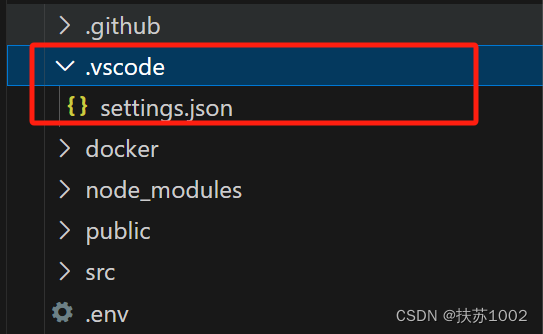

:::tips
众所周知，vscode的配置分两类
- 全局的用户配置
- 当前工作区配置
:::
vscode打开的文件夹的根目录是一个工作区，**.vscode目录就是存放当前工作区相关配置文件的目录**，这样分享项目时，也把该项目的vscode配置分享出去了，保证了协同工作开发环境的统一性。

## .vscode目录下一般有4种配置文件和项目中的代码片段
- extensions.json: 推荐当前项目使用的插件
- setting.json: vscode编辑器和插件的相关配置
- lanuch.json: 调试配置文件
- task.json: 任务配置
- xxxxx.code-snippets: 项目中共享的代码片段

### extensions.json
- 将插件天道到该项目的推荐列表中

    - 点击插件的设置按钮，选择添加到工作区建议

        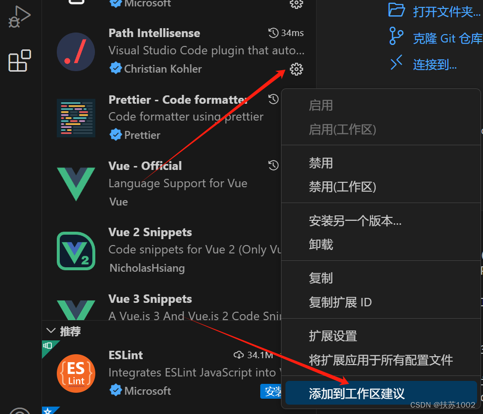
    - 选择要添加的工作区

        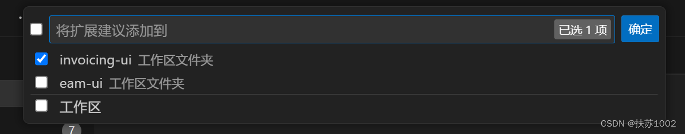
    - 生成 extensions.json文件

        ```js
        {
            "recommendations": ["christian-kohler.path-intellisense"]
        }
        ```
- 拿到别人的项目，安装项目中推荐的扩展插件

    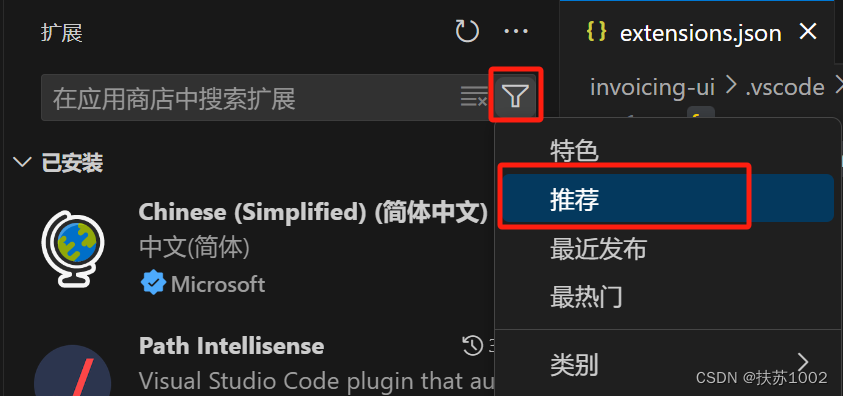

### setting.json
- 创建工作区设置配置文件

    - 在vscode左下角，点击设置按钮

        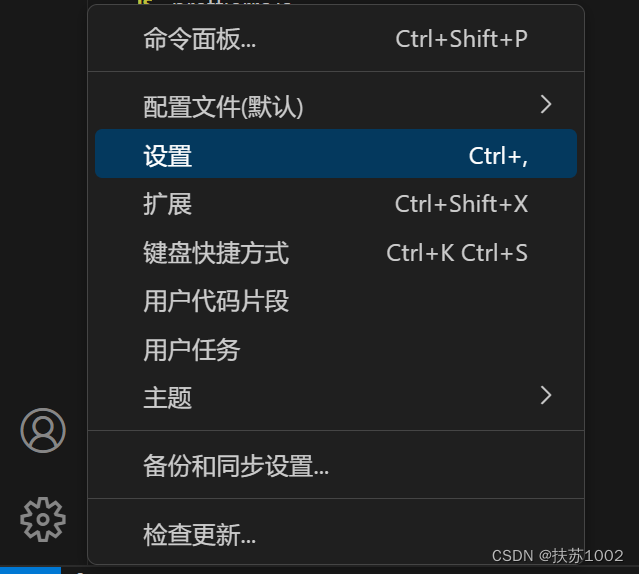
    - 进入工作区设置界面，点击任一【在setting.json中编辑】链接都会自动创建setting.json文件

        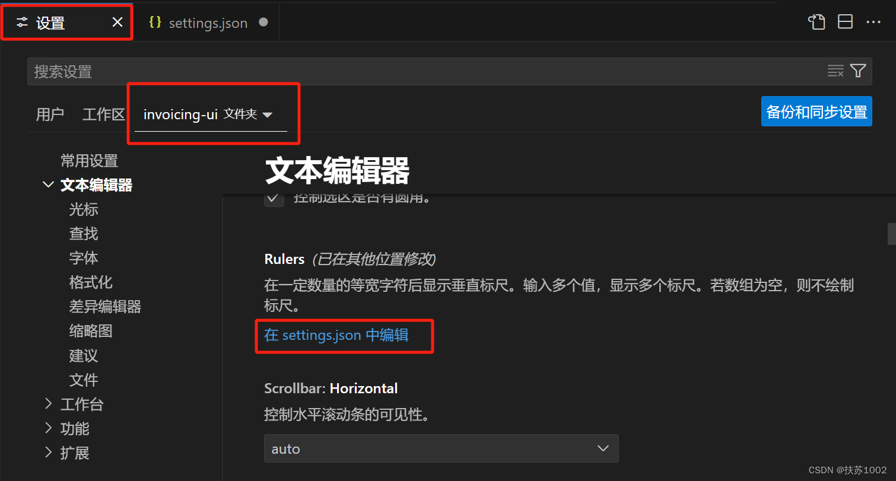

    - 生成setting.json文件

        ```js
        {
            "editor.codeActionsOnSave": {
            
            }
        }
        ```
    - 如果想直接修改JSON文件，可以使用ctrl + space智能提示来查看该选项都有哪些设置。
    - 生成 setting.json 文件后，在可视化的工作区设置界面，修改的设置都会自动添加到 setting.json 文件中。包括对插件的设置。

        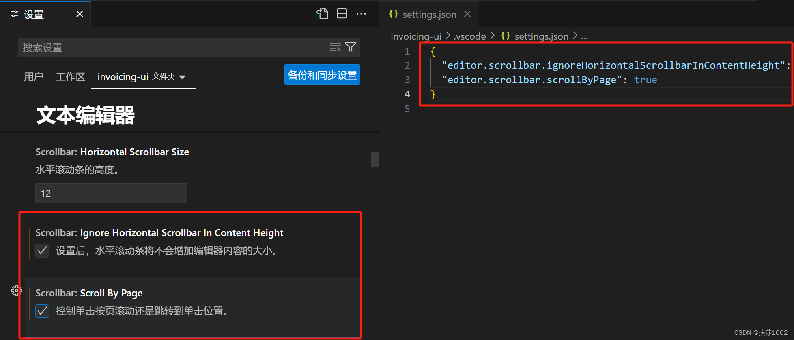
### launch.json
- 创建调试配置文件

    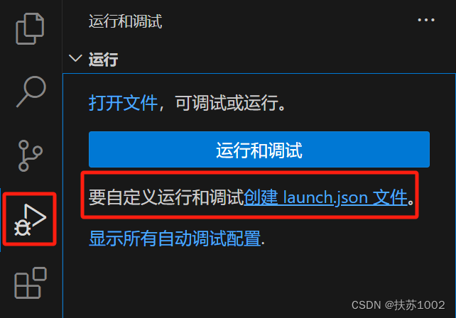

    - 选择工作区

        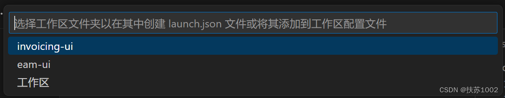
    - 选择调试器

        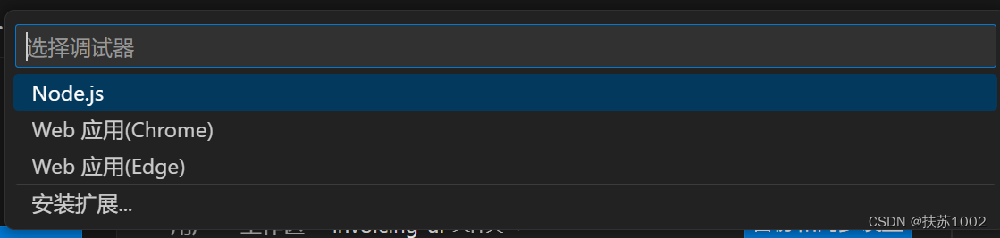

    - 选择调试引擎后，就会自动生成调试配置文件，以 node.js 为调试引擎为例：

        ```js
        {
            // 使用 IntelliSense 了解相关属性。 
            // 悬停以查看现有属性的描述。
            // 欲了解更多信息，请访问: https://go.microsoft.com/fwlink/?linkid=830387
            "version": "0.2.0",
            "configurations": [
                {
                "type": "node",
                "request": "launch",
                "name": "启动程序",
                "skipFiles": [
                    "<node_internals>/**"
                ],
                "program": "${file}"
                }
            ]
        }
        ```
### task.json
之前很多工作都是通过命令行为完成，比如执行一个文件 node test.js。这种工作就可以配置成任务，让vscode一键执行。

- 创建任务配置文件

    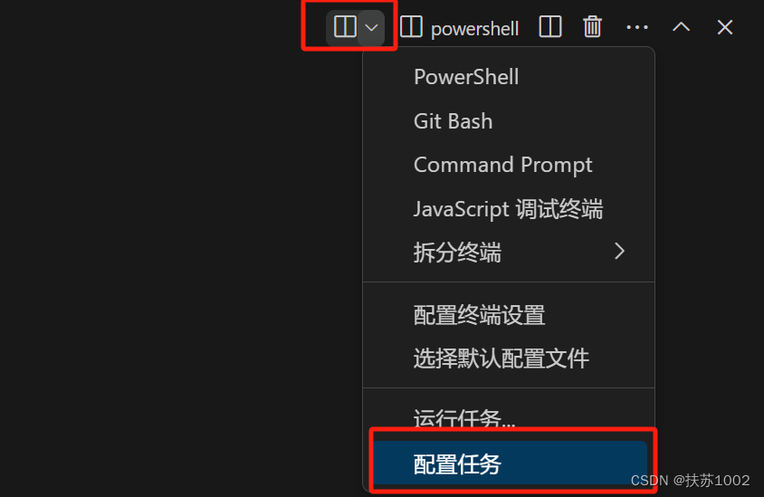

    - 如果项目中存在 package.json 文件，vscode 就会读取其中的脚本命令，可以方便的将脚本命令配置为任务。
    - 比如自动配置好 node 执行 test.js 文件的任务。
    - package.json :

        ```js
        "scripts": {
            "node": "node test.js",
        },
        ```
    - vscode 自动读取脚本，选择要配置的任务：

        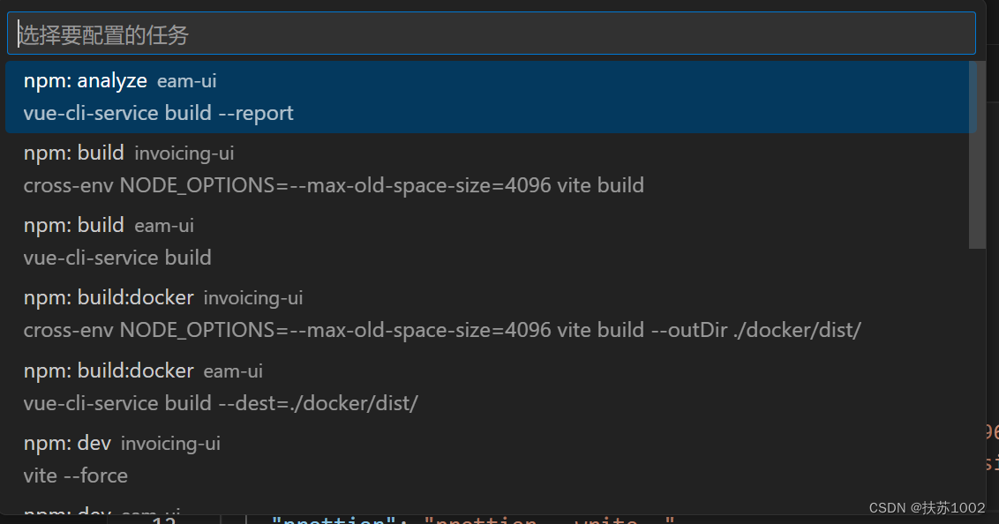

    - task.json

        ```js
        {
            "version": "2.0.0",
            "tasks": [
                {
                    "type": "npm",
                    "script": "node",
                    "problemMatcher": [],
                    "label": "npm: node",
                    "detail": "node test.js"
                }
            ]
        }
        ```

### 代码片段
对于一些重复代码，我们可以在 vscode 中配置用户代码片段，方便一键生成。

代码片段有用户级别的，也有项目级别的。用户级，比如你换了台电脑，就可以将自己之前保存的代码片段共享过来，项目级别的就是便于团队成员之间使用了。

#### 创建代码片段
- 在vscode左下角，点击设置按钮，选择新建用户代码片段：

- 选择工作区（可以项目也可以全局）

    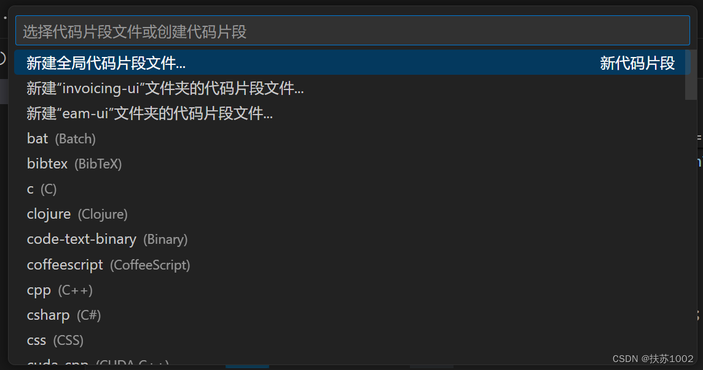

- VSCode中的代码片段有固定的 json 格式，所以我们一般会借助于一个在线工具来完成

具体的步骤如下：

- 第一步，复制自己需要生成代码片段的代码；

    ```js
    {
        "片段名字": {
            "prefix": "快捷指令",
            "body": [
                代码片段
            ],
            "description": ""
        }
    }
    ```
- 第二步，https://snippet-generator.app/在该网站中生成代码片段；
- 第三步，在VSCode中配置代码片段；

比如生成一个打印 123 的片段：

```js
"print 123": {
  "prefix": "p123",
  "body": [
    "console.log(123)"
  ],
  "description": "print 123"
}
```