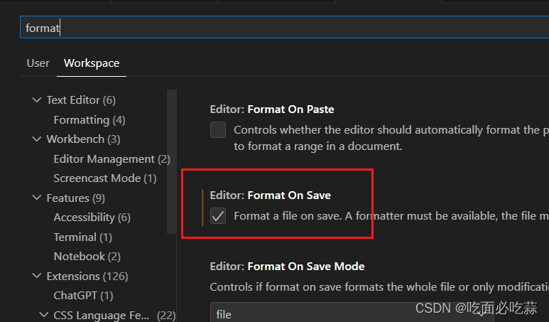
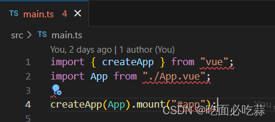
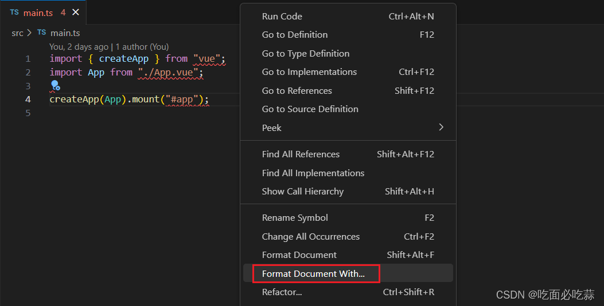
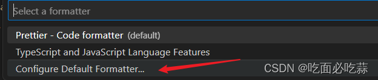
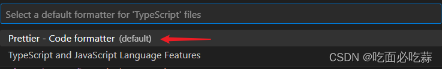
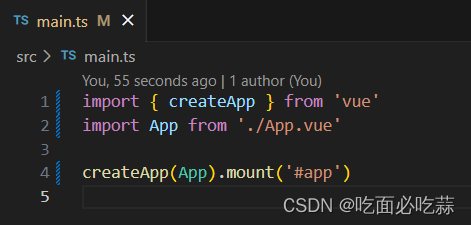

## 实现步骤- 1. 安装如下插件

1. ESLint: eslint 编码规范
2. Vetur: vue 格式化代码
3. Chinese (Simplified) Language Pack for Visual Studio Code： 中文包

## 实现步骤- 2. 打开配置文件

MacOS 使用 Command + Shift + P, window 使用 Ctrl + Shift + P 快捷键-->搜索“Configure Language Specific Settings”--->选择“Vue”--->打开配置文件--->将如下代码复制粘贴到配置文件中。

```js
{
    // 分号
    "prettier.semi": false,
    "prettier.eslintIntegration": true,
    // 单引号包裹字符串
    // 尽可能控制尾随逗号的打印
    "prettier.trailingComma": "all",
    "prettier.singleQuote": true,
    "prettier.tabWidth": 2,
    // 关闭自带的格式化
    "javascript.format.enable": false,
    // 让函数(名)和后面的括号之间加个空格
    "javascript.format.insertSpaceBeforeFunctionParenthesis": true,
    // 启用eslint
    /*
      该代码为旧版本，已废弃。采用下面的新版本
      "eslint.enable": true,
      "eslint.validate": [
        "javascript",
        "javascriptreact",
        {
          "language": "vue",
          "autoFix": true
        }
      ],
    */
    "eslint.format.enable": true,
     //autoFix默认开启，只需输入字符串数组即可
     "eslint.validate": ["javascript", "vue", "html"],
    // 格式化.vue中html
    "vetur.format.defaultFormatter.html": "js-beautify-html",
    // 让vue中的js按编辑器自带的ts格式进行格式化
    "vetur.format.defaultFormatter.js": "vscode-typescript",
    "vetur.format.defaultFormatterOptions": {
      "js-beautify-html": {
        // #vue组件中html代码格式化样式
        // "wrap_attributes": "force-expand-multiline"
        // "wrap_attributes": "force"
        // "wrap_attributes": "force-aligned",// 属性强制折行对齐
        "wrap_attributes": "auto"
      }
    },
    "vetur.format.enable": true,
    "eslint.options": {
      "extensions": [".js", ".vue"]
    },
    /*
    该版本为旧版本，已经废弃。采用下面的代码
     "eslint.autoFixOnSave": true,
    特别重要
    */
    "editor.codeActionsOnSave": {
      "source.fixAll.eslint": true
    },
    "editor.tabSize": 2,
    // 开启行数提示
    "editor.lineNumbers": "on",
    // 去掉 vscode 自带的自动保存 ，vscode 默认也是 false
    "editor.formatOnSave": false,
    // vscode默认启用了根据文件类型自动设置tabsize的选项
    "editor.detectIndentation": false,
    "editor.quickSuggestions": {
      //开启自动显示建议
      "other": true,
      "comments": true,
      "strings": true
    },
    "extensions.ignoreRecommendations": false,
    "window.zoomLevel": 1,
    "files.autoGuessEncoding": false,
    "workbench.sideBar.location": "left"
  }

```

<span style="color: red">其中重要的一个</span>

```js
/*
    该版本为旧版本，已经废弃。采用下面的代码
     "eslint.autoFixOnSave": true,
    特别重要
    */
    "editor.codeActionsOnSave": {
      "source.fixAll.eslint": true
    },
```

## 解决：.prettierrc 配置完后，自动保存并没有格式化代码

[解决：.prettierrc 配置完后，自动保存并没有格式化代码](https://blog.csdn.net/Curry_On/article/details/131753002)

如果你也碰到了同样的问题，请先确保

1. .prettierrc 文件已正确配置，例如我的

  ```js
  {
    "semi": false,
    "singleQuote": true,
    "arrowParens": "always",
    "trailingComma": "all"
  }
  ```

2. vscode 已经正确配置 formatOnSave,如图

  

  在确保了上面两点正确配置后，这个时候文件保存的时候并没有代码格式化，仅仅只是报红，像下面这样：

  

那么可以试下我的解决方法，很简单：鼠标右键，选择



然后选择 configure default formatter…



然后选择 prettier 即可。



这个时候再 ctrl s 保存后，代码就已经按照配置的要求进行格式化了：双引号变成了单引号，分号去掉了。



## 资料

[VSCode 支持.vue 文件自动保存的格式设置](https://juejin.cn/post/6988360578850881549)
